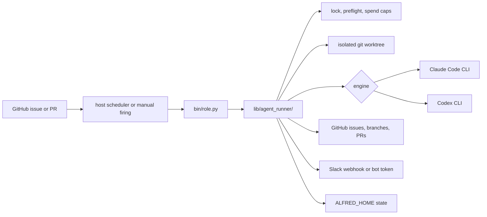

# Alfred

<p align="center">
  
</p>

[](https://github.com/luminik-io/alfred-os/actions/workflows/ci.yml)
[](https://alfred.luminik.io/)
[](LICENSE)


**Local coding agents that turn Slack requests, specs, and labeled issues into pull requests, reviews, safe merges, and Slack updates.**

Alfred keeps engineering work moving when you are not sitting at the keyboard.
It turns Slack requests, rough plans, specs, and GitHub issues into scoped
tasks, isolated worktrees, pull requests, reviews, tests, safe merges, and Slack
summaries. Batman is the architect for work that spans repos. Lucius is the
senior developer. Drake scopes smaller work. Ra's al Ghul is the reviewer. Bane
handles test coverage. Nightwing fixes reviewer comments. Automerge can land
small safe PRs once they pass your policy. The agents run on a computer you
choose, during the hours that machine is awake, using the subscriptions you
already pay for. Alfred shells out to your local CLI auth, so provider API keys
and hosted agent accounts are not part of the setup.

You do not sit in front of Claude or Codex and keep prompting every step.
You give Alfred the goal, the repos, and the approval rules; Alfred keeps the
loop moving until it has a pull request, a review finding, or a decision to
bring back to Slack.

Docs site: https://alfred.luminik.io

## Why use it

Interactive coding agents finish one prompt while you sit at the keyboard.
Alfred is for engineering work that should keep moving after you step away:
planned features, reviewer comments, follow-up tests, dependency bumps, docs
gaps, and multi-repo rollouts. It starts from Slack intake, rough plans, specs,
or GitHub issues, helps structure that work into tasks, gives each run its own
isolated copy of the repo, sends the right work to the right agent, hands
finished code to a reviewer, caps how much it can spend, and keeps several
agents from stepping on each other.

- Narrow roles with clear handoffs: Batman is the architect for cross-repo
  work, Lucius is the senior developer, Drake scopes smaller work, Ra's al Ghul
  is the reviewer, Bane is QA, and Nightwing is the fixer.
- Coordinate through ordinary repo primitives: GitHub issues and pull
  requests, labels, specs, isolated git worktrees, commit trailers, and Slack
  summaries. The local dashboard and desktop app read the same local state and
  GitHub records.
- Treat Slack as the planning surface: teammates can reply in a Batman plan
  thread with scope changes, questions, and acceptance criteria while you keep
  approval authority. Registered plan-thread replies persist
  local revision artifacts and echo the current repo scope before approval.
  Follow-up replies after PR links are captured as context for the next pass,
  not as implicit merge approval.
- Run the fleet conversationally from Slack: trusted control commands
  (`status`, `runs`, `plans`, `plan <id>`, `draft <id>`, `handled <id>`,
  `memory` / `memories`, `memory remember ...`, `memory harvest`, `remember ...`,
  `memory promote <id>`, `memory reject <id>`, `memory redis`, `memory sync`,
  `pause`, `resume`) inspect and steer local state from chat with no shell. Scoped Slack
  drafts and scheduled failure harvests can queue reviewable memory candidates
  without promoting them. When the issue bridge is enabled, an approved draft can become a labeled GitHub issue, and in-thread
  progress posts (claimed, PR opened, CI, merged) report back as the fleet
  works it. A plain-language intake profile lets a non-technical user approve
  outcomes instead of code.
- Route engines by role. Run implementation on Claude Code and review on
  Codex, or keep Claude as primary with Codex fallback for selected agents.
- Bring your own subscription. Alfred shells out to your local `claude` and
  optional `codex` CLI auth. It does not bill LLM calls separately and does
  not require provider API keys.
- Keep autonomy bounded: one firing, one worktree, one IAM scope, one Slack
  report, hard spend caps, and an explicit GitHub state machine. A locally drafted
  single-repo issue lands behind an approval gate
  (`agent:plan-pending-approval`) and is held from autonomous pickup until you
  approve it.

Default flow: request, plan, spec, or issue -> Drake files scoped
`agent:implement` issues -> Lucius claims one issue and opens a worktree ->
Claude Code or Codex implements -> a PR opens with `agent:authored` -> Ra's al
Ghul reviews -> Nightwing fixes P0/P1 comments -> Bane adds tests -> Automerge
lands the small safe PRs you allow -> Slack reports what changed.

## Quick start

Install the core runtime first. Add Alfred Desktop when you want the local app
for plans, agents, logs, setup checks, and memory review.

### Install Alfred core

Budget about 30 minutes on a dev machine that already has GitHub auth, Claude
Code, a package manager, and Python ready. A fresh laptop, Mac mini, old Mac, or
Linux box is closer to 60 to 120 minutes because browser auth and Slack setup
take real time.

Source checkout path:

```sh
git clone https://github.com/luminik-io/alfred-os.git ~/code/alfred-os
cd ~/code/alfred-os
bash install.sh
exec $SHELL                       # pick up ~/.alfredrc
gh auth login                     # GitHub
claude                            # Claude Code first-run auth
./bin/alfred-init.py              # choose agents, repos, codenames, Slack
```

macOS Homebrew path, if you prefer package-manager installs:

```sh
brew tap luminik-io/alfred-os https://github.com/luminik-io/alfred-os
brew install alfred-os
alfred-install
exec $SHELL                       # pick up ~/.alfredrc
gh auth login                     # GitHub
claude                            # Claude Code first-run auth
alfred-init                       # choose agents, repos, codenames, Slack
```

The Homebrew formula installs the latest tagged release and exposes
`alfred`, `alfred-init`, `alfred-install`, `alfred-deploy`, and
`alfred-doctor` on your PATH. Use the source checkout path when you want to
work from `main` or run the Linux installer.

### Install Alfred Desktop

Alfred Desktop is optional. It connects to the local runtime over
`alfred serve`; it does not run agents by itself.

- macOS 11+ on Apple silicon: download the signed, notarized DMG from
  [`alfred.luminik.io/download/`](https://alfred.luminik.io/download/).
- Linux: download the AppImage or `.deb` from the same page.
- Local development: `cd clients/desktop && npm install && npm run tauri dev`.

Start the local API before opening the app:

```sh
alfred serve --port 7010 --no-browser
```

For a solo-builder setup that an AI coding tool can run without guessing at
prompts or labels, pass one repo or an explicit comma-separated repo list:

```sh
./bin/alfred-init.py \
  --non-interactive \
  --agents starter \
  --repos your-org/api,your-org/web \
  --slack-webhook skip
```

The starter fleet is Drake, Lucius, Ra's al Ghul, and agent-cleanup: plan
issues, implement labelled issues, review PRs, and clean stale state. Slack is
optional. The `--repos` owner must match `GH_ORG`; the runtime agents store the
bare repo name in `~/.alfredrc` and build `GH_ORG/repo` at firing time.
`alfred-init.py` now seeds prompt templates into
`~/.alfred/prompts/`, creates the standard GitHub labels on selected repos,
writes `launchd/agents.conf` (the shared scheduler manifest), updates
`~/.alfredrc`, runs deploy, and runs
doctor.

For a framework-only install with no agents configured, use `bash deploy.sh &&
bash bin/doctor.sh`; doctor reports `0 passed, 0 failed`. See
[`examples/bin/echo_summarise.py`](examples/bin/echo_summarise.py) for the
smallest useful agent (the one [the tutorial](docs/TUTORIAL.md) builds) or
[`examples/bin/hello.py`](examples/bin/hello.py) for the absolute minimum.

Full setup including AWS IAM-per-agent, Slack webhook, and your first scheduled firing: [`BOOTSTRAP.md`](BOOTSTRAP.md). From-zero install with troubleshooting: [`INSTALL.md`](INSTALL.md). On Linux, see [`docs/LINUX.md`](docs/LINUX.md) for the `systemd --user` path.

Want Claude Code, Codex, or another local coding assistant to drive setup for
you? Use [`docs/AI_ASSISTED_INSTALL.md`](docs/AI_ASSISTED_INSTALL.md). It gives
the assistant a copy-paste prompt, explicit repo-scope lanes, and the guardrails
that prevent it from assigning every repo or inventing secrets. For checkout
layout choices, use [`docs/WORKSPACE_PATTERNS.md`](docs/WORKSPACE_PATTERNS.md).

### Check setup

Use doctor and dry-run to verify the machine before trusting scheduled work:

```sh
alfred auth status
bash bin/doctor.sh       # source checkout
# or: alfred-doctor      # Homebrew install
alfred dry-run lucius
```

Dry-run is a diagnostic path. It resolves the codename and prints the firing
steps without touching the scheduler, GitHub, Slack, engines, or local files. See
[`docs/DRY_RUN.md`](docs/DRY_RUN.md) for the exact boundary.

## System shape



One firing is one short-lived process. The OS scheduler controls cadence, the
runner applies safety rails, and the LLM CLI only receives the bounded task.

## Design notes

Many agent harnesses assume one long-running process, in-memory state, and a
human at a prompt. That is the wrong shape for unattended engineering work:

- Long-running loops have no failure isolation. One bad run trashes the others.
- In-memory state can't survive an OS reboot. A long-lived host restarts every few weeks.
- Chat-first interfaces keep you on the critical path.

Alfred inverts that. The host scheduler fires `bin/<role>.py` every N minutes, the `agent_runner` module wraps each firing in a lock, preflight, spend cap, and isolated worktree, and `claude -p` (or `codex exec`) does the bounded LLM work in a fresh subprocess. Spend is tracked per agent per day. When a Claude-backed agent hits a Claude provider limit, every other agent skips for an hour. The framework code never touches the LLM directly: the runner is plain Python, the model writes the code. The [System shape](#system-shape) diagram above traces one firing end to end; [`ARCHITECTURE.md`](ARCHITECTURE.md) has the full rationale.

## Runtime boundary

Alfred core does not install or run an external agent gateway, hosted memory
database, skill registry, or dashboard service. The fleet works with local
Python scripts, `gh`, `git`, the local fleet-brain SQLite store, and the
configured LLM CLIs.

`ALFRED_HOME` is the runtime root. A fresh install defaults to `~/.alfred`,
where deployed scripts, state, logs, Codex artifacts, prompt overrides, and
worktrees live. Alfred uses `ALFRED_HOME` only for its runtime path.

Companion layers can be useful around Alfred, but they are not bundled and must
not be required for a clean OSS install. See
[`docs/INTEGRATIONS.md`](docs/INTEGRATIONS.md) for the boundary.

Alfred provides the repeatable local fleet pattern: schedules, worktrees, issue
claims, PR loops, Slack reporting, and failure guards. Today it supports Claude
Code CLI and Codex CLI adapters. Other engines require a wrapper binary or new
adapter code.

## Anonymous usage totals

Alfred can report anonymous aggregate counts for the public
[Impact](https://alfred.luminik.io/impact/) page. Reporting is on when an ingest
endpoint is configured. Turn it off any time with `alfred telemetry off` or
`ALFRED_TELEMETRY_ENABLED=0`. If no endpoint is configured, nothing is sent.
When an install has already reported, `alfred telemetry off` asks the collector
to remove that install's stored record before writing the local opt-out.

Alfred reports counts only. It does not send repo names, file paths, code,
prompts, titles, branches, people, hostnames, or billing data. A reporting
failure never breaks a firing.

Configure or change the endpoint:

```sh
alfred telemetry on --url https://your-worker.example.com/ingest
```

If your collector uses an ingest token, pass it when enabling:

```sh
alfred telemetry on \
  --url https://your-worker.example.com/ingest \
  --token the-same-value-as-the-collector
```

Then run `bash deploy.sh` from the source checkout so launchd or systemd
installs the scheduler change.

Turn reporting off:

```sh
alfred telemetry off
```

If this install has already reported, the command asks the collector to remove
the stored record before it writes the local opt-out.

Inspect local state:

```sh
alfred telemetry status
alfred telemetry status --json
```

The bundled collector lives under [`telemetry/worker/`](telemetry/worker/).
Full contract: [`docs/TELEMETRY.md`](docs/TELEMETRY.md).

## What's in here

| Path | What it is |
|---|---|
| [`lib/agent_runner/`](lib/agent_runner/__init__.py) | Shared library (package; public API re-exported from `__init__.py`). Preflight, lock, spend, claude_invoke, codex_invoke, gh, slack, event-log, commit-trailer, handoff-table, issue claim state machine, runner gate helpers, dedup helpers (`find_open_authored_pr_for_issue`, `reuse_or_make_worktree`), worktree recovery refs, runtime memory, slack severity routing, dry-run seam. |
| [`lib/slack_format.py`](lib/slack_format.py) | Block Kit + bot-token Slack helpers: per-firing `firing_thread_root` / `firing_thread_reply` / `firing_thread_close`. Severity colour stripes. |
| [`lib/batman.py`](lib/batman.py) | Bundle primitives for Batman, the architect agent: `Bundle`, `claim_bundle` (all-or-nothing), `release_bundle`, `parse_plan_from_bundle`. |
| [`lib/planning_assistant.py`](lib/planning_assistant.py) | Shared issue/spec refinement helpers for `alfred serve`, `alfred spec refine`, and Slack plan amendments. |
| [`lib/scheduler.py`](lib/scheduler.py) | Host-scheduler abstraction: `launchd` on macOS, `systemd --user` on Linux, behind one interface. |
| [`bin/alfred`](bin/alfred) | Alfred CLI: `alfred agents`, `alfred status`, `alfred enable <codename>`, `alfred disable <codename>`, `alfred pause` / `resume` / `run`, `alfred clear-lock`, `alfred telemetry status/on/off`, `alfred brain ...`, `alfred mcp serve`, `alfred spec ...`, `alfred labels bootstrap/check`, `alfred engine status/set`, `alfred claude status/primary/secondary/swap/probe`, `alfred codex status/probe`, `alfred auth status/probe`. |
| [`bin/alfred-usage.py`](bin/alfred-usage.py) | Live Claude + Codex subscription usage for the rolling 5-hour and weekly limit windows, read from the engines' own local CLI state (no billing API). The same data is served over the live `GET /api/usage` endpoint; this is its `alfred usage` CLI front end. |
| [`bin/alfred-shipped-summary.py`](bin/alfred-shipped-summary.py) | Daily/weekly shipped-work report across configured repos: merged PRs, issues, LOC, and model/config changes. Also available as `alfred shipped`. |
| [`bin/shipped-summary-daily.sh`](bin/shipped-summary-daily.sh), [`bin/shipped-summary-weekly.sh`](bin/shipped-summary-weekly.sh) | Launchd wrappers for scheduled shipped-work Slack reports. |
| [`bin/batman.py`](bin/batman.py) | Architect agent for cross-repo work. Picks `agent:large-feature` / `agent:bundle:<slug>` issues, posts a Slack plan, applies approved repo-scope amendments, and carries approved thread notes into child issues. |
| [`bin/fleet-doctor.py`](bin/fleet-doctor.py) | Daily fleet-health snapshot. Read-only checks (paused repos, global block, stale worktrees, runner gate list) → severity-stripe Slack thread. |
| [`bin/memory-harvest.py`](bin/memory-harvest.py) | Optional scheduled memory-harvest wrapper. Queues reviewable repeated-failure candidates and nudges Slack when there is something to review. |
| [`bin/proof-telemetry.py`](bin/proof-telemetry.py) | Anonymous usage-total reporter. Posts only aggregate counts to the configured endpoint; `ALFRED_TELEMETRY_ENABLED=0` turns it off; fail-soft. |
| [`telemetry/worker/`](telemetry/worker/) | Self-hostable Cloudflare Worker that ingests the anonymous aggregate and serves the public totals for the site counter. Ships with placeholder ids; deploy under your own account. |
| [`bin/`](bin/) | Local helpers, including `doctor.sh` (host validator). |
| [`launchd/`](launchd/) | `_template.plist` + `agents.conf.example` + `render.sh` (TSV → plists). |
| [`systemd/`](systemd/) | `_template.service` + `_template.timer` + `render.sh` (TSV → `systemd --user` units) for the Linux path. |
| [`deploy.sh`](deploy.sh) | Sync `lib/` + `bin/` into `${ALFRED_HOME}`. If `launchd/agents.conf` exists, render units and bootstrap the host scheduler; otherwise do a framework-only deploy. |
| [`install.sh`](install.sh) | Fresh-machine bootstrap: Homebrew (macOS) or apt (Debian/Ubuntu) + npm + dirs + shell rc. Idempotent. |
| [`examples/bin/hello.py`](examples/bin/hello.py) | Smallest possible codename agent: preflight + Slack post. |
| [`examples/bin/echo_summarise.py`](examples/bin/echo_summarise.py) | Full lifecycle reference: pick / claim / claude / act / release / report. |
| [`examples/bin/label_state.py`](examples/bin/label_state.py) | Alfred CLI helper for the issue claim state machine. |
| [`examples/git-hooks/pre-push`](examples/git-hooks/pre-push) | Refuses push if a referenced issue is in-flight. Symmetric guard. |
| [`Formula/alfred-os.rb`](Formula/alfred-os.rb) | Homebrew formula pinned to the latest public release tarball. |
| [`site/`](site/) | Astro Starlight docs site, with GitHub Pages publishing gated by the release repo variable. |
| [`clients/desktop/`](clients/desktop/) | Tauri Mac/Linux client. A local dashboard over `alfred serve` JSON APIs, with Inbox, Ask, Work, Agents, and Setup surfaces plus explicit Slack and GitHub external links. Inbox carries a Claude + Codex usage rail (real subscription usage, no billing API; backed by the live `GET /api/usage` endpoint); Agents defaults to a cinematic roster with a list toggle. Builds native installers (`.app`/`.dmg`, `.AppImage`/`.deb`) from the Tauri bundle config. |
| [`lib/slack_control.py`](lib/slack_control.py), [`lib/slack_trust.py`](lib/slack_trust.py) | Trusted Slack control/query commands (`status`/`runs`/`plans`/`plan`/`draft`/`handled`/`memory`/`remember`/`pause`/`resume`/`trusted`/`trust`/`untrust`/`help`), codename-, plan-id-, and memory-id-validated, no shell, with local collaborator state under `$ALFRED_HOME/state/slack-trust`. |
| [`lib/slack_thread_status.py`](lib/slack_thread_status.py), [`bin/alfred-slack-thread-sync.py`](bin/alfred-slack-thread-sync.py) | In-thread fleet progress: read-only issue/PR/CI sweep that posts only the new lifecycle states back to the originating Slack thread. |

## Documentation

- [Install](INSTALL.md): fresh-machine walkthrough.
- [Install tiers](docs/INSTALL_TIERS.md): `core` (standalone, headless), optional `client` (desktop), optional `slack`.
- [AI-assisted install](docs/AI_ASSISTED_INSTALL.md): copy-paste prompt for Claude Code, Codex, or another local coding assistant.
- [Workspace patterns](docs/WORKSPACE_PATTERNS.md): one-repo, multi-repo, specs-led, and Batman planning layouts.
- [Specs-driven development](docs/SPECS_DRIVEN_DEVELOPMENT.md): how to turn specs into issue queues, Batman plans, and reviewable PRs.
- [Bootstrap](BOOTSTRAP.md): operations guide (AWS IAM, Slack, troubleshooting).
- [Tutorial: your first agent](docs/TUTORIAL.md): Echo, end-to-end.
- [Dry-run mode](docs/DRY_RUN.md): watch a side-effect-safe firing lifecycle before trusting scheduled work.
- [Architecture](ARCHITECTURE.md): design rationale.
- [Architecture diagrams](docs/ARCHITECTURE.md): mermaid diagrams for the agent lifecycle, model dispatch, locking, the Slack-native flow, the disk guardian, and the layered install.
- [State machine](docs/STATE_MACHINE.md): `agent:in-flight` → `agent:pr-open` → `agent:done` lifecycle.
- [Fleet brain](docs/FLEET_BRAIN.md): local memory, Slack-driven reviewable lesson candidates, failure history, reliability governor, explicit Redis AMS sync, and read-only MCP access.
- [Alfred Desktop](docs/NATIVE_CLIENT.md): Mac/Linux app, Slack-native boundary, the usage capacity rail (backed by the live `GET /api/usage` endpoint), cinematic agent roster, and local API shape.
- [Desktop app guide](docs/DESKTOP_CLIENT.md): the desktop app tab by tab, the Claude + Codex usage rail (backed by the live `GET /api/usage` endpoint), the `alfred serve` API, and building native installers.
- [Alfred analytics CLIs](docs/CLI.md): `alfred metrics`, `alfred logs`, `alfred usage`, and `alfred slack-listener`.
- [Goals](docs/GOALS.md): durable goal contract across Slack, CLI, client, planning readiness, evaluator, and memory.
- [Plain mode](docs/PLAIN_MODE.md): the non-technical intake profile (`ALFRED_INTAKE_PROFILE=plain`).
- [Claude Code and Codex](docs/CLAUDE_CODE.md): install, Pro vs Max, account routing, engine routing.
- [Codex provider](docs/CODEX_PROVIDER.md): Codex engine modes, probe commands, runtime contract, and billing posture.
- [Slack setup](docs/SLACK_SETUP.md): webhook + AWS storage + (optional) bot token, planning listener, trusted control commands, the issue bridge, and in-thread fleet-progress thread-sync.
- [AWS setup](docs/AWS_SETUP.md): IAM-per-agent, scoped policies.
- [Skills](docs/SKILLS.md): recommended Claude Code skills.
- [Telemetry](docs/TELEMETRY.md): anonymous aggregate usage totals, the on/off switch, and how to self-host the collector.
- [Integrations](docs/INTEGRATIONS.md): optional companion tools and what Alfred does not bundle.
- [Hermes integration](docs/HERMES.md): optional Hermes-layer recipe for teams already using Hermes.
- [Linux](docs/LINUX.md): Debian/Ubuntu via `systemd --user` timers. Install, deploy, and operate.
- [Publishing](docs/PUBLISHING.md): GitHub Pages, custom-domain, and release-site checks.
- [Contributing](CONTRIBUTING.md) | [Roadmap](ROADMAP.md) | [Changelog](CHANGELOG.md)
- [Security](SECURITY.md): private-disclosure process.
- [Release checklist](docs/RELEASE_CHECKLIST.md): pre-tag gates, scrub scan, GitHub Release flow.

Rendered version: https://alfred.luminik.io/.

## Codename pattern

The framework expects one agent script per narrow specialist, named after a coherent fictional cast, coordinating via labels and gh state rather than in-process calls. The shipped examples use Batman side-characters: **Batman** (architect), **Lucius** (feature dev), **Drake** (planner), **Bane** (test coverage), **Ra's al Ghul** (PR review), **Robin** (bug triage), **Nightwing** (review-fix), **Huntress** (post-deploy smoke), **Gordon** (deploy health). Pick whatever cast fits.

The cast matters for two reasons. Codenames appear in PR titles, Slack messages, and commit-trailer metadata; a coherent cast makes the fleet's channel scannable. And narrow scopes per codename are a forcing function for design quality. "What does Bane do?" is a sharper question than "what does the test agent do?".

See [Architecture → Codename pattern](https://alfred.luminik.io/concepts/codename-pattern/) for more.

## Design boundaries

Alfred has a deliberate shape. The boundaries below are intentional.

- **Single install.** One person, one Mac or Linux box, one config. Alfred is software you install and run yourself.
- **The OS schedules; Alfred runs.** No long-running orchestration loop. `launchd` / `systemd` own cadence; each firing is a fresh, isolated process. That means better failure isolation, and it survives reboots.
- **Local CLI auth.** Alfred shells out to `claude` and optional `codex` on your own subscription-backed CLI auth. There is no hosted inference service or provider API key setup.
- **Explicit goals and bounded autonomy.** Larger work should have a clear contract: outcome, verification, constraints, human gates, and blocked condition.
- **Lean on the platform.** When Anthropic ships a capability natively (Agent Teams, the Memory Tool), Alfred adopts it rather than re-implementing it.
- **Browser automation is per-codename.** If a codename needs a browser, it installs Playwright in its own bin script; the core stays lean.

The engineering fleet, local memory, reliability governor, `alfred serve`, and
the signed macOS desktop app plus Linux desktop packages all ship in v0.5.1. Content, sales, and ops
departments are the next larger surface area: [`ROADMAP.md`](ROADMAP.md).

## Status

**Latest release: v0.5.1.** Alfred ships a local coding-agent fleet for solo
builders: install, starter setup, prompt seeding, GitHub label setup, specs-assisted
workspace patterns, doctor, dry-run, Linux/systemd or macOS launchd scheduling,
Claude/Codex engine routing, Slack reporting, and isolated worktree execution.
v0.5.1 carries the first signed macOS desktop app and Linux desktop packages (built with Tauri),
live Claude and Codex subscription usage in that app, a single-repo
approval gate, a disk guardian that pauses your agents cleanly when the
disk is nearly full, a Slack planning path that turns an approved draft into a
labeled GitHub issue, fleet-brain reliability and memory tooling, one-command
setup-token bootstrap, a public download page, and SEO plus consent-gated
analytics on the site. See
[CHANGELOG.md](CHANGELOG.md) and [ROADMAP.md](ROADMAP.md) for the full ledger.

The native app has Inbox, Ask, Work, Agents, and Setup surfaces
for local trust and repair. Its Inbox view carries a Claude and Codex usage rail
(real subscription usage, read from the engines' own local CLI state with no
billing API, backed by the live `GET /api/usage` endpoint, with the same data
also available from the `alfred usage` CLI). Its Agents view has a cinematic
roster with a list toggle. Runs emit step-level events so the timeline shows
real progress, and any
issue carrying the approval gate label (`agent:plan-pending-approval`)
is held from autonomous pickup until you approve it and the label
clears. Slack remains the primary collaboration surface.

The design boundary is stable: one person, one local Mac or Linux box, local CLIs, isolated worktrees, GitHub as the coordination layer. PRs are welcome when they strengthen that shape: reliability, setup, docs, tests, new codenames with clear scope, or optional integrations that fail cleanly. Bigger shifts, such as a new department or runtime change, should start as a discussion.

## License

MIT. See [`LICENSE`](LICENSE). Copyright (c) 2026 DataRavel Inc.

## Name and theme

Alfred is named after Alfred Pennyworth: the calm system that keeps the cave
running while the mission is in flight. The public repository is
`luminik-io/alfred-os`, but the product name is Alfred. The default codenames
use the same theme: Batman is the architect, Lucius is the senior developer,
Drake scopes smaller work, Ra's al Ghul reviews PRs, Bane adds tests, and
Nightwing handles review fixes.
