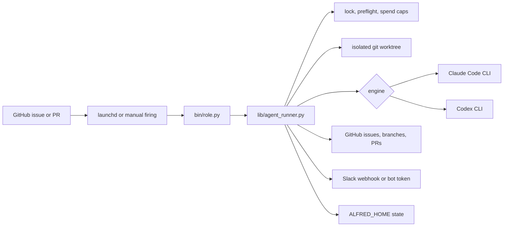

# Alfred

<p align="center">
  
</p>

[](https://github.com/luminik-io/alfred-os/actions/workflows/ci.yml)
[](https://alfred.luminik.io/)
[](LICENSE)


A local engineering-fleet runtime: Claude Code-first agents scheduled by the host's per-user scheduler (`launchd` on macOS, `systemd --user` on Linux) with optional Codex routing for review-style work. Each firing runs as a fresh subprocess in its own git worktree. Per-agent IAM. Per-day spend caps. Fleet-wide rate-limit block.

Docs site: https://alfred.luminik.io

## Why use it

Alfred is for the operator who wants a small agent fleet working while they
sleep without turning their product into a hosted agent platform.

- Label a GitHub issue, then let a narrow codename agent draft the plan, write
  the code, open the PR, review the PR, or fix review comments.
- Run on your own always-on Mac or Linux box and your own Claude Code
  subscription. No hosted scheduler, no shared queue, no API-key-only model
  gateway.
- Keep autonomy bounded: one firing, one worktree, one IAM scope, one Slack
  report, hard spend caps, and an explicit GitHub state machine.

## Quick start

Two ways in. The dry-run needs nothing installed and shows you the whole
firing lifecycle; the full install wires up a real scheduled fleet.

### Try it in 2 minutes (dry-run)

Want to watch an agent fire before configuring anything? Dry-run mode runs the
whole firing lifecycle (pick, claim, worktree, invoke, act, release, report)
with every side-effecting boundary stubbed. No LLM call, no spend, no Slack
post, no GitHub mutation, no real repo. It works with **zero host config**: no
`gh` auth, no AWS, no Slack, no Claude.

```sh
git clone https://github.com/luminik-io/alfred-os.git ~/code/alfred-os
cd ~/code/alfred-os
PYTHONPATH=lib python3 examples/bin/echo_summarise.py --dry-run
```

You get a narrated, step-numbered trace of the full lifecycle and an exit code
of 0:

```text
[dry-run]  1. (start) echo dry-run firing, no LLM, no spend, no gh/slack/git side effects
[dry-run]  2. (preflight) preflight reported config gaps, continuing (dry-run)
[dry-run]  3. (pick) would `gh issue list --label agent:summarise`; using a synthetic issue instead
[dry-run]  4. (gh) would claim dry-run-org/dry-run-repo#0 for echo: add agent:in-flight, post claim comment
[dry-run]  5. (llm) would invoke claude with prompt of 464 chars, model=(cli-default), max_turns=5
[dry-run]  6. (spend) would increment real ledger (firings_today+=1, turns_today+=3); dry-run ledger only
[dry-run]  7. (gh) would `gh issue comment #0` on dry-run-org/dry-run-repo: **Echo (auto-summary):** ...
[dry-run]  8. (gh) would release dry-run-org/dry-run-repo#0 for echo: outcome=success, remove agent:in-flight, add agent:done
[dry-run] 10. (spend) would increment real ledger (successes_today+=1); dry-run ledger only
[dry-run] 11. (slack) would post to Slack (severity=info): Echo summarised dry-run-org/dry-run-repo#0: ...
```

The same works for `examples/bin/hello.py` and `bin/lucius.py`, and via the
`ALFRED_DRY_RUN=1` env var instead of the flag. See [`docs/DRY_RUN.md`](docs/DRY_RUN.md)
for what is stubbed versus real.

### Full install

About 30 minutes from a fresh Mac or Debian/Ubuntu host.

```sh
git clone https://github.com/luminik-io/alfred-os.git ~/code/alfred-os
cd ~/code/alfred-os
bash install.sh
exec $SHELL                       # pick up ~/.alfredrc
gh auth login                     # GitHub
claude                            # Claude Code first-run auth
./bin/alfred-init.py              # choose agents, repos, codenames, Slack
```

For a single-repo solo-builder setup that an AI coding tool can run without
guessing at prompts or labels:

```sh
./bin/alfred-init.py \
  --non-interactive \
  --agents starter \
  --repos your-org/your-repo \
  --slack-webhook skip
```

The starter fleet is Drake, Lucius, Ras al Ghul, and agent-cleanup: plan
issues, implement labelled issues, review PRs, and clean stale state. Slack is
optional. The `--repos` owner must match `GH_ORG`; the runtime agents store the
bare repo name in `~/.alfredrc` and build `GH_ORG/repo` at firing time.
`alfred-init.py` now seeds prompt templates into
`~/.alfred/prompts/`, creates the standard GitHub labels on selected repos,
writes `launchd/agents.conf`, updates `~/.alfredrc`, runs deploy, and runs
doctor.

For a framework-only install with no agents configured, use `bash deploy.sh &&
bash bin/doctor.sh`; doctor reports `0 passed, 0 failed`. See
[`examples/bin/echo_summarise.py`](examples/bin/echo_summarise.py) for the
smallest useful agent (the one [the tutorial](docs/TUTORIAL.md) builds) or
[`examples/bin/hello.py`](examples/bin/hello.py) for the absolute minimum.

Full setup including AWS IAM-per-agent, Slack webhook, and your first scheduled firing: [`BOOTSTRAP.md`](BOOTSTRAP.md). From-zero install with troubleshooting: [`INSTALL.md`](INSTALL.md). On Linux, see [`docs/LINUX.md`](docs/LINUX.md) for the `systemd --user` path.

## System shape



One firing is one short-lived process. The OS scheduler owns cadence, the
runner owns safety rails, and the LLM CLI only receives the bounded task.

## Design notes

Most agent frameworks (crewAI, MetaGPT, OpenHands, AutoGPT-style loops) assume one long-running Python process, in-memory state, and a human at a REPL. Wrong shape for unattended work:

- Long-running loops have no failure isolation. One bad run trashes the others.
- In-memory state can't survive an OS reboot. A long-lived host restarts every few weeks.
- Chat-first interfaces put the operator on the critical path.

Alfred inverts that. The host scheduler fires `bin/<role>.py` every N minutes, the `agent_runner` module wraps each firing in a lock, preflight, spend cap, and isolated worktree, and `claude -p` (or `codex exec`) does the bounded LLM work in a fresh subprocess. Spend is tracked per agent per day. When any agent hits Anthropic's rate limit, every other agent skips for an hour. The framework code never touches the LLM directly: the runner is plain Python, the model writes the code. The [System shape](#system-shape) diagram above traces one firing end to end; [`ARCHITECTURE.md`](ARCHITECTURE.md) has the full rationale.

## Runtime boundary

Alfred core does not install or run an external agent gateway, memory database,
skill registry, or dashboard service. The fleet works with local Python scripts,
`gh`, `git`, and the configured LLM CLIs.

`ALFRED_HOME` is the runtime root. A fresh install defaults to `~/.alfred`,
where deployed scripts, state, logs, Codex artifacts, prompt overrides, and
worktrees live. Alfred uses `ALFRED_HOME` only for its runtime path.

Companion layers can be useful around Alfred, but they are not bundled and must
not be required for a clean OSS install. See
[`docs/INTEGRATIONS.md`](docs/INTEGRATIONS.md) for the boundary.

Alfred is also not a hosted model gateway. It owns the repeatable local fleet pattern: schedules, worktrees, issue claims, PR loops, Slack reporting, and failure guards. Concrete engines such as Claude Code CLI, Codex CLI, and future SDK-backed runners plug in as adapters.

## What's in here

| Path | What it is |
|---|---|
| [`lib/agent_runner.py`](lib/agent_runner.py) | Shared library. Preflight, lock, spend, claude_invoke, codex_invoke, gh, slack, event-log, commit-trailer, handoff-table, issue claim state machine, runner gate helpers, dedup helpers (`find_open_authored_pr_for_issue`, `reuse_or_make_worktree`), slack severity routing, dry-run seam. |
| [`lib/slack_format.py`](lib/slack_format.py) | Block Kit + bot-token Slack helpers: per-firing `firing_thread_root` / `firing_thread_reply` / `firing_thread_close`. Severity colour stripes. |
| [`lib/batman.py`](lib/batman.py) | Bundle primitives for the multi-repo coordinator: `Bundle`, `claim_bundle` (all-or-nothing), `release_bundle`, `parse_plan_from_bundle`. |
| [`lib/scheduler.py`](lib/scheduler.py) | Host-scheduler abstraction: `launchd` on macOS, `systemd --user` on Linux, behind one interface. |
| [`bin/alfred`](bin/alfred) | Operator CLI: `alfred agents`, `alfred status`, `alfred enable <codename>`, `alfred disable <codename>`, `alfred pause` / `resume` / `run`, `alfred engine status/set`, `alfred claude status/primary/secondary/swap/probe`. |
| [`bin/alfred-shipped-summary.py`](bin/alfred-shipped-summary.py) | Daily/weekly shipped-work report across configured repos: merged PRs, issues, LOC, and model/config changes. Also available as `alfred shipped`. |
| [`bin/shipped-summary-daily.sh`](bin/shipped-summary-daily.sh), [`bin/shipped-summary-weekly.sh`](bin/shipped-summary-weekly.sh) | Launchd wrappers for scheduled shipped-work Slack reports. |
| [`bin/batman.py`](bin/batman.py) | Skeleton multi-repo coordinator. Picks `agent:large-feature` / `agent:bundle:<slug>` issues and posts a plan to Slack. |
| [`bin/fleet-doctor.py`](bin/fleet-doctor.py) | Daily fleet-health snapshot. Read-only checks (paused repos, global block, stale worktrees, runner gate list) → severity-stripe Slack thread. |
| [`bin/`](bin/) | Operator helpers, including `doctor.sh` (host validator). |
| [`launchd/`](launchd/) | `_template.plist` + `agents.conf.example` + `render.sh` (TSV → plists). |
| [`systemd/`](systemd/) | `_template.service` + `_template.timer` + `render.sh` (TSV → `systemd --user` units) for the Linux path. |
| [`deploy.sh`](deploy.sh) | Sync `lib/` + `bin/` into `${ALFRED_HOME}`. If `launchd/agents.conf` exists, render units and bootstrap the host scheduler; otherwise do a framework-only deploy. |
| [`install.sh`](install.sh) | Fresh-machine bootstrap: Homebrew (macOS) or apt (Debian/Ubuntu) + npm + dirs + shell rc. Idempotent. |
| [`examples/bin/hello.py`](examples/bin/hello.py) | Smallest possible codename agent: preflight + Slack post. |
| [`examples/bin/echo_summarise.py`](examples/bin/echo_summarise.py) | Full lifecycle reference: pick / claim / claude / act / release / report. |
| [`examples/bin/label_state.py`](examples/bin/label_state.py) | Operator CLI for the issue claim state machine. |
| [`examples/git-hooks/pre-push`](examples/git-hooks/pre-push) | Refuses push if a referenced issue is in-flight. Symmetric guard. |
| [`Formula/alfred-os.rb`](Formula/alfred-os.rb) | Homebrew formula pinned to the latest public release tarball. |
| [`site/`](site/) | Astro Starlight docs site, with GitHub Pages publishing gated by the release repo variable. |

## Documentation

- [Install](INSTALL.md): fresh-machine walkthrough.
- [Bootstrap](BOOTSTRAP.md): operations guide (AWS IAM, Slack, troubleshooting).
- [Tutorial: your first agent](docs/TUTORIAL.md): Echo, end-to-end.
- [Dry-run mode](docs/DRY_RUN.md): watch a full firing lifecycle with no LLM call, no spend, and no side effects.
- [Architecture](ARCHITECTURE.md): design rationale.
- [State machine](docs/STATE_MACHINE.md): `agent:in-flight` → `agent:pr-open` → `agent:done` lifecycle.
- [Claude Code](docs/CLAUDE_CODE.md): install, Pro vs Max, `alfred claude`.
- [Slack setup](docs/SLACK_SETUP.md): webhook + AWS storage + (optional) bot token.
- [AWS setup](docs/AWS_SETUP.md): IAM-per-agent, scoped policies.
- [Skills](docs/SKILLS.md): recommended Claude Code skills.
- [Integrations](docs/INTEGRATIONS.md): optional companion tools and what Alfred does not bundle.
- [Hermes integration](docs/HERMES.md): optional operator-layer recipe for teams already using Hermes.
- [Linux](docs/LINUX.md): Debian/Ubuntu via `systemd --user` timers. Install, deploy, and operate.
- [Publishing](docs/PUBLISHING.md): GitHub Pages, custom-domain, and release-site checks.
- [Contributing](CONTRIBUTING.md) | [Roadmap](ROADMAP.md) | [Changelog](CHANGELOG.md)
- [Security](SECURITY.md): private-disclosure process.
- [Release checklist](docs/RELEASE_CHECKLIST.md): pre-tag gates, scrub scan, GitHub Release flow.

Rendered version: https://alfred.luminik.io/.

## Codename pattern

The framework expects one agent script per narrow specialist, named after a coherent fictional cast, coordinating via labels and gh state rather than in-process calls. The shipped examples use Batman side-characters: **Batman** (multi-repo coordinator), **Lucius** (feature dev), **Drake** (planner), **Bane** (test coverage), **Ra's al Ghul** (PR review), **Robin** (bug triage), **Nightwing** (review-fix), **Huntress** (post-deploy smoke), **Gordon** (deploy health). Pick whatever cast fits.

The cast matters for two reasons. Codenames appear in PR titles, Slack messages, and commit-trailer metadata; a coherent cast makes the fleet's channel scannable. And narrow scopes per codename are a forcing function for design quality. "What does Bane do?" is a sharper question than "what does the test agent do?".

See [Architecture → Codename pattern](https://alfred.luminik.io/concepts/codename-pattern/) for more.

## Design boundaries

Alfred has a deliberate shape. These are not missing features; they are the design.

- **Single operator.** One person, one host, one config. Alfred is not multi-tenant and will not become a hosted SaaS. It is software you install and run yourself.
- **The OS schedules; Alfred runs.** No long-running orchestration loop. `launchd` / `systemd` own cadence; each firing is a fresh, isolated process. That means better failure isolation, and it survives reboots.
- **Local CLIs, not a model gateway.** Alfred shells out to `claude` / optional `codex` / optional Ollama on your own subscription. It does not run a hosted inference service.
- **Lean on the platform.** When Anthropic ships a capability natively (Agent Teams, the Memory Tool), Alfred adopts it rather than re-implementing it.
- **Browser automation is per-codename.** If a codename needs a browser, it installs Playwright in its own bin script; the core stays lean.

The engineering fleet ships today. Content, sales, and ops departments, plus a memory layer and a local `alfred serve` UI, are the roadmap: [`ROADMAP.md`](ROADMAP.md).

## Status

**v0.2.1**. Alfred is usable today as a local engineering-agent fleet for one operator: install, starter setup, prompt seeding, GitHub label setup, launchd/systemd deployment, doctor, dry-run, Slack reporting, and Claude/Codex engine routing.

The design boundary is stable: one operator, one machine, local CLIs, isolated worktrees, GitHub as the coordination surface. PRs are welcome when they strengthen that shape: reliability, setup, docs, tests, new codenames with clear scope, or optional integrations that fail cleanly. Bigger shifts, such as a new department or substrate change, should start as a discussion.

## License

MIT. See [`LICENSE`](LICENSE). Copyright (c) 2026 DataRavel Inc.

## Why the repo slug is `alfred-os`

Alfred is named after Bruce Wayne's butler, the one who keeps the cave running while the mission is in flight. The default codenames are bat-themed, and the framework that lets the cave function is `alfred-os`.
