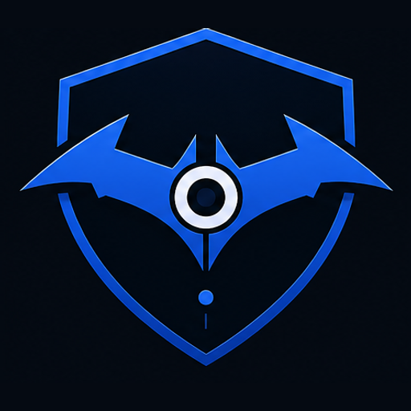
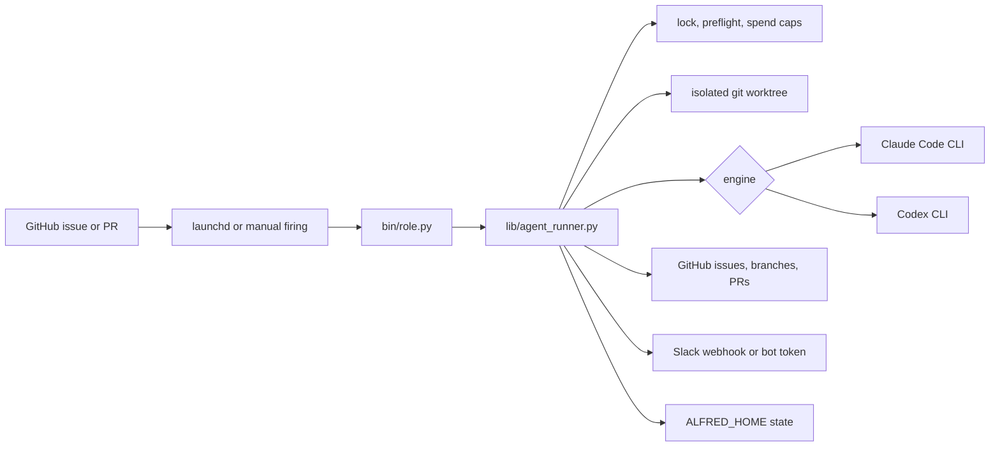

# Alfred

<p align="center">
  
</p>

[](https://github.com/luminik-io/alfred-os/actions/workflows/ci.yml)
[](https://alfred.luminik.io/)
[](LICENSE)


A local engineering-fleet runtime: Claude Code-first agents scheduled by the host's per-user scheduler — `launchd` on macOS, `systemd --user` on Linux — with optional Codex routing for review-style work. Each firing runs as a fresh subprocess in its own git worktree. Per-agent IAM. Per-day spend caps. Fleet-wide rate-limit block.

Docs site: https://alfred.luminik.io

## Why use it

Alfred is for the operator who wants a small agent fleet working while they
sleep without turning their product into a hosted agent platform.

- Label a GitHub issue, then let a narrow codename agent draft the plan, write
  the code, open the PR, review the PR, or fix review comments.
- Run on your own always-on Mac and your own Claude Code subscription. No
  hosted scheduler, no shared queue, no API-key-only model gateway.
- Keep autonomy bounded: one firing, one worktree, one IAM scope, one Slack
  report, hard spend caps, and an explicit GitHub state machine.

## Runtime and integrations

Alfred core does not install or run Hermes, gbrain, or any other external agent
gateway. The launchd fleet works with local Python scripts, `gh`, `git`, and
the configured LLM CLIs.

`ALFRED_HOME` is the runtime root. A fresh install defaults to `~/.alfred`,
where deployed scripts, state, logs, Codex artifacts, prompt overrides, and
worktrees live. Alfred OS uses `ALFRED_HOME` only for its runtime path.

Hermes, gbrain, MCP servers, canon files, dashboards, and skill packs can be
useful companion layers, but they are not bundled into Alfred and should not be
required for a clean OSS install.

See [`docs/INTEGRATIONS.md`](docs/INTEGRATIONS.md) for the bundling policy and
[`docs/HERMES.md`](docs/HERMES.md) for the optional Hermes recipe.

Alfred is also not a hosted model gateway. It owns the repeatable local fleet pattern: schedules, worktrees, issue claims, PR loops, Slack reporting, and failure guards. Concrete engines such as Claude Code CLI, Codex CLI, and future SDK-backed runners plug in as adapters.

## System Shape



One firing is one short-lived process. The OS scheduler owns cadence, the
runner owns safety rails, and the LLM CLI only receives the bounded task.

## Design Notes

Most agent frameworks (crewAI, MetaGPT, OpenHands, AutoGPT-style loops) assume one long-running Python process, in-memory state, and a human at a REPL. Wrong shape for unattended work:

- Long-running loops have no failure isolation. One bad run trashes the others.
- In-memory state can't survive an OS reboot. A long-lived host restarts every few weeks.
- Chat-first interfaces put the operator on the critical path.

Alfred's shape:

```
launchd plist (every N min)
   │
   ▼
${ALFRED_HOME}/bin/<role>.py        one file per agent role
   │
   ▼
agent_runner module                 lock + preflight + spend + claude/codex invoke + gh + slack
   │
   ▼
claude -p '<prompt>' --max-turns N    the LLM work, in a fresh subprocess
                                      N is the caller's value or the
                                      framework default ("effectively
                                      unlimited"); the wall-clock
                                      timeout is the real ceiling
   │
   ▼
slack_post('<result>', severity=…)  report to the fleet's Slack channel
```

Each firing is a fresh subprocess in its own worktree. Spend tracked per agent per day. When any agent hits Anthropic's rate limit, every other agent skips for an hour. The framework code never touches the LLM directly; the runner is plain Python, the model writes the code.

## Quick start

About 30 minutes from a fresh Mac.

```sh
git clone https://github.com/luminik-io/alfred-os.git ~/code/alfred-os
cd ~/code/alfred-os
bash install.sh
exec $SHELL                       # pick up ~/.alfredrc
gh auth login                     # GitHub
claude                            # Claude Code first-run auth
./bin/alfred-init.py              # choose agents, repos, codenames, Slack
```

`alfred-init.py` writes `launchd/agents.conf`, updates `~/.alfredrc`, runs deploy, and runs doctor. For a framework-only install with no agents configured, use `bash deploy.sh && bash bin/doctor.sh`; doctor reports `0 passed, 0 failed`. See [`examples/bin/echo_summarise.py`](examples/bin/echo_summarise.py) for the smallest useful agent (the one [the tutorial](docs/TUTORIAL.md) builds) or [`examples/bin/hello.py`](examples/bin/hello.py) for the absolute minimum.

Full setup including AWS IAM-per-agent, Slack webhook, and your first scheduled firing: [`BOOTSTRAP.md`](BOOTSTRAP.md). From-zero install with troubleshooting: [`INSTALL.md`](INSTALL.md).

### Try it in 2 minutes (dry-run)

Want to watch an agent fire before configuring anything? Dry-run mode runs the whole firing lifecycle — pick, claim, worktree, invoke, act, release, report — with every side-effecting boundary stubbed. No LLM call, no spend, no Slack post, no GitHub mutation, no real repo. It works with **zero host config**: no `gh` auth, no AWS, no Slack, no Claude.

```sh
git clone https://github.com/luminik-io/alfred-os.git ~/code/alfred-os
cd ~/code/alfred-os
PYTHONPATH=lib python3 examples/bin/echo_summarise.py --dry-run
```

You get a narrated, step-numbered trace of the full lifecycle and an exit code of 0. The same works for `examples/bin/hello.py` and `bin/lucius.py`, and via the `ALFRED_DRY_RUN=1` env var instead of the flag. See [`docs/DRY_RUN.md`](docs/DRY_RUN.md) for what is stubbed versus real.

## What's in here

| Path | What it is |
|---|---|
| [`lib/agent_runner.py`](lib/agent_runner.py) | Shared library. Preflight, lock, spend, claude_invoke, codex_invoke, gh, slack, event-log, commit-trailer, handoff-table, issue claim state machine, runner gate helpers, dedup helpers (`find_open_authored_pr_for_issue`, `reuse_or_make_worktree`), slack severity routing. |
| [`lib/slack_format.py`](lib/slack_format.py) | Block Kit + bot-token Slack helpers: per-firing `firing_thread_root` / `firing_thread_reply` / `firing_thread_close`. Severity colour stripes. |
| [`lib/batman.py`](lib/batman.py) | Bundle primitives for the multi-repo coordinator: `Bundle`, `claim_bundle` (all-or-nothing), `release_bundle`, `parse_plan_from_bundle`. |
| [`bin/alfred`](bin/alfred) | Operator CLI: `alfred agents`, `alfred status`, `alfred enable <codename>`, `alfred disable <codename>`, `alfred enabled-agents`, `alfred engine status/set`, `alfred claude status/primary/secondary/swap/probe`. |
| [`bin/alfred-shipped-summary.py`](bin/alfred-shipped-summary.py) | Daily/weekly shipped-work report across configured repos: merged PRs, issues, LOC, and model/config changes. Also available as `alfred shipped`. |
| [`bin/shipped-summary-daily.sh`](bin/shipped-summary-daily.sh), [`bin/shipped-summary-weekly.sh`](bin/shipped-summary-weekly.sh) | Launchd wrappers for scheduled shipped-work Slack reports. |
| [`bin/batman.py`](bin/batman.py) | Skeleton multi-repo coordinator. Picks `agent:large-feature` / `agent:bundle:<slug>` issues and posts a plan to Slack. |
| [`bin/fleet-doctor.py`](bin/fleet-doctor.py) | Daily fleet-health snapshot. Read-only checks (paused repos, global block, stale worktrees, runner gate list) → severity-stripe Slack thread. |
| [`bin/`](bin/) | Operator helpers, including `doctor.sh` (host validator). |
| [`launchd/`](launchd/) | `_template.plist` + `agents.conf.example` + `render.sh` (TSV → plists). |
| [`deploy.sh`](deploy.sh) | Sync `lib/` + `bin/` into `${ALFRED_HOME}`. If `launchd/agents.conf` exists, render plists and bootstrap `launchd`; otherwise do a framework-only deploy. |
| [`install.sh`](install.sh) | Fresh-machine bootstrap: brew + npm + dirs + shell rc. Idempotent. |
| [`examples/bin/hello.py`](examples/bin/hello.py) | Smallest possible codename agent: preflight + Slack post. |
| [`examples/bin/echo_summarise.py`](examples/bin/echo_summarise.py) | Full lifecycle reference: pick / claim / claude / act / release / report. |
| [`examples/bin/label_state.py`](examples/bin/label_state.py) | Operator CLI for the issue claim state machine. |
| [`examples/git-hooks/pre-push`](examples/git-hooks/pre-push) | Refuses push if a referenced issue is in-flight. Symmetric guard. |
| [`Formula/alfred-os.rb`](Formula/alfred-os.rb) | Draft Homebrew formula. Published after the first public tag has a real tarball checksum. |
| [`site/`](site/) | Astro Starlight docs site, with GitHub Pages publishing gated by the release repo variable. |

## Documentation

- [Install](INSTALL.md): fresh-Mac walkthrough.
- [Bootstrap](BOOTSTRAP.md): operations guide (AWS IAM, Slack, troubleshooting).
- [Tutorial: your first agent](docs/TUTORIAL.md): Echo, end-to-end.
- [Dry-run mode](docs/DRY_RUN.md): watch a full firing lifecycle with no LLM call, no spend, and no side effects.
- [Architecture](ARCHITECTURE.md): design rationale.
- [State machine](docs/STATE_MACHINE.md): `agent:in-flight` → `agent:pr-open` → `agent:done` lifecycle.
- [Claude Code](docs/CLAUDE_CODE.md): install, Pro vs Max, `alfred claude`.
- [Slack setup](docs/SLACK_SETUP.md): webhook + AWS storage + (optional) bot token.
- [AWS setup](docs/AWS_SETUP.md): IAM-per-agent, scoped policies.
- [Skills](docs/SKILLS.md): recommended Claude Code skills.
- [Integrations](docs/INTEGRATIONS.md): what Alfred does and does not bundle.
- [Hermes integration](docs/HERMES.md): optional Hermes, MCP, gbrain, canon, and skills recipe.
- [Linux](docs/LINUX.md): Debian/Ubuntu via `systemd --user` timers — install, deploy, and operate.
- [Publishing](docs/PUBLISHING.md): GitHub Pages, custom-domain, and release-site checks.
- [Contributing](CONTRIBUTING.md) | [Roadmap](ROADMAP.md) | [Changelog](CHANGELOG.md)
- [Security](SECURITY.md): private-disclosure process.
- [Release checklist](docs/RELEASE_CHECKLIST.md): pre-tag gates, scrub scan, GitHub Release flow.

Rendered version: https://alfred.luminik.io/.

## Codename pattern

The framework expects one agent script per narrow specialist, named after a coherent fictional cast, coordinating via labels and gh state rather than in-process calls. The shipped examples use Batman side-characters: **Batman** (multi-repo coordinator), **Lucius** (feature dev), **Drake** (planner), **Bane** (test coverage), **Ra's al Ghul** (PR review), **Robin** (bug triage), **Nightwing** (review-fix), **Huntress** (post-deploy smoke), **Gordon** (deploy health). Pick whatever cast fits.

The cast matters for two reasons. Codenames appear in PR titles, Slack messages, and commit-trailer metadata; a coherent cast makes the fleet's channel scannable. And narrow scopes per codename are a forcing function for design quality. "What does Bane do?" is a sharper question than "what does the test agent do?".

See [Architecture → Codename pattern](https://alfred.luminik.io/concepts/codename-pattern/) for more.

## What Alfred does not do

- ❌ Multi-tenant. Single operator, one Mac, one config.
- ❌ A web UI. Slack is the human surface.
- ❌ Long-running orchestration loops. The OS scheduler is the orchestrator.
- ❌ Hosted model gateways. Alfred shells out to local CLIs (`claude`, optional `codex`, optional Ollama); it does not run a multi-tenant inference gateway.
- ❌ Browser automation runtimes. If your fleet needs a browser, install Playwright in your codename agent's bin script.
- ❌ Bundled vector databases or memory stores. Some fleets use gbrain or a doc-shaped memory layer. Alfred doesn't ship one; that's a per-fleet decision.
- ❌ Anything Anthropic ships natively (Agent Teams, Memory Tool). When those mature, lean on them rather than re-implementing in Alfred.

## Status

**v0.2.1**. Complete local engineering-agent fleet for one operator, with the first public launch cleanup pass applied. APIs in `agent_runner` are stable for the operator's own use; expect rough edges if you fork. There is no roadmap to make Alfred multi-tenant.

Maintained on weekends. Issues triaged on a best-effort basis. PRs that match the design constraints (see [`CONTRIBUTING.md`](CONTRIBUTING.md)) get reviewed; PRs that broaden scope get politely declined.

## License

MIT. See [`LICENSE`](LICENSE).

## Why the repo slug is `alfred-os`

Alfred is named after Bruce Wayne's butler, the one who keeps the cave running while the mission is in flight. The default codenames are bat-themed, and the framework that lets the cave function is `alfred-os`.
