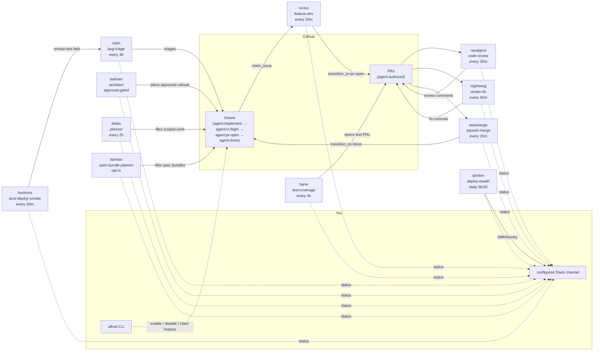
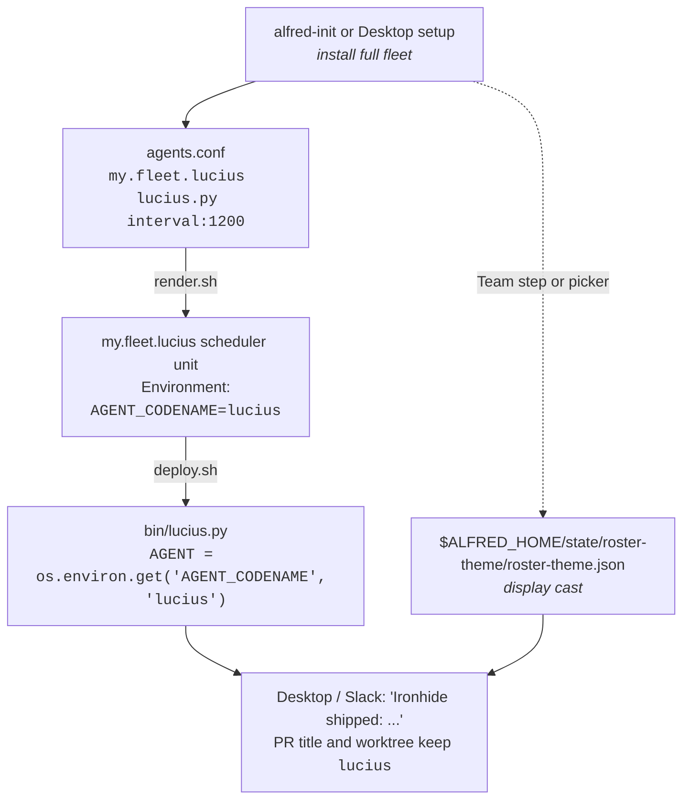

# Agents

The agents shipped in Alfred are engineering-focused. Each is a narrow specialist. Runtime codenames default to Batman side-characters; Alfred Desktop lets you choose a visible roster theme or custom display names without changing scheduler labels, GitHub labels, worktree names, or merge gates.

## Fleet map



Solid arrows are state transitions (someone modifies the issue or PR). Dashed
arrows are observability (someone reports). You interact through the
`alfred` CLI, Slack, and the optional `examples/bin/label_state.py` helper for
issue-claim overrides.

## Shipped topology (engineering)

The repo ships these agents. Schedules are sensible defaults; override
per-agent in `agents.conf`.

The recommended engineering hierarchy starts with Batman, Lucius, and Drake:
Batman is the architect for cross-repo features, Lucius ships repo-local
implementation PRs, and Drake scopes smaller single-repo requests. A full
install configures the whole engineering fleet, including Batman, from the
start. High-impact parent-plan execution stays behind the runner gate and the
approval mode you choose, so a one-repo install can keep Batman visible without
letting it file work until multi-repo or multi-package plans are ready.

| Codename | Role | Default schedule | Default repos | What it does |
|---|---|---|---|---|
| **batman** | architect | every 1 h, approval-gated | `BATMAN_PARENT_REPO` | Coordinates multi-repo features. Batman drafts the rollout from parent issues, waits for Slack or Alfred client approval, files child `agent:implement` issues, and reports status so implementation can move in parallel. |
| **lucius** | feature-dev | every 20 min | `ALFRED_LUCIUS_REPOS` | Picks the oldest open `agent:implement` issue, claims it via the state machine, opens a worktree, runs `claude -p` with the issue body + repo context, pushes a PR labelled `agent:authored`. |
| **drake** | planner | every 2 h | all in-scope repos | Reads specs / roadmap / `IMMEDIATE_NEXT_STEPS` / cross-repo open-issue list / code-reality grep. Files the next well-scoped `agent:implement` issue. Caps at 5 issues per firing, 20 in rolling 24 h. |
| **damian** | spec-bundle-planner | daily 09:00, opt-in | `DAMIAN_SCAN_REPOS` | Reads `DAMIAN_SPEC_DIR` end-to-end, identifies multi-repo features, files `agent:bundle:<slug>` siblings across affected repos. All-or-nothing per bundle. Caps at 3 bundles per firing. Single-repo work is left to drake. Prompt seeded from `prompts/spec-bundle-planner.md`. |
| **bane** | test-coverage | every 4 h | `ALFRED_BANE_REPOS` (round-robin) | Picks the lowest-coverage actively-changed file. Writes tests. Opens PR. |
| **rasalghul** | code-review | every 30 min | all in-scope repos | Multi-axis review (correctness, security, perf, maintainability) on every fresh PR. Posts as comment. |
| **nightwing** | review-fix | every 45 min | all `agent:authored` PRs | Lands fixes for P0 / P1 reviewer comments (CodeRabbit, Codex, rasalghul) on agent-authored PRs. |
| **robin** | bug-triage | every 3 h | all in-scope repos | Classifies new bug-report issues. Adds severity labels, asks for repro info, hands off to lucius via `agent:implement`. Has a local touched-issues ledger so it doesn't re-triage. |
| **huntress** | post-deploy-smoke | every 30 min | staging only | Runs Playwright smoke tests against `ALFRED_HUNTRESS_TARGET_URL`. Reports failures with screenshots. |
| **gordon** | deploy-health | daily 08:00 | ECS + Sentry | Diffs ECS staging task-def image SHA against repo `main` HEAD; pulls top-5 unresolved Sentry issues from the last 24 h. Quiet on healthy days, Slack-posts on drift / Sentry signal. Read-only. |
| **automerge** | utility | every 15 min | all `agent:authored` PRs | Squash-merges PRs that pass: 30 min age, CI green, no unresolved P0 reviewer comments, latest rasalghul comment ends "Ship-ready: yes". Never touches non-`agent:authored` PRs. |
| **agent-cleanup** | utility | daily 03:00 | n/a | Sweeps stale `/tmp/<agent>-debug-*`, abandoned worktrees, expired spend files, expired transcripts, stuck locks (>4h), stale `agent:in-flight` claims (>4h via `force_release_stale_claim`). |
| **code-map-refresh** | utility | every 6 h | `ALFRED_CODE_MAP_REPOS` | Scans configured repos and writes `${ALFRED_HOME}/state/code-map.json` with source files, symbols, imports, API calls, server routes, and contract drift. Drake, Batman, and code-map-aware review prompts can read it for cross-repo context. |
| **agent-morning-brief** | utility | daily 07:00 | n/a | Slack post: yesterday's PRs shipped, in-flight work, doctor status, anything red. |
| **fleet-recap** | utility | 07:30 + 22:00 | n/a | Two firings of the same script. Aggregates per-agent spend / firings / success rate. Posts to Slack. |

## Roster customization

The stable runtime codename is the machine identity. It appears in PR titles, commit-trailer metadata, log filenames, worktree paths, and the host scheduler label or unit. The visible roster name is the human identity. Alfred Desktop can apply preset themes or custom names and role labels across the desktop and Slack while the runtime codename stays stable.

### Why the defaults are Batman

Two reasons:

1. **Operational legibility.** A coherent fictional cast makes scanning the Slack channel faster than `agent-1 / agent-2 / agent-3` or `feature-dev / test-coverage / review`. Once you've worked with Lucius for a week, "Lucius failed on #303" is instantly readable.
2. **Design forcing function.** "What does *Bane* do?" is a sharper question than "what does the test agent do?". Naming the role after a *character* (who has a personality, a domain, a relationship to other characters) forces narrow scope per codename.

### Picking your own visible cast

If you want a different visible cast, use Alfred Desktop's Team step or Agents roster picker. Pick something coherent. Some examples:

- **Greek pantheon**: Athena (planner), Hephaestus (feature dev), Iris (notifier), Asclepius (deploy health).
- **The Wire**: Bunk (review), McNulty (triage), Omar (security audit), Lester (bug investigation).
- **Tolkien**: Aragorn, Legolas, Gimli, Gandalf. Be careful about lore consistency.
- **Your favourite anime, novel, podcast, board game**.

Constraints for custom display names:

- Short single-line names. Long names pollute Slack scrolling.
- Pronounceable. You'll say "lucius shipped #303" out loud at some point.
- Consistent across the fleet. Don't mix Batman + Star Wars; pick one universe.

The utility agents (`automerge`, `agent-cleanup`, `code-map-refresh`, `agent-morning-brief`, `fleet-recap`) are infrastructure and ship with plain-English names. You can give them visible names too, but most people leave them plain.

## How the identity gets wired



The agent script lives at `bin/<role>.py` (e.g. `bin/lucius.py` is the feature-dev script's default name). The runtime codename is set via:

1. The scheduler unit environment: `AGENT_CODENAME=<codename>`. Rendered from the label suffix in `agents.conf`.
2. The agent runner reads `AGENT = os.environ.get("AGENT_CODENAME", "<default>")` at startup.
3. PR titles, log paths, worktree paths, and label-claim comments use the codename from `AGENT`.
4. Desktop and Slack labels resolve a visible display name from the roster-theme store when one is configured.

The bin script filename stays `lucius.py` because it is the role implementation. Custom roster names change what humans see, not the role implementation or the scheduler contract.

## Adding a brand-new codename for your own role

To add a role not in the default set (e.g., `arsenal` for "deploy-time security scanner"):

1. Write `bin/arsenal.py` following the pattern in `bin/lucius.py`. Import from `agent_runner`. Set `AGENT = os.environ.get("AGENT_CODENAME", "arsenal")`.
2. Add a row to `launchd/agents.conf`:

   ```
   my.fleet.arsenal	arsenal.py	interval:3600	no	my.fleet.arsenal	Deploy-time security scanner
   ```

3. Run `bash deploy.sh`.
4. Run `./bin/alfred doctor` to confirm preflight passes.

The existing primitives in `lib/agent_runner/` cover the common patterns: lock, preflight, spend, gh, slack, claim/release, claude_invoke, event log. Read [`docs/STATE_MACHINE.md`](STATE_MACHINE.md) and [`docs/TUTORIAL.md`](TUTORIAL.md) before writing the script. Once the agent appears in the runtime status or schedule, Alfred Desktop includes it in the custom roster editor so you can give it a visible name. A future native flow can generate this script and schedule row from an engine, role, and prompt, but the current OSS path keeps the code explicit and reviewable.

## Roadmap categories (post-v0.2)

The default install is engineering-only. Future categories tracked in [`ROADMAP.md`](../ROADMAP.md):

- **Sales / SDR agents**: prospect identification, LinkedIn / event-page scraping, outreach drafts. Human-in-the-loop on send.
- **Content agents**: blog / LinkedIn / SEO drafts, site-page generation, content-drift detection. Human-in-the-loop on publish.
- **Personal-assistant agents**: inbox triage, calendar, daily digest. Generates Gmail drafts; never sends.
- **Finance-ops agents**: invoice generation, bank reconciliation, subscription audit. Generates drafts; never moves money.
- **Product-ops / SRE agents**: uptime monitoring, release notes, customer-health signals.

These categories require their own integration surface (Apollo, Reddit, Gmail, Wise, Sentry, etc.) and are out of scope for the v0.2 engineering release. PRs that propose individual agents in these categories are welcome; see [`CONTRIBUTING.md`](../CONTRIBUTING.md).

## Inspect and gate

```sh
alfred agents                 # configured agents, schedule, enable state, role
alfred status                 # local fleet health, locks, pauses, approval waits
alfred clear-lock <codename>  # clear a stale /tmp lock after safety checks
alfred enable <codename>      # add codename to the runner gate
alfred disable <codename>     # remove codename from the runner gate
alfred enabled-agents         # print the current runner-gate list
alfred labels check --all     # report missing lifecycle/approval labels
alfred labels bootstrap --all # create missing lifecycle/approval labels
alfred shipped --period weekly # summarize merged PRs, issues, LOC, config changes
bash deploy.sh                 # sync bin/lib; render + bootstrap if agents.conf exists
./bin/alfred doctor            # preflight configured Python agents
./bin/alfred doctor --lifecycle # validate Batman parser, Slack approval, Claude OAuth
```

Use `alfred-label-state` for issue-claim overrides. Use
`alfred clear-lock --check` before clearing a lock unless you have already
confirmed the holder is dead and any matching worktree is preserved.
