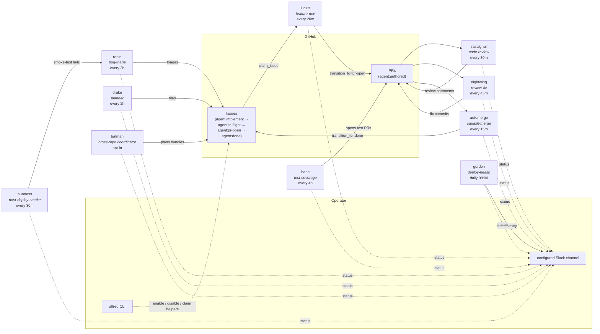
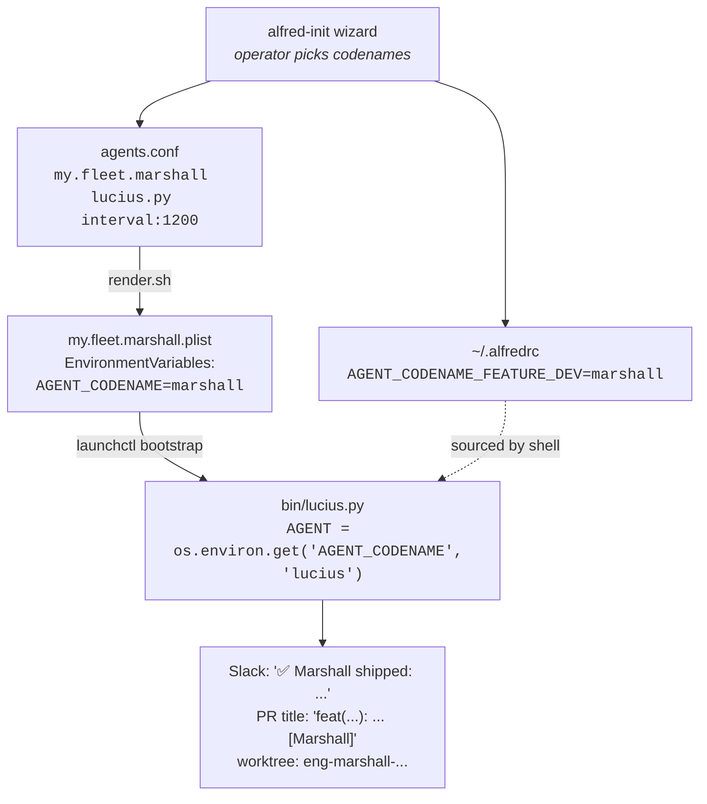

# Agents

The agents shipped in Alfred are engineering-focused. Each is a narrow specialist. Codenames default to Batman side-characters; the operator can rename any agent during `alfred-init` or by editing `~/.alfredrc` later.

## Fleet map



Solid arrows are state transitions (someone modifies the issue or PR). Dashed
arrows are observability (someone reports). Operator interaction is via the
`alfred` CLI, Slack, and the optional `examples/bin/label_state.py` helper for
issue-claim overrides.

## Shipped topology (engineering)

The repo ships these agents. Schedules are sensible defaults; override
per-agent in `agents.conf`.

The recommended starter fleet is intentionally smaller: Drake, Lucius, Ras al
Ghul, and agent-cleanup. That gives a solo builder planning, implementation,
review, and housekeeping without lighting up every scheduled role on day one.

| Codename | Role | Default schedule | Default repos | What it does |
|---|---|---|---|---|
| **lucius** | feature-dev | every 20 min | `ALFRED_LUCIUS_REPOS` | Picks the oldest open `agent:implement` issue, claims it via the state machine, opens a worktree, runs `claude -p` with the issue body + repo context, pushes a PR labelled `agent:authored`. |
| **drake** | planner | every 2 h | all in-scope repos | Reads specs / roadmap / `IMMEDIATE_NEXT_STEPS` / cross-repo open-issue list / code-reality grep. Files the next well-scoped `agent:implement` issue. Caps at 5 issues per firing, 20 in rolling 24 h. |
| **batman** | cross-repo coordinator | every 1 h, opt-in | `BATMAN_SCAN_REPOS` | Picks `agent:large-feature` / `agent:bundle:<slug>` issues and posts a bundle plan. OSS ships this as plan-only; site-specific fleets can add execution and approval gates on top. |
| **bane** | test-coverage | every 4 h | `ALFRED_BANE_REPOS` (round-robin) | Picks the lowest-coverage actively-changed file. Writes tests. Opens PR. |
| **rasalghul** | code-review | every 30 min | all in-scope repos | Multi-axis review (correctness, security, perf, maintainability) on every fresh PR. Posts as comment. |
| **nightwing** | review-fix | every 45 min | all `agent:authored` PRs | Lands fixes for P0 / P1 reviewer comments (CodeRabbit, Codex, rasalghul) on agent-authored PRs. |
| **robin** | bug-triage | every 3 h | all in-scope repos | Classifies new bug-report issues. Adds severity labels, asks for repro info, hands off to lucius via `agent:implement`. Has a local touched-issues ledger so it doesn't re-triage. |
| **huntress** | post-deploy-smoke | every 30 min | staging only | Runs Playwright smoke tests against `ALFRED_HUNTRESS_TARGET_URL`. Reports failures with screenshots. |
| **gordon** | deploy-health | daily 08:00 | ECS + Sentry | Diffs ECS staging task-def image SHA against repo `main` HEAD; pulls top-5 unresolved Sentry issues from the last 24 h. Quiet on healthy days, Slack-posts on drift / Sentry signal. Read-only. |
| **automerge** | utility | every 15 min | all `agent:authored` PRs | Squash-merges PRs that pass: 30 min age, CI green, no unresolved P0 reviewer comments, latest rasalghul comment ends "Ship-ready: yes". Never touches non-`agent:authored` PRs. |
| **agent-cleanup** | utility | daily 03:00 | n/a | Sweeps stale `/tmp/<agent>-debug-*`, abandoned worktrees, expired spend files, expired transcripts, stuck locks (>4h), stale `agent:in-flight` claims (>4h via `force_release_stale_claim`). |
| **code-map-refresh** | utility | every 6 h | `ALFRED_CODE_MAP_REPOS` | Scans every product repo, writes `${ALFRED_HOME}/state/code-map.json`. Drake / lucius / rasalghul read it for cross-repo context. |
| **agent-morning-brief** | utility | daily 07:00 | n/a | Slack post: yesterday's PRs shipped, in-flight work, doctor status, anything red. |
| **fleet-recap** | utility | 07:30 + 22:00 | n/a | Two firings of the same script. Aggregates per-agent spend / firings / success rate. Posts to Slack. |

## Codename customization

`alfred-init` asks for each agent's codename and falls back to the Batman default if you press Enter. The codename appears in PR titles, Slack messages, commit-trailer metadata, log filenames, worktree paths, and the launchd plist label.

### Why the defaults are Batman

Two reasons:

1. **Operational legibility.** A coherent fictional cast makes scanning the Slack channel faster than `agent-1 / agent-2 / agent-3` or `feature-dev / test-coverage / review`. Once you've worked with Lucius for a week, "Lucius failed on #303" is instantly readable.
2. **Design forcing function.** "What does *Bane* do?" is a sharper question than "what does the test agent do?". Naming the role after a *character* (who has a personality, a domain, a relationship to other characters) forces narrow scope per codename.

### Picking your own cast

If you want to rename, pick something coherent. Some examples:

- **Greek pantheon**: Athena (planner), Hephaestus (feature dev), Iris (notifier), Asclepius (deploy health).
- **The Wire**: Bunk (review), McNulty (triage), Omar (security audit), Lester (bug investigation).
- **Tolkien**: Aragorn, Legolas, Gimli, Gandalf. Be careful about lore consistency.
- **Your favourite anime, novel, podcast, board game**.

Constraints:

- ASCII-safe names (used in filenames, label slugs, gh CLI args). `rasalghul` not `Ra's al Ghul`.
- ~10 characters max. Long codenames pollute Slack scrolling.
- Pronounceable. You'll say "lucius shipped #303" out loud at some point.
- Consistent across the fleet. Don't mix Batman + Star Wars; pick one universe.

The utility agents (`automerge`, `agent-cleanup`, `code-map-refresh`, `agent-morning-brief`, `fleet-recap`) are infrastructure and ship with plain-English names. You can rename these too if you want every agent in your cast, but most operators leave them alone.

## How the codename gets wired



The agent script lives at `bin/<role>.py` (e.g. `bin/lucius.py` is the feature-dev script's default name). The operator-chosen codename is set via:

1. The launchd plist's `EnvironmentVariables` block: `AGENT_CODENAME=<chosen-name>`. Rendered by `launchd/render.sh` from the label suffix in `agents.conf`.
2. The agent runner reads `AGENT = os.environ.get("AGENT_CODENAME", "<default>")` at startup.
3. Slack messages, PR titles, log paths, worktree paths, label-claim comments all use the codename from `AGENT`.

If you rename `lucius` to `marshall`, the renamed agent:

- Is labelled `my.fleet.marshall` in launchd.
- Posts `✅ Marshall shipped: <PR-url>` to Slack.
- Files commit trailers `Agent-Codename: marshall`.
- Claims issues with `<!-- agent-claim:codename=marshall firing_id=... -->`.

The bin script filename stays `lucius.py` (it's the role implementation). Only the runtime codename changes.

## Adding a brand-new codename for your own role

To add a role not in the default set (e.g., `arsenal` for "deploy-time security scanner"):

1. Write `bin/arsenal.py` following the pattern in `bin/lucius.py`. Import from `agent_runner`. Set `AGENT = os.environ.get("AGENT_CODENAME", "arsenal")`.
2. Add a row to `launchd/agents.conf`:

   ```
   my.fleet.arsenal	arsenal.py	interval:3600	no
   ```

3. Run `bash deploy.sh`.
4. Run `bash bin/doctor.sh` to confirm preflight passes.

The existing primitives in `lib/agent_runner.py` cover the common patterns: lock, preflight, spend, gh, slack, claim/release, claude_invoke, event log. Read [`docs/STATE_MACHINE.md`](STATE_MACHINE.md) and [`docs/TUTORIAL.md`](TUTORIAL.md) before writing the script.

## Roadmap categories (post-v0.2)

The default install is engineering-only. Future categories tracked in [`ROADMAP.md`](../ROADMAP.md):

- **Sales / SDR agents**: prospect identification, LinkedIn / event-page scraping, outreach drafts. Human-in-the-loop on send.
- **Content agents**: blog / LinkedIn / SEO drafts, site-page generation, content-drift detection. Human-in-the-loop on publish.
- **Personal-assistant agents**: inbox triage, calendar, daily digest. Generates Gmail drafts; never sends.
- **Finance-ops agents**: invoice generation, bank reconciliation, subscription audit. Generates drafts; never moves money.
- **Product-ops / SRE agents**: uptime monitoring, release notes, customer-health signals.

These categories require their own integration surface (Apollo, Reddit, Gmail, Wise, Sentry, etc.) and are out of scope for the v0.2 engineering release. PRs that propose individual agents in these categories are welcome; see [`CONTRIBUTING.md`](../CONTRIBUTING.md).

## Inspect and gate

```sh
alfred agents                 # configured agents, schedule, enable state, role
alfred status                 # local fleet health, locks, pauses, approval waits
alfred enable <codename>      # add codename to the runner gate
alfred disable <codename>     # remove codename from the runner gate
alfred enabled-agents         # print the current runner-gate list
alfred shipped --period weekly # summarize merged PRs, issues, LOC, config changes
bash deploy.sh                # sync bin/lib; render + bootstrap if agents.conf exists
bash bin/doctor.sh            # preflight configured Python agents
```

For issue-claim operator overrides, copy or wrap `examples/bin/label_state.py`
in your own fleet.
