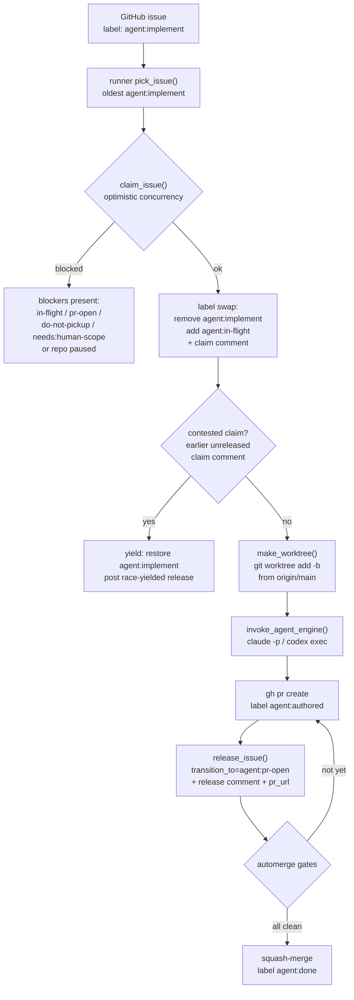
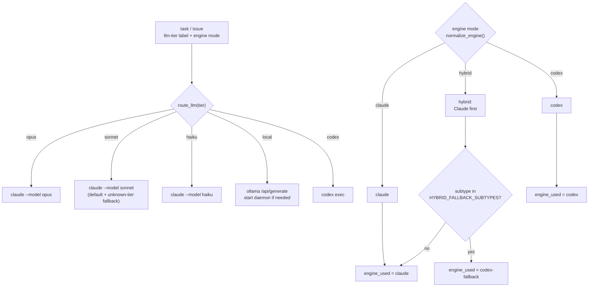
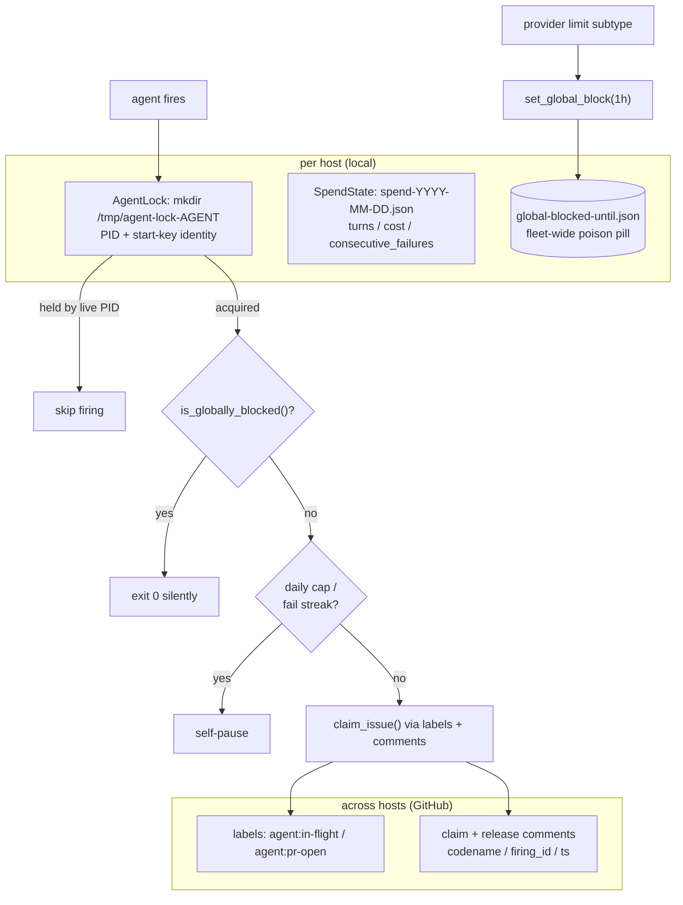
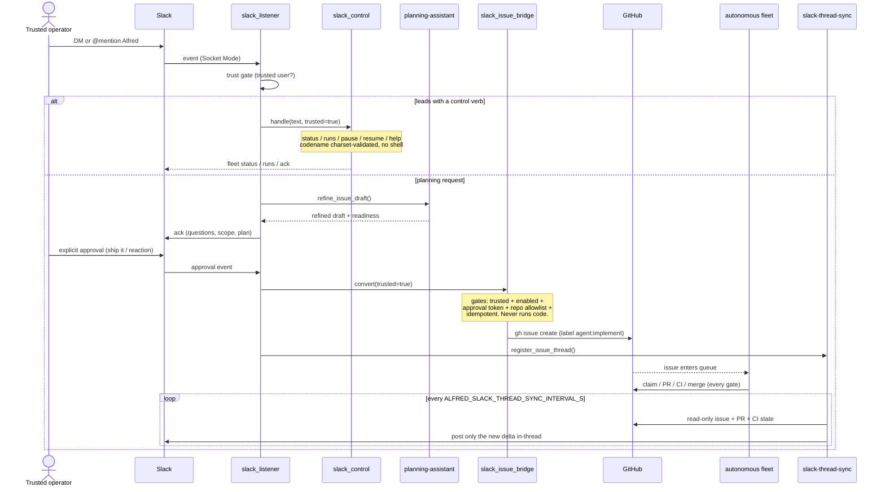
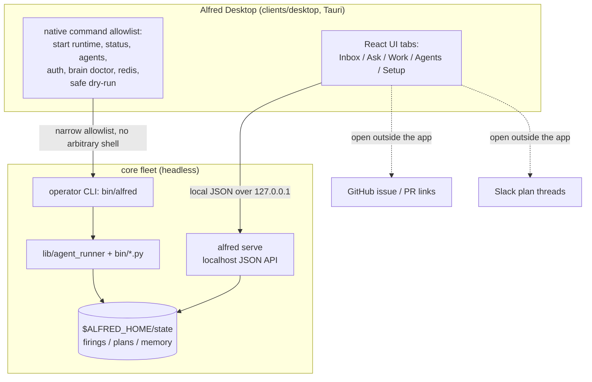
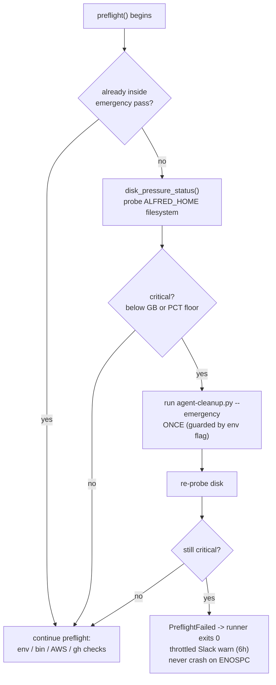
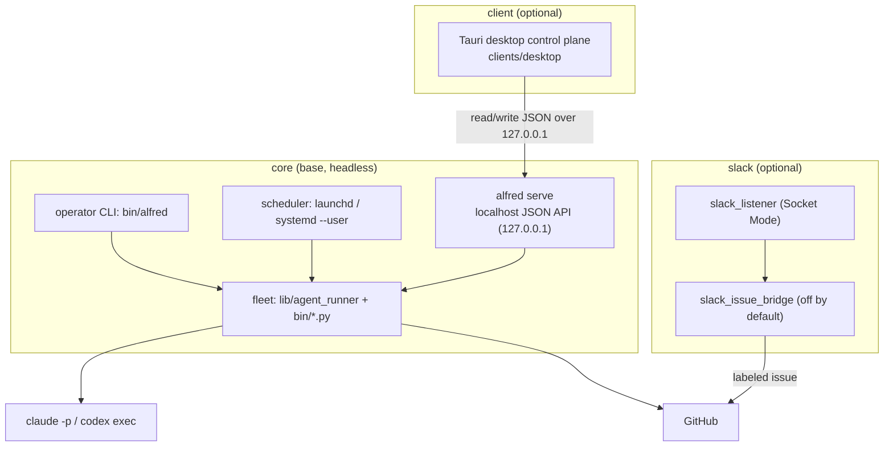
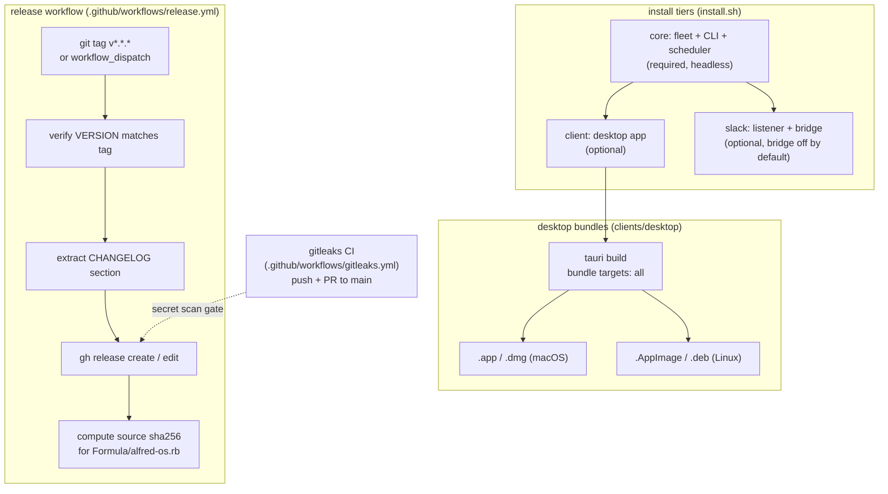

# Architecture diagrams

This is the diagram companion to the top-level [`../ARCHITECTURE.md`](../ARCHITECTURE.md). That doc explains *why* Alfred has the shape it has; this one shows *how* the moving parts connect, with one mermaid diagram per subsystem. Every diagram is traced from the code in `lib/agent_runner/`, `lib/slack_listener.py`, `lib/slack_issue_bridge.py`, and `bin/`.

If a diagram and the code ever disagree, the code wins. File references are inline so you can verify each box.

## Contents

- [Agent lifecycle](#agent-lifecycle): issue to merged PR.
- [Model dispatch and tiers](#model-dispatch-and-tiers): which engine runs a prompt.
- [Distributed locking](#distributed-locking): GitHub labels plus a local mkdir lock plus the global poison pill.
- [Slack conversational flow](#slack-conversational-flow): control commands, DM to labeled issue, and in-thread fleet progress.
- [Desktop control plane](#desktop-control-plane): the client to `alfred serve` to fleet seam.
- [Disk guardian](#disk-guardian): the ENOSPC back-off.
- [Layered install and distribution](#layered-install-and-distribution): tiers, desktop bundles, and the release workflow.

## Agent lifecycle

A firing turns a labeled GitHub issue into a PR, then the optional automerge agent gates it to merge. The claim step uses optimistic concurrency: the runner swaps labels and posts a structured claim comment, then re-reads the issue and yields if an earlier unreleased claim exists.

Code: `lib/agent_runner/github.py` (`claim_issue`, `release_issue`, `make_worktree`), `lib/agent_runner/process.py` (`invoke_agent_engine`), `bin/automerge.py` (`is_mergeable`).

The automerge gate is not a single boolean. `bin/automerge.py:is_mergeable` requires, in order: no unresolved reviewer threads, a review-agent main review whose body says `Ship-ready: yes`, the reviewed head SHA matches the current PR head, the review is newer than the latest commit, and no unresolved `P0` comment. PRs younger than `ALFRED_AUTOMERGE_MIN_AGE_MIN` (default 30 minutes) wait. Only `agent:authored` PRs in `ALFRED_AUTOMERGE_REPOS` are eligible, and the merge is a squash.

The claim is `release_issue`-symmetric: every claim comment is paired with a release comment carrying the same `codename`/`firing_id`. A crash that leaves a claim unpaired is recovered by `find_stale_claims` / `force_release_stale_claim` in the cleanup agent after `ALFRED_CLAIM_MAX_AGE_HOURS` (default 4).

## Model dispatch and tiers

Two orthogonal choices decide which CLI runs a prompt: the **tier** (which model) and the **engine mode** (Claude, Codex, or hybrid fallback).

The tier comes from an `llm-tier:<x>` label, read by `get_tier_from_labels` and dispatched by `route_llm` (`lib/agent_runner/orchestrator.py`). Unknown tiers fall back to `sonnet` so a label typo never takes an agent down. The `local` tier posts to a localhost Ollama daemon, starting it first if needed; the `codex` tier shells out to `codex exec`.

The engine mode is resolved by `agent_engine` (`lib/agent_runner/config.py`) from the precedence chain `ALFRED_<AGENT>_ENGINE` then an optional legacy env var then `ALFRED_ENGINE`, defaulting to `hybrid`. `invoke_agent_engine` (`lib/agent_runner/process.py`) returns `(result, engine_used)` where `engine_used` is one of `claude`, `codex`, or `codex-fallback`.

Hybrid means Claude first, Codex only on a fallback subtype. `HYBRID_FALLBACK_SUBTYPES` (`config.py`) is the provider-limit set (`error_budget`, `error_rate_limit`) plus the other transient failure subtypes. Codex does not expose Claude's allow-list, max-turn, or resume-session semantics, so `codex_invoke` rejects those kwargs rather than implying they were enforced; its default posture is a read-only sandbox with no approval prompts.

## Distributed locking

Alfred coordinates without a shared database. Three independent layers stop two firings, on one host or across hosts, from doing the same work.

- **Local mutex** (`lib/agent_runner/state.py:AgentLock`): a `mkdir` on `/tmp/agent-lock-<agent>` is atomic. The lock records PID plus a `ps lstart` start-key so a recycled PID cannot masquerade as the holder.
- **Cross-host claim** (`lib/agent_runner/github.py`): GitHub labels (`agent:in-flight`, `agent:pr-open`) plus structured claim/release comments are the shared state every host reads. This is what lets two machines run the same fleet against the same repos.
- **Global poison pill** (`state.py:set_global_block`): when a Claude-backed firing hits a provider limit, it writes `global-blocked-until.json`. Every other agent's `is_globally_blocked()` check at the top of `main()` then exits silently until the block expires.

The spend ledger (`state.py:SpendState`) is the per-agent per-day file the cap checks read: `turns_today`, `cost_usd_today`, `consecutive_failures`, and friends, auto-resetting at midnight via the per-day filename. The global block defaults to a one-hour window (`maybe_set_global_block_for_result`) and only trips for the `claude` engine, since Codex provider limits are handled as silent hybrid fallbacks instead.

## Slack conversational flow

Slack is a conversational surface for the fleet, not an approval mechanism for arbitrary code execution. A trusted user can do three things from chat, and the listener routes each one differently:

1. **Run a control or query command.** A message that *leads with a known verb* (`status`, `runs`, `pause <codename>`, `resume <codename>`, `help`) is handled by `slack_control.SlackControlHandler`. Read commands shell out to `alfred status --json`; mutating commands run the `alfred` CLI through an explicit argv with `shell=False` after the codename passes a strict charset check. Free-form prose never triggers an action.
2. **Plan and ship work.** A message *without* a leading verb is refined into a saved draft and scored for readiness. Only an explicit, trusted approval crosses the (off-by-default) bridge into a labeled GitHub issue, which the fleet picks up through every existing gate.
3. **Watch progress without leaving the thread.** Once the bridge files an issue, the originating thread is registered. The `alfred slack-thread-sync` sweep (or the listener's idle loop) reads the issue and its linked PR read-only and posts only the new lifecycle states back into that thread.

Code: `lib/slack_listener.py` (`SlackPlanningListener`), `lib/slack_control.py` (`SlackControlHandler`), `lib/slack_issue_bridge.py` (`SlackIssueBridge`), `lib/slack_thread_status.py` (`SlackThreadStatusTracker`), `bin/alfred-slack-thread-sync.py`.

Three safety properties are worth stating plainly because the code enforces them:

- **Control commands need an explicit leading verb and a trusted user.** `slack_control` only acts when the first token is a known verb; everything else falls through to planning intake. `pause`/`resume` accept exactly one codename, validated against `[A-Za-z0-9._-]` (never leading `-`) before it reaches the argv, so a chat message can never inject a flag or a second command. Queries are read-only. Trust is gated by the listener and re-checked in the handler.
- **The bridge is off by default.** `ALFRED_BRIDGE_ENABLED` is unset on a fresh install, so every approval is a no-op refine until the operator explicitly enables it and sets an `ALFRED_BRIDGE_REPOS` allowlist. An empty allowlist refuses to file anywhere.
- **The bridge never executes code.** `SlackIssueBridge.convert` only calls `gh issue create`. It opens no worktree, pushes no branch, spawns no agent. The worst a bug in the bridge can do is file an unwanted issue, which still cannot ship without passing the same claim, spend, review, and merge gates as any other issue. Five gates must all pass before an issue is created: trusted user, feature enabled, explicit approval token (`ship it` / `create issue` / `file issue` / `/ship`, or a `white_check_mark` reaction), saved readiness at or above `ALFRED_BRIDGE_MIN_READINESS_SCORE` with no blocking findings, and every target repo on the allowlist. The conversion is idempotent: a converted draft is stamped so it can never double-create.

The in-thread progress sweep is strictly read-only on GitHub (`gh issue view`, `gh pr list`/`pr view`) and write-only into the thread it already owns. It advances each thread through an ordered lifecycle (`filed`, `claimed`, `pr_open`, `ci_pass`/`ci_fail`, `merged`/`closed`) and posts each state at most once, so re-running a sweep with no GitHub change posts nothing. The idle-loop cadence is `ALFRED_SLACK_THREAD_SYNC_INTERVAL_S` (default 300 s; `0` disables the in-listener hook and leaves the standalone `alfred slack-thread-sync` entry point to run on its own schedule).

The planning-assistant refinement is LLM-backed only when `ALFRED_PLANNING_ASSISTANT_ENGINE` is set (via `engine_refiner_from_env`); otherwise it falls back to a deterministic heuristic refiner. Either way the output is a scored draft with concrete missing-scope questions, never an executed action. When `ALFRED_INTAKE_PROFILE=plain` is set, the same structured draft is produced but the conversational surface drops all jargon (see [`PLAIN_MODE.md`](PLAIN_MODE.md)).

## Desktop control plane

Alfred Desktop (`clients/desktop`) is a Tauri app and the optional `client` tier. It is a thin local control surface, not a second runtime: it reads the fleet's own state over the `alfred serve` JSON API and runs a narrow set of safe local actions through a native command allowlist. There is no hosted gateway, no public port, and no shadow database.

Code: `clients/desktop/src/` (React UI, `api.ts`, `types.ts`), `clients/desktop/src-tauri/` (Tauri shell + native command allowlist), `lib/server/` (`alfred serve`).

The boundary is enforced in the Tauri layer, not just by convention. The fetch command only allows Alfred JSON API paths on `http://localhost`, `http://127.0.0.1`, or `http://[::1]`; local plans and firing traces stay in native inspector panes, while explicit Slack and GitHub links open *outside* the app through Tauri's opener plugin. State-changing controls use a narrow native allowlist (start the runtime, run fleet/auth/agent/memory/Redis checks, safe agent dry-runs, pause/resume/run, and local follow-up planning) and surface command audit detail with the result. There is no arbitrary shell execution. See [`NATIVE_CLIENT.md`](NATIVE_CLIENT.md) and [`SERVE.md`](SERVE.md) for the full client and API contracts, and [`DESKTOP_CLIENT.md`](DESKTOP_CLIENT.md) for the tab-by-tab control surface and how to build native installers.

## Disk guardian

Scheduled agents write worktrees, transcripts, and ledgers every firing. When the disk fills, the next `claude` / `codex` call hits `ENOSPC` and the scheduler crash-loops, burning a turn per tick. The guardian makes preflight back off cleanly instead of crashing.

Code: `lib/agent_runner/disk.py` (`disk_pressure_status`), `lib/agent_runner/orchestrator.py` (`_disk_preflight_gate`, `_run_emergency_cleanup`), `bin/agent-cleanup.py --emergency`.

The probe is `critical` only when free space is below the absolute floor (`ALFRED_MIN_FREE_DISK_GB`, default 3.0 GB). That floor is the real ENOSPC guard. The relative floor (`ALFRED_MIN_FREE_DISK_PCT`, default 5%) is advisory only: it feeds the `low` early-warning band (and the throttled Slack heads-up) but never forces a back-off on its own, because a low percent on a large disk can still leave ample absolute headroom. On a critical reading the gate runs `agent-cleanup.py --emergency` exactly once, guarded by the `ALFRED_DISK_EMERGENCY_IN_PROGRESS` env flag so the cleanup agent's own preflight cannot recurse into a second pass. After cleanup it re-probes: if space recovered, the firing proceeds; if not, it raises `PreflightFailed`, which every runner already catches and turns into `sys.exit(0)`. The Slack warning is throttled to once per `ALFRED_DISK_SLACK_MIN_HOURS` (default 6h). The probe fails open: any `OSError` reading the filesystem reports a healthy status, so a transient stat hiccup can never wedge the fleet into a permanent skip.

## Layered install and distribution

Alfred installs in tiers. `core` is the standalone base and runs headless; `client` and `slack` are optional surfaces that talk to core through seams the operator can inspect by hand.

- **`core`** is the fleet (`lib/agent_runner/` plus the `bin/*.py` runners), the operator CLI (`bin/alfred`), the host scheduler (launchd on macOS, `systemd --user` on Linux), and `alfred serve`, a localhost JSON API over `$ALFRED_HOME/state`. Core is headless and Linux-friendly: nothing here needs a desktop, a browser, or Slack. This is the only tier you must install.
- **`client`** is the Tauri desktop control plane under `clients/desktop`: fleet service control, a command center, plan/run/memory views, and safe local actions. It is a thin control plane, not a second runtime. It talks to core over the `alfred serve` JSON seam, restricted to `http://localhost` / `http://127.0.0.1` / `http://[::1]` and a fixed set of read paths plus a narrow native command allowlist. Run Alfred with or without it.
- **`slack`** is the planning listener plus the issue bridge. The listener (`lib/slack_listener.py`) runs in Socket Mode; the bridge (`lib/slack_issue_bridge.py`) is off by default and only ever files a labeled issue. The `serve` extra (`pip install 'alfred-os[serve]'`) pulls in FastAPI and uvicorn for `alfred serve`; `slack-sdk` and `boto3` are in the base install since v0.4.0.

The boundary matters: Alfred Desktop and any future surface read and write the same `$ALFRED_HOME` state, GitHub, and Slack threads the operator can inspect directly. There is no hosted gateway, no public port, and no shadow database. See [`INSTALL_TIERS.md`](INSTALL_TIERS.md) for how to install each tier and [`NATIVE_CLIENT.md`](NATIVE_CLIENT.md) and [`SERVE.md`](SERVE.md) for the client and API contracts.

Distribution follows the same shape. The fleet and CLI install from source; Alfred Desktop builds native installers; tagged releases are published from CI; and a secret scan gates every push.

- **Desktop bundles.** `clients/desktop/src-tauri/tauri.conf.json` builds `.app` and `.dmg` on macOS, plus `.AppImage` and `.deb` on Linux. CI builds the client with `--no-bundle` to prove the binary compiles without requiring code signing or packaging. Releases publish a signed and notarized macOS DMG and app zip, plus Linux AppImage and Debian artifacts (see [`DESKTOP_CLIENT.md`](DESKTOP_CLIENT.md)).
- **Tag-triggered release.** `.github/workflows/release.yml` runs on a `v*.*.*` tag (or `workflow_dispatch`). It verifies the tag matches the `VERSION` file, extracts the matching `CHANGELOG.md` section as release notes, creates or edits the GitHub Release, and prints the source-tarball `sha256` for the Homebrew formula (`Formula/alfred-os.rb`).
- **Secret-scan gate.** `.github/workflows/gitleaks.yml` runs the free gitleaks binary (no org license needed) on every push and PR to `main`, scanning full history with `.gitleaks.toml`. The same scan runs on the internal repo, so nothing with a leaked secret reaches a release.

## Where to go next

- [`../ARCHITECTURE.md`](../ARCHITECTURE.md): the design rationale behind every diagram here.
- [`STATE_MACHINE.md`](STATE_MACHINE.md): the claim/release state machine in full, including stale-claim recovery.
- [`ENGINE_ROUTING.md`](ENGINE_ROUTING.md): per-codename engine selection and the precedence chain.
- [`SLACK_UX.md`](SLACK_UX.md) and [`SLACK_APPROVAL.md`](SLACK_APPROVAL.md): the Slack message contract and the reaction approval gate.
- [`SLACK_SETUP.md`](SLACK_SETUP.md): control commands, thread-sync, and the issue bridge setup.
- [`DESKTOP_CLIENT.md`](DESKTOP_CLIENT.md): the desktop control surface and how to build native installers.
- [`PLAIN_MODE.md`](PLAIN_MODE.md): the non-technical intake profile.
- [`INSTALL_TIERS.md`](INSTALL_TIERS.md): the three install tiers and what each one needs.
