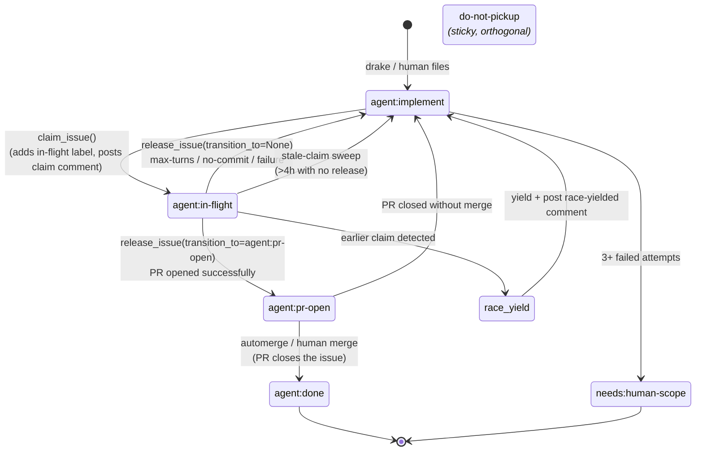

# Issue claim state machine

Cooperative cross-actor coordination for the agent fleet: the primitive that prevents two actors (any agent, any operator) from doing the same work twice on the same GitHub issue.

The state machine is implemented entirely on GitHub: labels carry the lifecycle state, structured HTML comments carry the audit trail. No shared database, no shared filesystem, no Slack lock: Alfred is single-host but the contract works the same way if you ever spread the fleet across machines, because GitHub is the synchronisation point.

## Lifecycle



## Lifecycle labels

| Label | Meaning | Set by | Cleared by |
|---|---|---|---|
| `agent:implement` | Eligible for autonomous pickup | the consumer's planner agent (or human) | next state transition |
| `agent:in-flight` | An agent is actively working it | `claim_issue()` before worktree | `release_issue()` on exit |
| `agent:pr-open` | A PR exists for this issue | `release_issue(transition_to="agent:pr-open")` | merge / close |
| `agent:done` | Closed and shipped | external (PR merge handler) | n/a |

At most one of those four is set on any issue at a time.

## Sticky modifiers (orthogonal)

| Label | Meaning |
|---|---|
| `do-not-pickup` | Operator override; agents must skip this issue regardless of any other label |
| `needs:human-scope` | Issue is too vague for autonomous work; not eligible for pickup |
| `agent:plan-pending-approval` | Operator-approval gate; the plan is filed but held from autonomous pickup until the operator approves it |

These can coexist with any lifecycle label.

A planned single-repo issue is filed carrying `agent:plan-pending-approval`. That
label is the blocker: `agent:plan-pending-approval` is in
`PICKUP_BLOCKING_LABEL_SET` in [`lib/labels.py`](../lib/labels.py), so
`pickup_blocking_labels()` reports it. In `decide_assignment`
([`lib/issue_assignment.py`](../lib/issue_assignment.py)) the gate label is kept
as a blocker (unlike `do-not-pickup`, `agent:large-feature`, and bundle labels,
which assignment deliberately discards), so any issue holding it routes to
`ROUTE_BLOCKED` with the reason `blocked from autonomous pickup by label(s):
agent:plan-pending-approval`. The issue is never auto-assigned and the dev agents
keep skipping it while the label is present. The operator clears the gate by
approving the plan (the planner files it with the label; approval removes the
label), and only then does the issue become eligible for pickup.

This is the single-repo counterpart to Batman's multi-repo approval, but the two
use different approval surfaces. A multi-repo Batman bundle parent also carries
`agent:plan-pending-approval` and waits on the operator's Slack approval reaction;
the parent's label is removed once that reaction lands. The bundle's sibling
child issues do not carry the gate label. Either way, nothing planned ships
without an operator go-ahead.

## Claim comments

Every `claim_issue` and `release_issue` call posts a structured HTML comment so the audit trail survives even if the lifecycle label is later stripped or replaced manually:

```
<!-- agent-claim:codename=lucius firing_id=20260501-194217-643a ts=2026-05-01T19:42:33Z -->
<!-- agent-release:codename=lucius firing_id=20260501-194217-643a outcome=success pr=https://github.com/foo/bar/pull/42 ts=2026-05-01T20:08:11Z -->
```

The comments are how `find_stale_claims()` decides who currently holds an in-flight claim and how old that claim is, without depending on label-event timestamps (which require an extra API call).

## Race resolution

`claim_issue()` reads the current label set, atomically adds `agent:in-flight` + posts the claim comment, then re-reads recent comments to detect any unreleased earlier claim. If an earlier claimant exists, the loser backs out cleanly:

1. Removes its own `agent:in-flight` label
2. Restores `agent:implement`
3. Posts a `release` comment with `outcome=race-yielded-to=<earlier_codename>:<earlier_firing_id>`

The earlier claimant keeps the issue. The loser exits the firing without burning a Claude turn on duplicate work.

## Stale-claim sweep

A runner crashing between claim and release would normally leave an issue blocked indefinitely. `find_stale_claims()` reads claim comments and surfaces any in-flight claim with no matching release after `max_age_hours`. `force_release_stale_claim()` then transitions the issue back to `agent:implement` so the queue picks it up again.

Wire it into your fleet's daily cleanup runner. The shipped `examples/bin/label_state.py` exposes this as `label-state sweep-claims [--max-age-hours N] [--dry-run]`.

## Operator overrides

Two ways to take an issue manually without racing an agent:

1. **`label-state claim <repo>#<N>`**: adds `do-not-pickup`. Agents skip it. Reverse with `label-state release <repo>#<N>`.
2. **`label-state repo pause <repo>`**: adds the repo to the pause list. Every consumer's `pick_*` helper skips paused repos. Reverse with `label-state repo resume <repo>`.

The pre-push hook in `examples/git-hooks/pre-push` enforces this symmetrically: if you push a branch whose commits reference `Closes #N` and that issue is currently in-flight or has a PR open, the push is refused.

## Repo pause file

`set_repo_paused()` writes to `${ALFRED_HOME}/state/paused-repos.json`:

```json
{"paused": ["my-backend-repo", "experimental-prototype"]}
```

`is_repo_paused(slug)` reads this file. Missing or unparseable file is treated as "no repos paused" (fail-open).

## API surface (in `agent_runner`)

```python
# State transitions
claim_issue(repo, num, *, codename, firing_id) -> bool
release_issue(repo, num, *, codename, firing_id,
              outcome="success", transition_to=None, pr_url=None) -> bool

# Inspection
issue_dedup_check(repo, num) -> dict
find_stale_claims(repo, *, max_age_hours=4) -> list[dict]

# Recovery
force_release_stale_claim(repo, num, *, sweep_id,
                          released_codename=None,
                          released_firing_id=None) -> bool

# Operator overrides
is_repo_paused(repo) -> bool
list_paused_repos() -> list[str]
set_repo_paused(repo, paused) -> list[str]

# Constants
LIFECYCLE_LABELS: list[tuple[str, str, str]]   # name, color, description
CLAIM_COMMENT_PREFIX: str
RELEASE_COMMENT_PREFIX: str
PAUSED_REPOS_FILE: Path
```

## Wire-up checklist

1. In every agent runner, between `pick_issue()` and `make_worktree()`:

   ```python
   if not claim_issue(repo, issue_num, codename=AGENT, firing_id=events.firing_id):
       print(f"[{AGENT.upper()}-DEDUP-SKIP] #{issue_num} already claimed / paused")
       return 0
   ```

2. On every exit path of the agent runner (success, no-commit, max-turns, rate-limit, error), call `release_issue` with an appropriate `outcome`. On PR-open success, pass `transition_to="agent:pr-open"`.

3. In your fleet's daily cleanup runner, add a sweep across the engineering repos:

   ```python
   for repo in CLEANUP_SWEEP_REPOS:
       for entry in find_stale_claims(repo, max_age_hours=4):
           force_release_stale_claim(
              repo,
              entry["number"],
              sweep_id=sweep_id,
              released_codename=entry.get("codename"),
              released_firing_id=entry.get("firing_id"),
          )
   ```

4. Bootstrap the labels on each repo before the fleet starts claiming issues:

   ```sh
   alfred labels check --all
   alfred labels bootstrap --all
   ```

   `--all` reads the configured fleet repo env vars and deduplicates them.
   Pass a single repo slug when bringing one new repo online.

5. Use the shipped `bin/alfred-label-state.py` as the operator command surface. `deploy.sh` copies it to `$ALFRED_HOME/bin/` so it's available alongside the other `alfred-*` binaries. The subcommand surface:

   ```sh
   alfred-label-state claim       <repo>#<N> [--force]
   alfred-label-state release     <repo>#<N>
   alfred-label-state dedup-check <repo>#<N> [--json]
   alfred-label-state status-issue <repo>#<N> [--json]
   alfred-label-state repo        {pause,resume,list} [<repo>]
   alfred-label-state sweep-claims [--max-age-hours N] [--repo <name>] [--dry-run]
   ```

   `sweep-claims` reads the comma-separated `LABEL_STATE_SWEEP_REPOS` env var for its default repo set. No hardcoded repo names; supply your own.

6. Install the `examples/git-hooks/pre-push` hook into every repo your operator touches manually:

   ```sh
   ln -s "$LABEL_STATE_HOOKS/pre-push" .git/hooks/pre-push
   ```

## Source-of-truth label constants

Every label string in this state machine lives in [`lib/labels.py`](../lib/labels.py). Import from there rather than duplicating string literals:

```python
from labels import (
    IMPLEMENT,             # "agent:implement"
    IN_FLIGHT,             # "agent:in-flight"
    PR_OPEN,               # "agent:pr-open"
    DONE,                  # "agent:done"
    DO_NOT_PICKUP,         # "do-not-pickup"
    NEEDS_HUMAN_SCOPE,     # "needs:human-scope"
    PLAN_PENDING_APPROVAL, # "agent:plan-pending-approval"
    AUTHORED,              # "agent:authored"
    LARGE_FEATURE,         # "agent:large-feature"
    bundle_label,          # builds "agent:bundle:<slug>"
    is_legal_transition,   # documents the state-machine moves
)
```

`labels.py` also exports the framework label definitions (`LIFECYCLE_LABEL_DEFS`) used by `ensure_labels()` to create missing labels on a fresh repo. If you need to change a label string, change it once in `labels.py` and the rest of the fleet follows.

## Cross-repo PR chains and worktrees

For multi-repo features (one issue, N PRs across N repos), `alfred-os` ships:

- **`lib/multi_worktree.py`** — `MultiWorktree(requests, agent, feature_id)` context manager that creates per-repo git worktrees with synchronised branch names and cleans them up on exit. Git interaction is injected via a `GitRunner` Protocol so tests don't touch real worktrees.
- **`lib/cross_repo_pr.py`** — `CrossRepoPRChain` plan/execute coordinator. `chain.plan(...)` returns a `Plan` dataclass (pure, no I/O); `chain.execute(plan)` opens each PR, persists state to `$ALFRED_HOME/state/pr-chains/<feature_id>.json` atomically, and refreshes earlier PR bodies as later siblings open so the cross-links stay current.

Both modules use Protocol-based dependency injection so consumers can swap the default subprocess implementation for tests or alternative GitHub clients.
