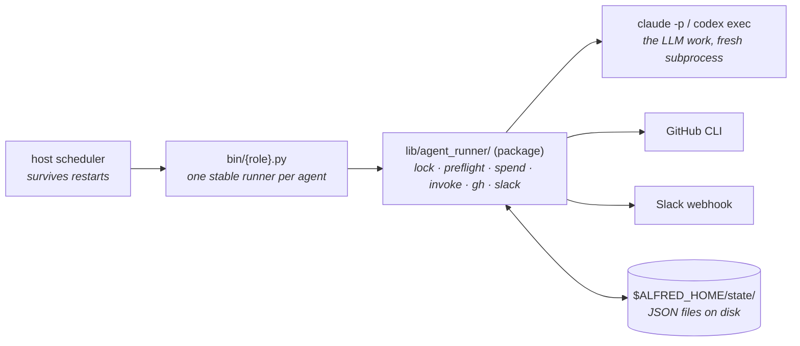
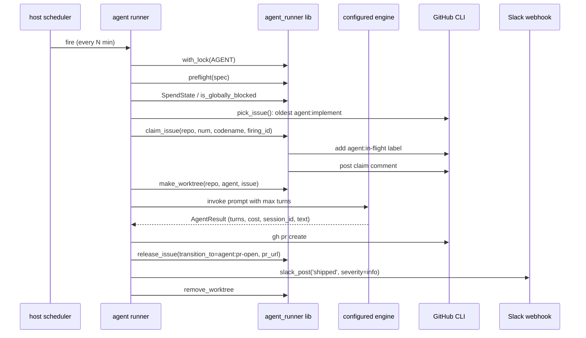
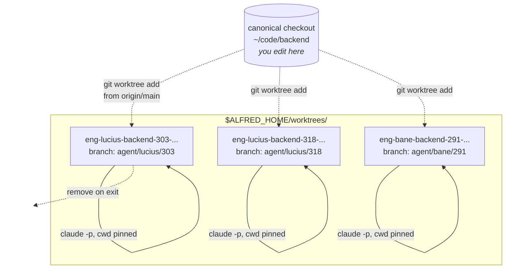
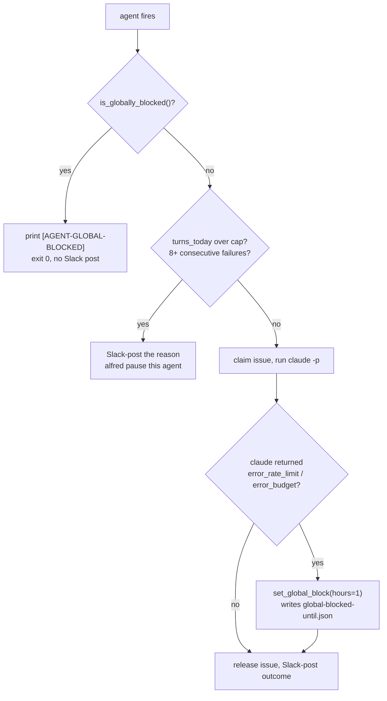

Full design doc at [`ARCHITECTURE.md`](https://github.com/luminik-io/alfred-os/blob/main/ARCHITECTURE.md). The diagram companion, with mermaid diagrams for the agent lifecycle, model dispatch and tiers, distributed locking, the Slack-native flow, the [disk guardian](/concepts/disk-guardian/), and the [layered install](/concepts/layered-install/), is [`docs/ARCHITECTURE.md`](https://github.com/luminik-io/alfred-os/blob/main/docs/ARCHITECTURE.md). This page is the executive summary.

## The runtime boundary

Alfred uses `ALFRED_HOME` as its runtime root. A fresh install defaults to `~/.alfred`. The core loop is four hops, and every box outside the host is reached by a stdlib subprocess or an HTTP call. There is no persistent connection and no long-lived process.



Alfred keeps operational state in plain JSON files under `$ALFRED_HOME/state/`,
uses FleetBrain for local review and reliability rows, and uses a loopback
Redis Agent Memory Server for recalled lessons. No SQS, Postgres, hosted memory
database, or external agent gateway is required.

## One firing, end to end

A single Lucius firing is the canonical trace. Every richer codename is a variation on this shape.



If a firing crashes anywhere in that trace, the next firing starts clean: it reads its inputs from scratch and `make_worktree` prunes any orphaned worktree first. There is no resume protocol to debug.

## Five non-negotiables

### 1. Host scheduler, not loops

Every agent firing is a fresh scheduler event, not a tick in a long-running process. Trade-offs:

- ✅ Failure isolation. A crashing firing doesn't poison the next one.
- ✅ OS-level reliability. Reboots, system updates, sleep cycles. `launchd` or `systemd --user` handles all of them.
- ✅ Per-firing observability. Stdout/stderr to per-agent files; normal grep-and-tail muscle memory works.
- ❌ No in-process state. Anything an agent needs to remember between firings goes through `$ALFRED_HOME/state/<agent>/*.json`.
- ❌ Cold start cost. ~1-2s of Python import + agent_runner setup per firing. Acceptable at the 20-min cadence.

`ALFRED_HOME` is the runtime root. The core loop is `host scheduler -> bin/role.py ->
lib/agent_runner/ -> configured engine / gh / slack`. Optional companion tools can
observe Alfred or read its exported state, but they are not part of the runtime
contract.

`lib/agent_runner/` is internally split into nine focused submodules
(`paths`, `config`, `process`, `result`, `transcripts`, `metadata`, `notify`,
`state`, `github`) plus a thin `orchestrator` that owns preflight + LLM
tier routing. Every public name is re-exported from the package's
`__init__.py`, so `from agent_runner import preflight, make_worktree,
slack_post` keeps working unchanged. See `ARCHITECTURE.md` for the
per-submodule responsibilities.

### 2. Per-firing git worktree isolation

Every `claude -p` invocation gets its own worktree:

```
~/.alfred/worktrees/eng-<codename>-<repo>-<issue>-<ts>/
```

The worktree is created via `git worktree add` from a fresh `origin/main` (or whatever the agent designates), and `git worktree remove --force` after. Concurrent firings on different issues do not see each other's edits. A crashed firing can't corrupt your main checkout because they're separate directories pointing at different branches.



Three Lucius firings against three issues create three worktrees and three branches. None can `git push` to another firing's branch, and none can edit a file you are actively editing in the canonical checkout. The worktree is removed at the end of the firing, success or failure.

### 3. Per-agent IAM

Every agent that touches AWS gets its own scoped IAM user:

```
<your-codename>-cron read-only on the agent's specific secrets (test creds, webhooks, etc.)
gordon-cron         read-only on ECS, ALB, CloudWatch logs/metrics, plus the Sentry token
alfred-host         read-only on alfred/* secrets (catch-all for fleet-wide config)
```

Your admin SSO is never used by scheduled agents. AWS-aware runners read role-specific variables such as `ALFRED_GORDON_AWS_PROFILE`, strip inherited `AWS_*` credentials, and set `AWS_PROFILE` only around the AWS subprocess they own.

See [AWS setup](/guides/aws/) for templates.

### 4. Spend caps + fleet-wide provider-limit block

Two layers:

- **Per-agent per-day caps** in `SpendState(AGENT)`. Tracks turns, cost, success rate. Each agent's runner enforces its own ceiling and self-pauses if exceeded.
- **Fleet-wide provider-limit block.** When a Claude-backed agent hits `error_rate_limit` or `error_budget`, it calls `set_global_block(hours=1, reason=...)`. Every other agent's `is_globally_blocked()` check at the top of `main()` exits silently for the next hour. Stops the stampede.



The wall hit by Lucius at 22:46 silences Bane's nightly run, Gordon's morning brief, and Huntress's next smoke until the block expires. Without it, the whole fleet would spend the next hour firing into the rate-limit wall and burning turns to learn the wall is still there.

### 5. Codename pattern

One agent script per narrow specialist. Named after a coherent fictional cast. The shipped examples use Batman side-characters: Batman, Lucius, Drake, Bane, Rasalghul, Robin, Nightwing, Huntress, Gordon.

Two reasons it matters:

1. **Operational legibility.** Codenames appear in PR titles, Slack messages, commit-trailer metadata. A coherent cast makes scanning your `#fleet` channel readable.
2. **Design forcing function.** "What does Bane do?" is a sharper question than "what does the test agent do?". Narrow scopes per codename force you to decide.

See [codename pattern](/concepts/codename-pattern/) for more.

## What this rules out

- Multi-tenant deployments. Alfred is a single-person install by design.
- Long-running orchestration loops. The OS scheduler is the orchestrator.
- Hosted LLM gateway. Alfred has local CLI engine adapters and simple per-agent engine selection; it does not run inference for you.
- Browser automation runtimes. If your fleet needs Playwright, install it in the codename's bin script.
- Hosted memory databases. Alfred ships local Redis Agent Memory for recalled
  lessons and keeps FleetBrain on the host for review and reliability state.
- Anything Anthropic ships natively (Agent Teams, Memory Tool). When those mature, lean on them rather than re-implementing.

## What this enables

- **Parallel codename agents on a single host**, each with its own IAM, spend cap, and Slack reporting, none stepping on the others.
- **The whole fleet pausable in seconds** through `alfred pause`, backed by launchd on macOS and systemd on Linux.
- **Reboot survival**. Host restart, WiFi flap, gh API outage: the fleet picks up where it left off on the next firing.
- **Cooperative coordination via GitHub** (the [issue claim state machine](/concepts/state-machine/)): no shared database, no shared filesystem, just labels + structured comments.

## Read order for new contributors

1. [`ARCHITECTURE.md`](https://github.com/luminik-io/alfred-os/blob/main/ARCHITECTURE.md): full doc
2. [`lib/agent_runner/`](https://github.com/luminik-io/alfred-os/tree/main/lib/agent_runner): package docstring + per-submodule responsibilities
3. [`examples/bin/echo_summarise.py`](https://github.com/luminik-io/alfred-os/blob/main/examples/bin/echo_summarise.py): the smallest "real" agent showing the full pattern
4. [`docs/STATE_MACHINE.md`](https://github.com/luminik-io/alfred-os/blob/main/docs/STATE_MACHINE.md): the cooperative coordination primitive
5. [`examples/bin/`](https://github.com/luminik-io/alfred-os/tree/main/examples/bin): small runnable agents you can copy into a fleet
