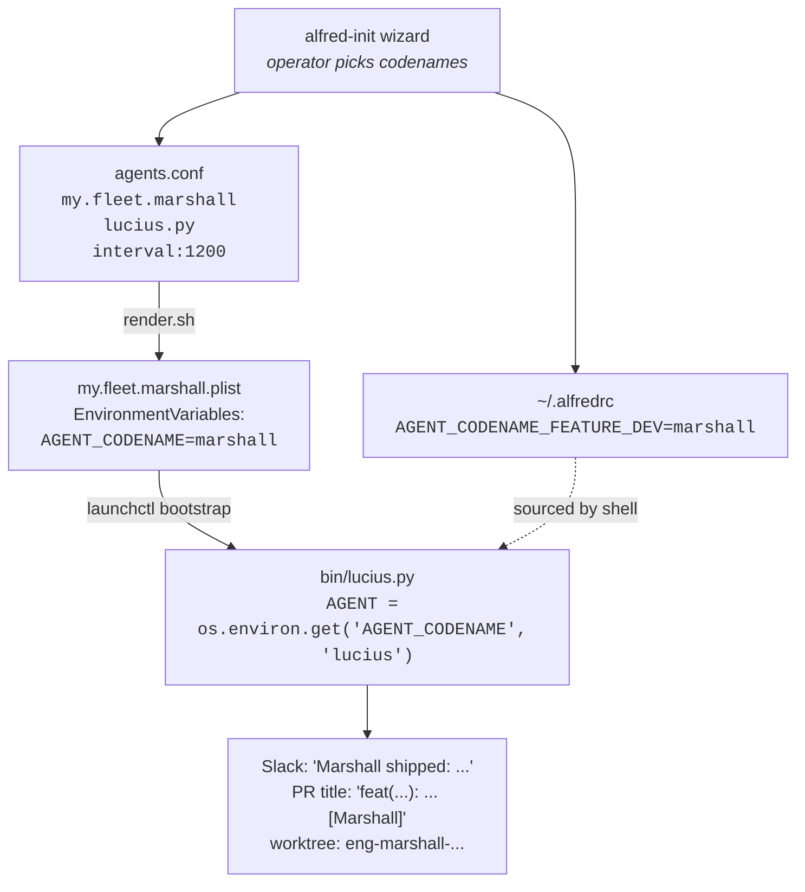

Alfred expects one agent script per narrow specialist, named after a coherent fictional cast, coordinating via labels + GitHub state, not in-process calls.

## What "narrow specialist" means

One codename agent, one job, 150-300 lines:

| Codename (Batman cast) | Single job |
|---|---|
| **Lucius** (Lucius Fox) | Pick the oldest `agent:implement` issue, claim it, ask Claude to implement, push a branch, open a PR. |
| **Drake** (Tim Drake) | Read specs + roadmap + code-reality grep, file the next well-scoped `agent:implement` issue. |
| **Bane** | Pick the lowest-coverage actively-changed file, write tests, open a PR. |
| **Ra's al Ghul** | Multi-axis review on every fresh PR. |
| **Nightwing** | Apply P0/P1 reviewer comments on `agent:authored` PRs. |
| **Robin** | Triage new bug-report issues; classify severity, ask for repro info. |
| **Huntress** | Post-deploy E2E smoke against staging. |
| **Gordon** | Daily ECS drift + Sentry top-N read. |
| **Alfred** | Cross-repo coordinator for features that span multiple repos. |
| **Bat-Signal** | Slack notifier for the other agents. |

What the pattern is not:

- Not "one agent does everything". A single Lucius doing feature dev + tests + review + triage + smoke would be unmaintainable, prompt-engineering hell.
- Not "the smallest possible unit of work per agent". A separate codename for "create branch", "commit", "push" is surgery for the sake of it.

The right granularity is one human role. If you'd hire a junior to do this job and review their work, it's a codename.

## Why a fictional cast

Two reasons.

### Operational legibility

Codenames show up in:

- PR titles (`feat(events): add nullable cost column [Lucius]`)
- Commit trailers (`Agent-Codename: lucius`)
- Slack messages (`✅ Lucius shipped: <url>`)
- Issue labels (`lucius-attempt-1`, `lucius-pr-open`)
- Worktree paths (`~/.alfred/worktrees/eng-lucius-backend-303-...`)
- Logs (`/tmp/my.fleet.lucius.stdout`)

If your cast is "agent-1 / agent-2 / agent-3" or "feature-dev / test-coverage / review", scanning the firehose becomes laborious. A coherent fictional cast (Batman, Greek mythology, The Wire) makes "Lucius failed on #303" instantly readable.

### Design forcing function

"What does Bane do?" is a sharper question than "what does the test agent do?". Naming the role after a character (with a personality, a domain, relationships to other characters) forces you to decide:

- What's Bane's scope? Brute-force test coverage on changed files. Not unit-test design philosophy.
- What does Bane never do? Never modifies non-test files. Never opens an architecture issue.
- How does Bane interact with the others? Bane's PRs go through Ra's al Ghul like any other PR. Bane consumes from the same `agent:implement` queue Lucius does, but only files labelled `test-coverage`.

Without the codename, "the test agent" tends to creep: "well, while it's there, it could also lint... and run a security scan...". With the codename, the answer is "no, that's not Bane. Bane writes tests."

## Pick your own cast

The shipped examples use Batman side-characters because the original operator liked Batman. Pick anything coherent:

- **Greek pantheon**: Athena (planner), Hephaestus (feature dev), Hermes (notifier), Asclepius (deploy health).
- **The Wire**: Bunk (review), McNulty (triage), Omar (security audit), Lester (bug investigation).
- **Tolkien**: Aragorn, Legolas, Gimli, Gandalf. Watch lore consistency (Gandalf shouldn't review Frodo's PR).
- **Your favourite anime, novel, podcast, board game.** All work.

Constraints:

- ASCII-safe names (used in filenames, label slugs, gh CLI args). `rasalghul` not `Ra's al Ghul`.
- ~10 characters max. Long codenames pollute Slack scrolling.
- Pronounceable. The operator is going to say "Lucius shipped #303" out loud at some point.
- Consistent across the fleet. Don't mix Batman + Star Wars; pick one universe.

## The wiring

Each codename has:

- **A bin script**: `bin/<role>.py`. Imports from `agent_runner`. ~150-300 lines.
- **A launchd entry**: one line in `launchd/agents.conf` (label, script, schedule, java flag).
- **(Optional) A prompt file**: `prompts/<role>.md` in this repo or `$ALFRED_HOME/prompts/<codename>.md` in your fleet. Long-form context the runner inlines into `claude -p`.
- **(Optional) An IAM identity**: if it touches AWS. See [AWS setup](/guides/aws/).
- **A row in your fleet's CLAUDE.md** documenting role + trigger + scope.

The role implementation lives in `bin/<role>.py` (the filename never changes). The operator-chosen codename flows in at runtime through the launchd plist:

Rename `lucius` to `marshall` and the bin script stays `lucius.py`; only the runtime codename in Slack messages, PR titles, log paths, worktree paths, and claim comments changes.

[Tutorial](/getting-started/tutorial/) for an end-to-end build of one codename. The [agent fleet](/concepts/fleet/) page maps the default cast and how the roles hand work to each other.

## Anti-patterns

- **Generic codenames**: "agent-1", "feature-bot", "the planner". The cast disappears as a forcing function; prompts bloat.
- **Code-named-after-tools**: "lucius-grpc", "bane-pytest". Couples the codename to the implementation; can't refactor the tool without renaming the role.
- **Cross-cast mixing**: Lucius (Batman) + Hermes (Greek) + Bunk (The Wire). Chaotic in Slack.
- **One codename per repo** instead of per role: "backend-bot", "frontend-bot". Loses the role-as-narrow-specialist forcing function.
- **Codename as adjective**: "smart-lucius", "fast-lucius". The codename is the specialist; modifiers don't add anything.
