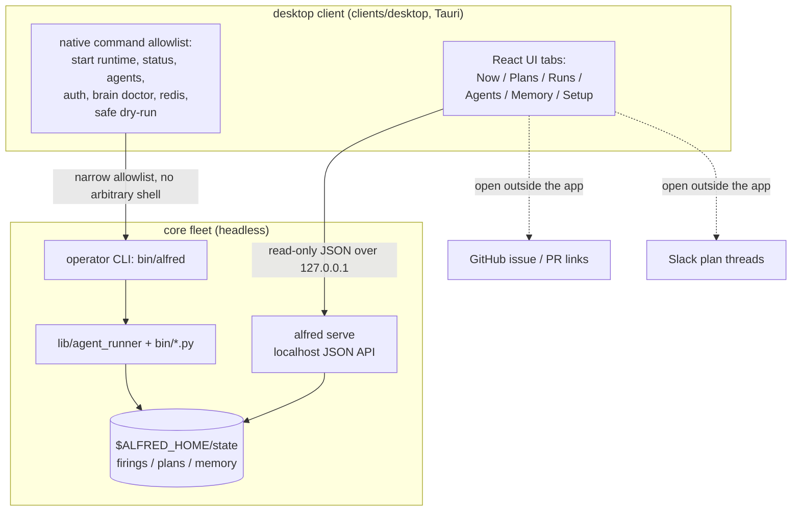

The Alfred desktop client (`clients/desktop`) is a native Mac/Linux control
plane for a local install. It is the optional `client` tier of the
[layered install](/concepts/layered-install/): the core fleet and CLI run fully
standalone without it.

Slack stays Alfred's collaboration surface. The desktop app is for local trust
and repair: what needs attention, which plans are waiting, why a run failed,
which memory candidates are ready, and which local actions are safe to run next.
It is a thin control plane, not a second runtime.

Design note and run commands: [`docs/DESKTOP_CLIENT.md`](https://github.com/luminik-io/alfred-os/blob/main/docs/DESKTOP_CLIENT.md) and [`docs/NATIVE_CLIENT.md`](https://github.com/luminik-io/alfred-os/blob/main/docs/NATIVE_CLIENT.md).

## The control plane



## Tabs

| Tab | Job |
|---|---|
| Now | The decision queue: repeated failures, blocked plans, follow-ups, memory candidates. |
| Plans | Plan state and origin (local form, Slack DM, app mention, registered thread), affected repos, PR chain; convert a follow-up to a draft or mark it handled. |
| Runs | Firing timelines, summaries, engine context, worktree path, issue and PR links. |
| Agents | Per-agent status and safe dry-runs. |
| Memory | Review candidates, recalled planning hints, memory doctor, Redis check. |
| Setup | Start the local runtime and run fleet/auth/agent/memory checks in-app. |

## Boundary

The client reads and writes the same local surfaces an operator can inspect by
hand: `$ALFRED_HOME`, `alfred serve`, the operator CLI, GitHub issue and PR
links, Slack plan threads, and the local fleet brain. It introduces no hosted
gateway, public port, shadow database, or separate scheduler.

The boundary is enforced in the Tauri layer. The fetch command only allows
read-only Alfred JSON API paths on `http://localhost`, `http://127.0.0.1`, or
`http://[::1]`. Links to Slack, GitHub, and `alfred serve` open outside the app.
State-changing controls use a narrow native allowlist (start runtime, run
checks, safe dry-runs, local follow-up planning) and surface an explicit
preview, affected path, result, and rollback hint. There is no arbitrary shell
execution. In a plain browser preview, the app stays read-only.

## Run it locally

```sh
alfred serve --no-browser
cd clients/desktop
npm install
npm run tauri dev
```

## Native installers

`tauri.conf.json` builds the native installer for the host platform:

```sh
cd clients/desktop
npm run tauri -- build
```

| Host | Artifacts |
|---|---|
| macOS | `.app` and `.dmg` |
| Linux | `.AppImage` and `.deb` |

Continuous integration builds with `--no-bundle` to prove the binary compiles
without code signing or packaging. Signed Mac builds and published Linux
artifacts are on the roadmap; today you build the installer locally from the
tagged source.
