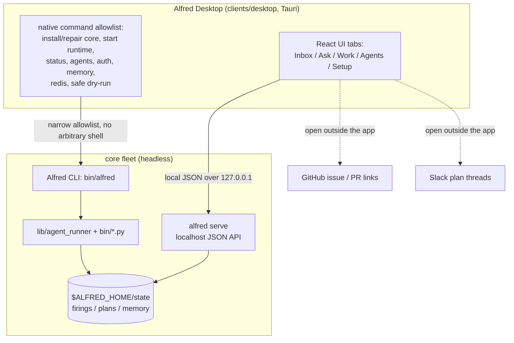

Alfred Desktop (`clients/desktop`) is a native Mac/Linux full installer and
control surface for a local install. It is the recommended `client` tier of the
[layered install](/concepts/layered-install/): the core fleet and CLI still run
fully standalone without it, but Setup gives local users the cleanest path
through core install/repair, install detection, auth, repos, full-fleet setup,
roster naming, and doctor checks.

Slack stays Alfred's collaboration surface. The desktop app is for local trust
installation and repair: what needs attention, which plans are waiting, why a run failed,
which memory candidates are ready, and which local actions are safe to run next.
It is the installer/control surface for the same local runtime, not a second
scheduler or hosted service.

Design note and run commands: [`docs/DESKTOP_CLIENT.md`](https://github.com/luminik-io/alfred-os/blob/main/docs/DESKTOP_CLIENT.md).

## The local control surface



## Tabs

| Tab | Job |
|---|---|
| Inbox | The decision queue: repeated failures, blocked plans, follow-ups, memory candidates, recent runs, shipped work, and the Claude/Codex capacity rail. |
| Ask | Plain-language planning intake backed by the same readiness engine as Slack. |
| Work | Kanban board, saved plans, Slack follow-ups, local draft actions, and issue queue controls. |
| Agents | Roster, activity feed, latest-run inspector, memory learning queue, and safe per-agent controls. |
| Setup | Install or repair the local runtime, configure the full fleet, choose roster naming, and run fleet/auth/agent/memory/Slack checks in-app. |

## Boundary

The client reads and writes the same local surfaces Alfred already uses:
`$ALFRED_HOME`, `alfred serve`, the Alfred CLI, GitHub issue and PR
links, Slack plan threads, and the local fleet brain. It opens no public port and
does not add a separate scheduler.

The boundary is enforced in the Tauri layer. The fetch command only allows
Alfred JSON API paths on `http://localhost`, `http://127.0.0.1`, or
`http://[::1]`. Local plan/run details stay in native inspector panes; explicit
Slack and GitHub links open outside the app.
State-changing controls use a narrow native allowlist (install/repair core,
start runtime, run checks, safe dry-runs, pause, resume, run once, and local follow-up planning)
and surface command audit detail with the result. There is no arbitrary shell
execution. In a plain browser preview, native actions are unavailable.

## Run it locally

```sh
alfred serve --port 7010 --no-browser
cd clients/desktop
npm install
npm run tauri dev
```

Setup can install or repair core and start this for you. The app uses `7010`
because macOS can reserve `7000` for Control Center.
Legacy saved `7000` URLs are treated as stale local configuration and rewritten
to 7010. Setup lets you enter a custom localhost URL when needed.

## Native installers

`tauri.conf.json` builds the native installer for the host platform:

```sh
cd clients/desktop
npm run tauri -- build
```

| Host | Artifacts |
|---|---|
| macOS 11+ on Apple silicon | `.app` and `.dmg` |
| Linux | `.AppImage` and `.deb` |

Continuous integration builds with `--no-bundle` to prove the binary compiles
without code signing or packaging. The release pipeline publishes a signed and
notarized macOS DMG and app zip, plus Linux AppImage and Debian artifacts.
