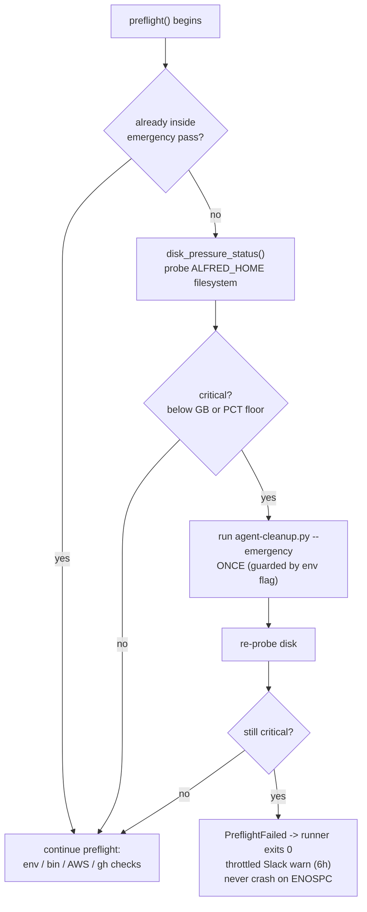

Scheduled agents write worktrees, transcripts, spend ledgers, and temp debug dirs every firing. When the disk fills, the next `claude` or `codex` call hits `ENOSPC`, the firing crashes, and the host scheduler re-fires on the next tick. Without a guard, that loop burns a turn every few minutes just to rediscover the disk is still full.

The disk guardian turns that crash-loop into a clean, throttled back-off. It runs as the first step of every agent's preflight.

Source: [`lib/agent_runner/disk.py`](https://github.com/luminik-io/alfred-os/blob/main/lib/agent_runner/disk.py) and the preflight gate in [`lib/agent_runner/orchestrator.py`](https://github.com/luminik-io/alfred-os/blob/main/lib/agent_runner/orchestrator.py).

## The back-off

## How critical is decided

`disk_pressure_status()` probes the filesystem holding `$ALFRED_HOME` (or its nearest existing parent, so a not-yet-created home still probes the right device). A reading is `critical` when free space is below either floor:

| Knob | Default | Meaning |
|---|---|---|
| `ALFRED_MIN_FREE_DISK_GB` | `3.0` | Absolute floor in GB |
| `ALFRED_MIN_FREE_DISK_PCT` | `5.0` | Relative floor in percent |

A `low` early-warning band sits at 1.5x of either floor. Per-agent specs can raise the floors for runners that check out large repos, without changing the fleet default.

## One emergency cleanup, then decide

On a critical reading the gate does not give up immediately. It runs `agent-cleanup.py --emergency` exactly once to reclaim space, then re-probes:

- If cleanup freed enough, the firing proceeds normally.
- If still critical, preflight raises `PreflightFailed`, which every runner already catches and turns into a clean `sys.exit(0)`. The firing skips; the next scheduled tick tries again.

The single-pass guarantee matters. An `ALFRED_DISK_EMERGENCY_IN_PROGRESS` env flag is set around the cleanup so the cleanup agent's own preflight (and the re-probe) cannot recurse into a second emergency pass. The cleanup agent is the one runner allowed to run *despite* low disk, because its whole job is to reclaim space.

## Quiet by design

Two properties keep the guardian from becoming noise or a new failure mode:

- **Throttled alerts.** When the fleet skips on disk pressure, the Slack warning posts at most once per `ALFRED_DISK_SLACK_MIN_HOURS` (default 6 hours). A full disk does not spam the channel on every tick.
- **Fails open.** Any `OSError` reading the filesystem reports a healthy, non-critical status. A transient stat hiccup can never wedge the fleet into a permanent skip. The real `ENOSPC` guard is the firing itself; this probe only adds an early, graceful back-off.

## See also

- [Architecture](/concepts/architecture/): the runtime boundary and preflight.
- [`ARCHITECTURE.md`](https://github.com/luminik-io/alfred-os/blob/main/docs/ARCHITECTURE.md): the full diagram companion, including this back-off.
</content>
