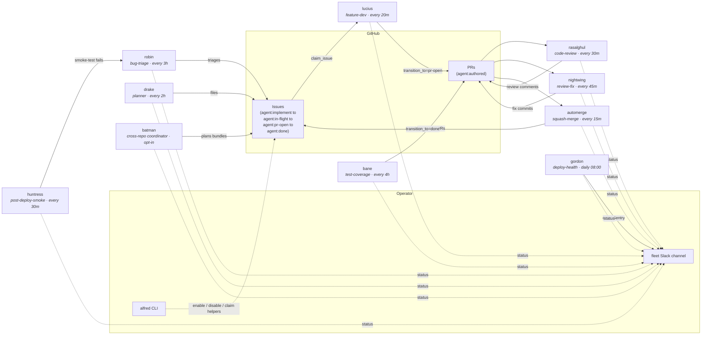

The default Alfred install ships an engineering-focused fleet. Each agent is a narrow specialist with its own schedule, turn budget, and tool list. Nothing chats with anything else: the agents coordinate through GitHub issues and PRs, and report to one Slack channel.

Full role map at [`docs/AGENTS.md`](https://github.com/luminik-io/alfred-os/blob/main/docs/AGENTS.md).

## How work flows

Solid arrows are state transitions (someone modifies an issue or PR). Dashed arrows are observability (someone reports).



The loop closes on itself: Drake files work, Lucius and Bane implement it, Ra's al Ghul reviews, Nightwing applies review feedback, automerge ships, and the merge transitions the issue to `agent:done`. Robin and Huntress feed the loop with triaged bug reports. Batman is opt-in for multi-repo bundle planning. The operator's first required action is usually just labelling issues `agent:implement` and reviewing PRs before merge.

## The default roster

Schedules are sensible defaults; override per-agent in `agents.conf`.

The installer starts with a smaller recommended fleet: Drake, Lucius, Ras al
Ghul, and agent-cleanup. Pick `all` only when you want the full roster.

### Specialist agents

| Codename | Role | Default schedule | What it does |
|---|---|---|---|
| **lucius** | feature-dev | every 20 min | Picks the oldest open `agent:implement` issue, claims it via the state machine, opens a worktree, runs `claude -p` with the issue body + repo context, pushes a PR labelled `agent:authored`. |
| **drake** | planner | every 2 h | Reads specs, roadmap, cross-repo open-issue list, and a code-reality grep. Files the next well-scoped `agent:implement` issue. Caps at 5 issues per firing, 20 in a rolling 24 h. |
| **batman** | cross-repo coordinator | every 1 h, opt-in | Picks `agent:large-feature` / `agent:bundle:<slug>` issues and posts a bundle plan. OSS ships this as plan-only; custom fleets can layer approval and execution on top. |
| **bane** | test-coverage | every 4 h | Picks the lowest-coverage actively-changed file, writes tests, opens a PR. Never touches non-test files. |
| **rasalghul** | code-review | every 30 min | Multi-axis review (correctness, security, performance, maintainability) on every fresh PR. Posts as a comment. |
| **nightwing** | review-fix | every 45 min | Lands fixes for P0/P1 reviewer comments (CodeRabbit, Codex, rasalghul) on `agent:authored` PRs. |
| **robin** | bug-triage | every 3 h | Classifies new bug-report issues, adds severity labels, asks for repro info, hands off to lucius via `agent:implement`. Keeps a local touched-issues ledger so it doesn't re-triage. |
| **huntress** | post-deploy-smoke | every 30 min | Runs Playwright smoke tests against `ALFRED_HUNTRESS_TARGET_URL`. Reports failures with screenshots. |
| **gordon** | deploy-health | daily 08:00 | Diffs the ECS staging task-def image SHA against repo `main` HEAD, pulls the top-5 unresolved Sentry issues from the last 24 h. Quiet on healthy days. Read-only. |

### Utility agents

These ship with plain-English names because they are fleet infrastructure, not roles a human would hold.

| Name | Role | Default schedule | What it does |
|---|---|---|---|
| **automerge** | squash-merge | every 15 min | Squash-merges `agent:authored` PRs that pass: 30 min age, CI green, no unresolved P0 reviewer comments, latest rasalghul comment ends "Ship-ready: yes". Never touches non-`agent:authored` PRs. |
| **agent-cleanup** | housekeeping | daily 03:00 | Sweeps stale debug dirs, abandoned worktrees, expired spend files and transcripts, stuck locks (>4 h), and stale `agent:in-flight` claims (>4 h via `force_release_stale_claim`). |
| **code-map-refresh** | indexing | every 6 h | Scans every product repo and writes `$ALFRED_HOME/state/code-map.json`. Drake, lucius, and rasalghul read it for cross-repo context. |
| **agent-morning-brief** | reporting | daily 07:00 | Slack post: yesterday's shipped PRs, in-flight work, doctor status, anything red. |
| **fleet-recap** | reporting | 07:30 + 22:00 | Aggregates per-agent spend, firings, and success rate. Posts to Slack. |

## Adding a codename for your own role

To add a role not in the default set (for example `arsenal`, a deploy-time security scanner):

1. Write `bin/arsenal.py` following the pattern in `bin/lucius.py`. Import from `agent_runner`. Set `AGENT = os.environ.get("AGENT_CODENAME", "arsenal")`.
2. Append a row to `launchd/agents.conf`:

   ```
   my.fleet.arsenal	arsenal.py	interval:3600	no	my.fleet.arsenal	Deploy-time security scanner
   ```

3. Run `bash deploy.sh`.
4. Run `bash bin/doctor.sh` to confirm preflight passes.

The primitives in `lib/agent_runner.py` cover the common patterns: lock, preflight, spend, gh, slack, claim/release, `claude_invoke`, event log. Read the [state machine](/concepts/state-machine/) and the [tutorial](/getting-started/tutorial/) before writing the script.

## Roadmap categories

The default install is engineering-only. Future categories are tracked in [`ROADMAP.md`](https://github.com/luminik-io/alfred-os/blob/main/ROADMAP.md): sales/SDR agents, content agents, personal-assistant agents, finance-ops agents, and product-ops/SRE agents. Each needs its own integration surface (Apollo, Reddit, Gmail, and so on) and its own prompt/test/docs package. PRs proposing individual agents in these categories are welcome when they keep the core runtime optional and single-operator.

## See also

- [Codename pattern](/concepts/codename-pattern/): why narrow specialists named after a fictional cast.
- [Architecture](/concepts/architecture/): the runtime boundary and the five non-negotiables.
- [Issue claim state machine](/concepts/state-machine/): the coordination primitive every agent shares.
- [How it works](/concepts/how-it-works/): one firing traced end to end.
