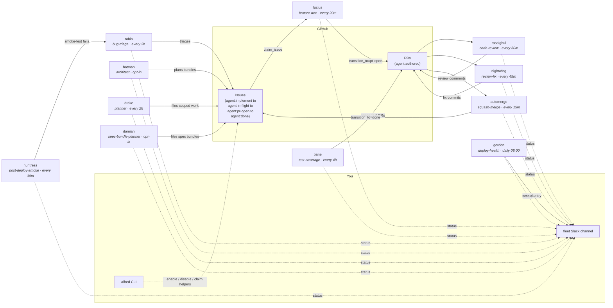

The default Alfred install ships an engineering-focused fleet. Each agent is a narrow specialist with its own schedule, turn budget, and tool list. Nothing chats with anything else: the agents coordinate through GitHub issues and PRs, and report to one Slack channel.

Full role map at [`docs/AGENTS.md`](https://github.com/luminik-io/alfred-os/blob/main/docs/AGENTS.md).

## How work flows

Solid arrows are state transitions (someone modifies an issue or PR). Dashed arrows are observability (someone reports).



The loop closes on itself: Batman leads multi-repo bundles, Drake files smaller scoped work, Lucius and Bane implement it, Ra's al Ghul reviews, Nightwing applies review feedback, automerge ships, and the merge transitions the issue to `agent:done`. Robin and Huntress feed the loop with triaged bug reports. Your first required action is usually labelling issues `agent:implement` and reviewing PRs before merge.

## Batman: the architect agent

Batman is the architect agent that leads a whole feature across repos. Where Lucius implements one scoped issue at a time inside one repo, Batman reads one `agent:large-feature` issue, walks the affected repos, drafts the rollout plan, posts it to Slack for approval, and only then files scoped `agent:implement` child issues across every repo Lucius needs to work in.

This is what makes Alfred different from single-repo coding agents. A backend service change that needs a frontend page and a mobile screen and a data-infra job becomes one Batman plan with four children, instead of four manual context-rebuilds in a chat window.

Batman runs every hour by default but is opt-in: a fresh install does not start it. Enable it once you have a recurring multi-repo or monorepo-package feature shape and want a coordination layer above the per-repo agents. Fresh installs halt after the plan by default. Set `BATMAN_AUTO_EXECUTE=approval-gate` after setup when you want Batman to file child issues only after Slack approval.

See [Multi-repo planning](/multi-repo/) for the marketing-side overview, and [Worked example: Batman across three repos](/guides/multi-repo-worked-example/) for an end-to-end walkthrough from large-feature issue to merged children.

## The default roster

Schedules are sensible defaults; override per-agent in `agents.conf`.

The engineering hierarchy starts with Batman, Lucius, and Drake: Batman is the
architect for cross-repo features, Lucius ships repo-local implementation PRs,
and Drake scopes smaller single-repo requests. The first-install preset stays
smaller: Lucius, Drake, Ras al Ghul, and agent-cleanup. Pick `all` only when
you want the full roster.

### Specialist agents

| Codename | Role | Default schedule | What it does |
|---|---|---|---|
| **batman** | architect | every 1 h, opt-in | Leads multi-repo features. The parent-issue path can draft the rollout, wait for Slack approval, file child `agent:implement` issues, and report status so implementation can move in parallel. The legacy scan path drafts plans only. See [docs/BATMAN.md](https://github.com/luminik-io/alfred-os/blob/main/docs/BATMAN.md). |
| **lucius** | feature-dev | every 20 min | Picks the oldest open `agent:implement` issue, claims it via the state machine, opens a worktree, runs the configured engine with the issue body + repo context, pushes a PR labelled `agent:authored`. |
| **drake** | planner | every 2 h | Reads specs, roadmap, cross-repo open-issue list, and a code-reality grep. Files the next well-scoped `agent:implement` issue. Caps at 5 issues per firing, 20 in a rolling 24 h. |
| **damian** | spec-bundle-planner | daily 09:00, opt-in | Walks `DAMIAN_SPEC_DIR`, identifies multi-repo features, and files `agent:bundle:<slug>` siblings across the affected repos. All-or-nothing per bundle. Caps at 3 bundles per firing. Single-repo work is left to drake. |
| **bane** | test-coverage | every 4 h | Picks the lowest-coverage actively-changed file, writes tests, opens a PR. Never touches non-test files. |
| **rasalghul** | code-review | every 30 min | Multi-axis review (correctness, security, performance, maintainability) on every fresh PR. Posts as a comment. |
| **nightwing** | review-fix | every 45 min | Lands fixes for P0/P1 reviewer comments (CodeRabbit, Codex, rasalghul) on `agent:authored` PRs. |
| **robin** | bug-triage | every 3 h | Classifies new bug-report issues, adds severity labels, asks for repro info, hands off to lucius via `agent:implement`. Keeps a local touched-issues ledger so it doesn't re-triage. |
| **huntress** | post-deploy-smoke | every 30 min | Runs Playwright smoke tests against `ALFRED_HUNTRESS_TARGET_URL`. Reports failures with screenshots. |
| **gordon** | deploy-health | daily 08:00 | Diffs the ECS staging task-def image SHA against repo `main` HEAD, pulls the top-5 unresolved Sentry issues from the last 24 h. Quiet on healthy days. Read-only. |

### Utility agents

These ship with plain-English names because they are fleet infrastructure, not roles a human would hold.

| Name | Role | Default schedule | What it does |
|---|---|---|---|
| **automerge** | squash-merge | every 15 min | Squash-merges `agent:authored` PRs that pass: 30 min age, CI green, no unresolved P0 reviewer comments, latest rasalghul comment ends "Ship-ready: yes". Never touches non-`agent:authored` PRs. |
| **agent-cleanup** | housekeeping | daily 03:00 | Sweeps stale debug dirs, abandoned worktrees, expired spend files and transcripts, stuck locks (>4 h), and stale `agent:in-flight` claims (>4 h via `force_release_stale_claim`). |
| **code-map-refresh** | indexing | every 6 h | Scans configured repos and writes `$ALFRED_HOME/state/code-map.json`. Drake and code-map-aware review prompts can read it for cross-repo context. |
| **agent-morning-brief** | reporting | daily 07:00 | Slack post: yesterday's shipped PRs, in-flight work, doctor status, anything red. |
| **fleet-recap** | reporting | 07:30 + 22:00 | Aggregates per-agent spend, firings, and success rate. Posts to Slack. |
| **curator** | content-quality | weekly | Opt-in. Fires the [slop detector](https://github.com/luminik-io/alfred-os/blob/main/docs/SLOP_DETECTOR.md) against `ALFRED_SLOP_TARGET_PATH`, posts findings to Slack. Read-only. Standalone CLI also available as `alfred slop-detect`. |

## Adding a codename for your own role

To add a role not in the default set (for example `arsenal`, a deploy-time security scanner):

1. Write `bin/arsenal.py` following the pattern in `bin/lucius.py`. Import from `agent_runner`. Set `AGENT = os.environ.get("AGENT_CODENAME", "arsenal")`.
2. Append a row to `launchd/agents.conf`:

   ```
   my.fleet.arsenal	arsenal.py	interval:3600	no	my.fleet.arsenal	Deploy-time security scanner
   ```

3. Run `bash deploy.sh`.
4. Run `bash bin/doctor.sh` to confirm preflight passes.

The primitives in the `agent_runner` package cover the common patterns: lock, preflight, spend, gh, slack, claim/release, `claude_invoke`, event log. Read the [state machine](/concepts/state-machine/) and the [tutorial](/getting-started/tutorial/) before writing the script.

## Roadmap categories

The default install is engineering-only. Future categories are tracked in [`ROADMAP.md`](https://github.com/luminik-io/alfred-os/blob/main/ROADMAP.md): sales/SDR agents, content agents, personal-assistant agents, finance-ops agents, and product-ops/SRE agents. Each needs its own integration surface (Apollo, Reddit, Gmail, and so on) and its own prompt/test/docs package. PRs proposing individual agents in these categories are welcome when they keep the core runtime optional and single-person.

## Memory

Every engine-aware codename that knows its target repo can recall what earlier
firings learned about that repo, file class, or issue type. The store is a
single SQLite file in your `$ALFRED_HOME`; it never leaves the host. The next
firing prepends the relevant lessons to its prompt context, so the fleet stops
rediscovering the same conventions on every run.

- Recall (read): the runner asks the configured memory provider for the latest
  lessons before invoking the engine.
- Reflect (write): the engine can append an optional machine-readable lesson
  block at the end of its result. Alfred strips that block from the visible
  result and records it locally.
- Operator: `alfred brain status`, `lessons`, `reflect`, `firings`, `forget`,
  `files`, `export`.

The brain also records file touches when a runner or outbox import knows the
repo-relative paths changed by a firing or PR. `alfred brain files your-org/api`
answers the practical question "what did the fleet touch here recently?"
without requiring a hosted dashboard or external index.

The shipping default is the in-tree `fleet_brain` SQLite provider. If you
maintain a separate personal knowledge base, you can chain it as a fallback:

```sh
ALFRED_MEMORY_PROVIDERS=fleet,gbrain
ALFRED_GBRAIN_BIN=/usr/local/bin/gbrain
```

The chain consults `fleet` first and falls through to `gbrain` only when the
fleet-brain has nothing for that `(codename, repo)`. The `gbrain` provider is
read-only and not bundled; it is your optional personal knowledge
base CLI, and the shim degrades to empty when the binary is missing.

If you already run Redis Agent Memory Server locally, add it as an optional
provider with `ALFRED_MEMORY_PROVIDERS=fleet,redis` and
`ALFRED_REDIS_MEMORY_URL=http://127.0.0.1:8000`. Alfred does not install or
start Redis for you.

Set `ALFRED_MEMORY_PROVIDERS=null` to turn memory off. Full reference:
[`docs/FLEET_BRAIN.md`](https://github.com/luminik-io/alfred-os/blob/main/docs/FLEET_BRAIN.md)
and
[`docs/MEMORY_PROVIDERS.md`](https://github.com/luminik-io/alfred-os/blob/main/docs/MEMORY_PROVIDERS.md).

## See also

- [Codename pattern](/concepts/codename-pattern/): why narrow specialists named after a fictional cast.
- [Architecture](/concepts/architecture/): the runtime boundary and the five non-negotiables.
- [Issue claim state machine](/concepts/state-machine/): the coordination primitive every agent shares.
- [How it works](/concepts/how-it-works/): one firing traced end to end.
