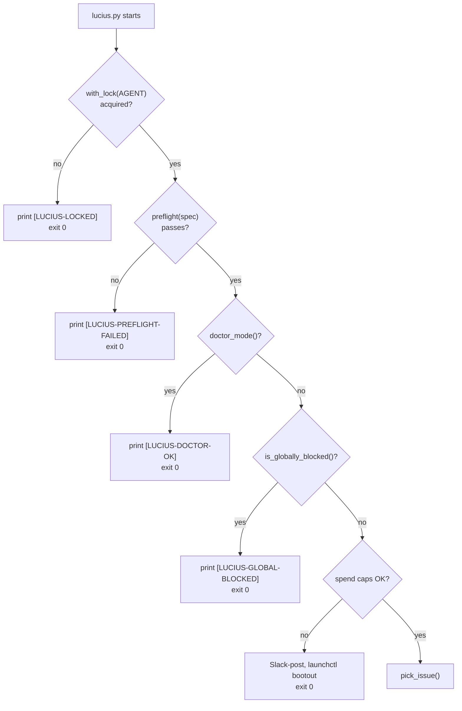

This page traces a single agent firing in detail. If [Architecture](/concepts/architecture/) is the why, this is the what-happens-in-order.

The example is Lucius, the feature-dev agent, because it exercises every primitive. Simpler agents (Echo in the [tutorial](/getting-started/tutorial/), Gordon's read-only health check) are subsets of this trace.

## Stage 1: the trigger

`launchd` owns the schedule. The rendered plist for Lucius carries a `StartInterval` of 1200 seconds. Every 20 minutes `launchd` execs:

```
$ALFRED_HOME/bin/agent-launch lucius.py
```

`agent-launch` is a thin shell wrapper. `launchd` does not source shell rc files, so the wrapper sources `~/.alfredrc` at firing time, then execs `$ALFRED_HOME/bin/lucius.py`. The plist's `EnvironmentVariables` block has already set `AGENT_CODENAME`, `LAUNCHD_LABEL`, `ALFRED_HOME`, `WORKSPACE_ROOT`, and `PATH`.

There is no daemon. The process exists only for the duration of this one firing.

## Stage 2: gates before any spend

The runner walks a fixed sequence of cheap checks before it will spend a Claude turn. Any gate that trips exits the firing early.



- **`with_lock(AGENT)`** is a `mkdir`-atomic per-codename mutex. If a previous Lucius firing is still running (a long `claude -p`), this firing exits rather than running two Luciuses at once.
- **`preflight(spec)`** checks the `PreflightSpec`: required CLIs on PATH (`gh`, `git`, the engine binary), `gh` auth still valid, the watched repo checkouts present under `WORKSPACE_ROOT`. A gap prints `[LUCIUS-PREFLIGHT-FAILED]` naming each missing piece.
- **`doctor_mode()`** reads `ALFRED_DOCTOR`. When `bin/doctor.sh` sets it to `1`, the agent emits `[LUCIUS-DOCTOR-OK]` and exits before doing real work. This is how the host gets verified without burning turns.
- **`is_globally_blocked()`** reads `$ALFRED_HOME/state/global-blocked-until.json`. If another agent tripped Anthropic's rate limit in the last hour, this firing exits silently.
- **Spend caps** read `SpendState(AGENT)`: `turns_today`, `consecutive_failures`. Over the cap, the agent Slack-posts the reason and `launchctl bootout`s its own launchd job.

Every gate is a plain function call against a file on disk or a subprocess. No network round-trip is needed to decide "should this firing even run."

## Stage 3: pick and claim the work

`pick_issue()` queries GitHub for the oldest open issue labelled `agent:implement` across the agent's watched repos, skipping any repo in the pause list (`is_repo_paused`).

Then `claim_issue(repo, num, codename=AGENT, firing_id=...)` runs the [state machine](/concepts/state-machine/) handshake: it adds the `agent:in-flight` label, posts a structured claim comment, and re-reads recent comments to check it actually won the race. If an earlier claim exists, this firing yields and exits. If `claim_issue` returns `False` for any reason (already claimed, repo paused, blocker label present), the firing prints `[LUCIUS-DEDUP-SKIP]` and exits.

## Stage 4: isolate and invoke

```mermaid
sequenceDiagram
    participant runner as lucius.py
    participant git as git
    participant claude as claude -p
    participant fs as worktree dir

    runner->>git: make_worktree(repo, agent, issue)
    git->>fs: git worktree add from origin/main
    runner->>runner: build prompt (issue body + repo context)
    runner->>claude: claude_invoke_streaming(prompt, workdir=wt, max_turns=N)
    claude->>fs: read, edit, write files; run tests
    claude-->>runner: ClaudeResult (success, turns, cost, session_id, text)
    runner->>git: git rev-list origin/main..HEAD
    git-->>runner: commit count
```

`make_worktree` creates a throwaway git worktree under `$ALFRED_HOME/worktrees/eng-lucius-<repo>-<issue>-<ts>/`, branched from a fresh `origin/main`. The `claude -p` subprocess runs with its `cwd` pinned to that worktree, so it physically cannot touch the operator's canonical checkout or another firing's branch.

The runner builds the prompt from the issue body plus repo context (the repo's `CLAUDE.md`, the cross-repo `code-map.json`), inlines it, and calls `claude_invoke_streaming` with a hard `max_turns` cap and a hard timeout. The result comes back as a `ClaudeResult` dataclass: `success`, `subtype`, `num_turns`, `cost_usd`, `session_id`, `result_text`.

## Stage 5: branch on the outcome

The runner inspects the result and the git state, then takes exactly one exit path. The exit "codes" are sentinel strings printed to stdout for the launchd log and Slack.

| Sentinel | When | What happens |
|---|---|---|
| `[OK] commit <sha>` | `claude -p` succeeded and committed | Push, `gh pr create`, label `agent:authored`, `release_issue(transition_to=agent:pr-open)`, Slack-post success at `info` |
| `[ALREADY-IMPLEMENTED]` | The work is already in the codebase | Comment on the issue, label `done-already`, close it. No PR |
| `[PARTIAL]` | Hit `error_max_turns` | Comment progress, leave the worktree, retry next firing. Not counted as a failure |
| `[BLOCKED]` | Claude could not resolve an error | Slack-post the reason at `warn`. Counted as a failure |
| `[LUCIUS-NO-COMMIT]` | Success returned but no commit landed | Inspect `git status`; salvage unstaged changes as a `do-not-review` draft PR, else count as failure |
| `[SILENT]` | No `agent:implement` issue matched | Exit 0, no Slack post. The non-event is the signal |

Whatever the path, `release_issue` runs so the issue never stays stuck in `agent:in-flight`, and `remove_worktree` cleans up the throwaway directory. Then the process exits and the host goes back to waiting for the next `launchd` trigger.

## Why this shape holds up unattended

- **Idempotent.** Every firing reads its inputs from scratch. A crash mid-run leaves no half-state to resume; the next firing's `make_worktree` even prunes orphaned worktrees first.
- **Bounded.** `max_turns` and the firing timeout cap the worst-case spend of any single firing. The schedule caps the worst-case spend of the day.
- **Observable.** Every exit path prints a sentinel and (for anything the operator should see) posts to Slack. Per-firing JSONL transcripts under `$ALFRED_HOME/state/transcripts/` survive reboots.
- **Isolated.** A bad firing trashes its own worktree and nothing else.

## See also

- [Architecture](/concepts/architecture/): the design rationale behind each gate.
- [The agent fleet](/concepts/fleet/): how multiple firings hand work to each other.
- [agent_runner API reference](/reference/agent-runner/): every primitive named above, with signatures.
- [Tutorial](/getting-started/tutorial/): build the smallest agent that uses this whole shape.
