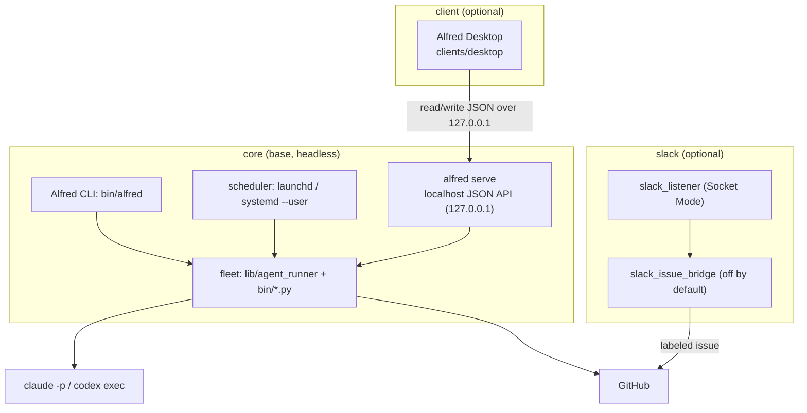

Alfred installs in three tiers. Only the first is required. Alfred Desktop and the Slack agent are optional surfaces that talk to the core through local APIs and state files.



## core: standalone and headless

The core tier is the whole product for most users:

- the fleet (`lib/agent_runner/` plus the `bin/*.py` runners),
- the Alfred CLI (`bin/alfred`),
- the host scheduler (launchd on macOS, `systemd --user` on Linux),
- `alfred serve`, a localhost JSON API over `$ALFRED_HOME/state`.

Core needs no desktop, no browser, and no Slack. A headless Debian or Ubuntu box runs the entire fleet from timers with nothing on screen. The CLI and fleet are fully standalone; the other tiers are additive.

`alfred serve` is an optional extra so a pure-fleet install stays small:

```sh
pip install 'alfred-os[serve]'   # FastAPI + uvicorn
alfred serve --port 7010 --no-browser
```

It binds to `127.0.0.1` by default. Binding to `0.0.0.0` is allowed but discouraged, since the dashboard exposes paths and event payloads that may carry repo context.

## client: the desktop app

Alfred Desktop (Tauri, under `clients/desktop`) is a thin local control surface, not a second runtime. It is for trust and repair: what needs attention now, which plans are waiting, why a run failed, which memory candidates are ready, and which safe action repairs the fleet. Inbox shows the decision queue, Ask holds planning intake, Work manages the queue and shipped board, Agents handles roster/activity/memory, and Setup handles repair checks.

The client talks to core only over the `alfred serve` JSON seam, restricted to `http://localhost`, `http://127.0.0.1`, or `http://[::1]` and a fixed set of Alfred JSON paths plus a narrow native command allowlist. It opens no public port and keeps `$ALFRED_HOME` as the source of truth. You can run Alfred entirely without it.

```sh
alfred serve --port 7010 --no-browser   # or let Setup start it
cd clients/desktop
npm install
npm run tauri dev
```

See [Alfred Desktop](/concepts/native-client/) for the full client design.

## slack: the planning surface

The optional Slack tier is the planning listener plus the issue bridge:

- the **listener** runs in Socket Mode and refines a trusted user's request into a saved local draft. It never files issues, opens PRs, or runs code.
- the **bridge** is off by default. When the configured approver explicitly approves a draft, and the bridge is enabled with a repo allowlist, it files one labeled GitHub issue. From there the fleet claims it through every existing gate. The bridge runs no code.

`slack-sdk` and `boto3` are already in the base install, so the Slack tier needs only configuration. Leave `ALFRED_BRIDGE_ENABLED` unset to keep approvals as refine-only no-ops. Trusted users can create and refine drafts; only `ALFRED_OPERATOR_SLACK_USER_ID` can file Slack-origin drafts into GitHub. See [Slack-native planning](/concepts/slack-native-planning/) and [Slack setup](/guides/slack/).

## Picking your tiers

| You want | Install |
|---|---|
| A headless Linux fleet, no UI | `core` only |
| A Mac with Alfred Desktop | `core` + `client` |
| Plan-in-Slack workflow | `core` + `slack` (bridge off until you trust it) |
| Everything | all three |

The client and Slack surfaces both sit on top of the same core and never bypass its claim, spend, review, and merge gates. Full tier walkthrough: [`docs/INSTALL_TIERS.md`](https://github.com/luminik-io/alfred-os/blob/main/docs/INSTALL_TIERS.md).
