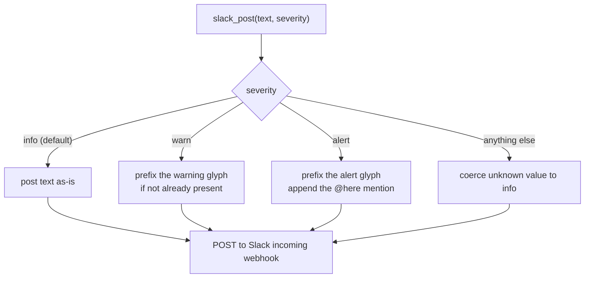

One Slack channel for the fleet. With 6+ codename agents firing every 20 minutes, everything ends up there: Lucius shipped, Drake noop, Bane no-coverage-target, automerge merged, cleanup swept, Gordon ECS-in-sync.

Two failure modes:

1. **Drown the signal.** A genuine alert (Claude rate-limit, ECS drift, security scan finding) gets lost in the daily firehose.
2. **Split the channel.** Two channels (one for noise, one for alerts) works, but solo operator + two channels = neither gets read religiously.

Severity routing solves both without changing channel count.

## The API

`slack_post()` takes an optional `severity=` keyword:

```python
slack_post("Lucius shipped #42", severity="info")        # default: plain text
slack_post("Lucius hit max-turns on #42", severity="warn") # ⚠️ prefix
slack_post("Staging deploy drifted from main", severity="alert") # 🚨 + <!here>
```

Three tiers:

| Tier | Behaviour | Use for |
|---|---|---|
| `info` (default) | Posted as-is | The bulk: agent shipped, merged, swept, no-op |
| `warn` | Prefixed `⚠️` if not already | Soft failures: rate-limit on one provider, max-turns hit, salvaged WIP draft |
| `alert` | Prefixed `🚨` + appends `<!here>` | Operator must see: production drift, fleet-wide rate-limit, doctor failure on a load-bearing agent, security signal |

Unknown severity values are coerced to `info`. Existing callers without a `severity=` kwarg keep their previous behaviour exactly: back-compat default.



## What you actually get

In Slack, the channel timeline now reads like:

```
[normal]    ✅ Lucius shipped: <PR-url> (turns=46)
[normal]    📋 Drake firing complete (turns=15, cost=$1.20)
[normal]    Auto-merged 2 PR(s): <pr1>, <pr2>
[normal]    ✅ Lucius shipped: <PR-url> (turns=82)
[normal]    🧹 cleanup: swept 1 stale agent:in-flight claim
[bold]      ⚠️ Lucius #305 hit max-turns (150). Will retry.
[normal]    ✅ Lucius shipped: <PR-url> (turns=51)
[ping]      🚨 Gordon: staging deployment health
            ECS drift (live ≠ main): staging-api-service main=abc123 live=def456
            <!here>
```

Your eye snaps to the 🚨 line. The ⚠️ line is visible without scrolling. The ✅ flood is scannable peripherally.

## Reclassification guidance

When sweeping a callsite, ask: what would I want to know about while making coffee?

- **`alert`**: anything that pauses the fleet, breaks production, or signals security. The operator must see it before the next agent firing potentially makes it worse.
- **`warn`**: soft failures that recover on their own (rate-limit on one provider, max-turns on one issue) but the operator should know happened.
- **`info`**: everything else. If you're not sure, this is the right answer.

Bias toward `info`. Over-using `alert` re-creates the firehose problem you started with.

## What's deferred

Today's `slack_post` uses an incoming webhook. Webhooks have two limits:

- Cannot post threaded replies (no `thread_ts`).
- Cannot update the channel topic (read-only on channel state).

Bot-token posting exists in `lib/slack_format.py` for per-firing Block Kit
threads. Two higher-level routing features remain follow-ups:

1. **Daily-thread routing for `info`-tier**. The `fleet-recap-morning` cron posts an anchor message at 07:30; every `info` post during the day goes as a threaded reply under it. Main-channel timeline shrinks to one anchor + the day's `warn` and `alert` events.
2. **Channel topic from fleet state**. `slack_set_channel_topic()` renders e.g. `Lucius: 17 ✅ / 3 ❌ today · Drake: 8 ok · 0 paused repos`. Glanceable status without opening a dashboard.

Both tracked in [Roadmap](/about/roadmap/) under "in-flight."

## See also

- [Slack setup](/guides/slack/): webhook creation, AWS storage, optional bot-token path.
- [`docs/SLACK_SETUP.md`](https://github.com/luminik-io/alfred-os/blob/main/docs/SLACK_SETUP.md): the full guide.
- [`agent_runner.slack_post`](https://github.com/luminik-io/alfred-os/blob/main/lib/agent_runner.py): the source.
