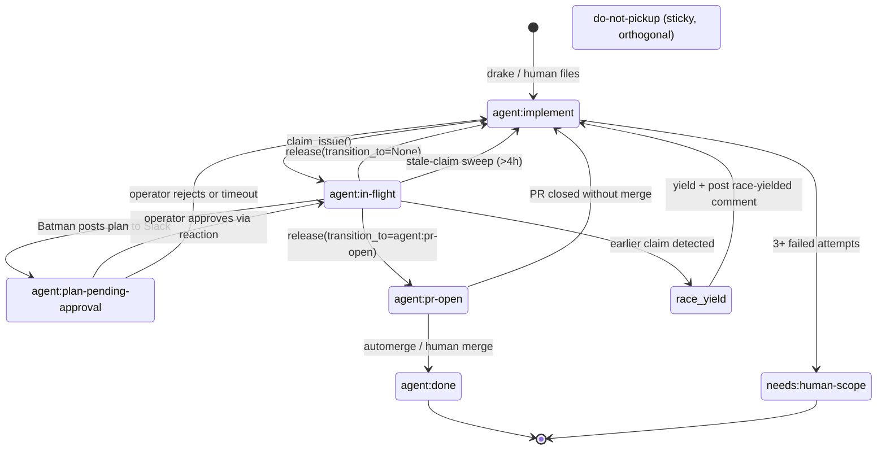
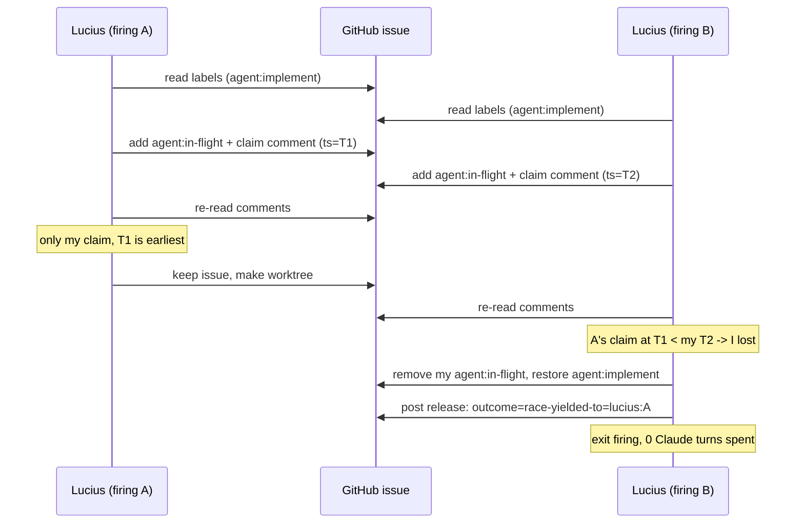

Full doc at [`docs/STATE_MACHINE.md`](https://github.com/luminik-io/alfred-os/blob/main/docs/STATE_MACHINE.md). This page is the executive summary.

## The problem

Two actors can race on the same issue:

- Two agent firings (rare; `with_lock` serializes per codename, but cross-codename collisions exist).
- One agent + the operator pushing a manual branch.
- Two operators if you ever expand beyond solo (out of scope today, but the design accommodates it).

Without a coordination primitive, you get duplicate work. A real failure mode: one agent ships a quick PR for an issue in the morning, then the operator opens a careful PR for the same issue later, neither aware of the other.

## The mechanism

State carried entirely on GitHub labels + structured HTML comments. No shared database, no shared filesystem, no Slack lock. GitHub is the synchronisation point. The lifecycle is single-host today, but the contract works the same way if you ever spread the fleet across machines.

### Lifecycle



### Lifecycle labels (mutually exclusive)

| Label | Meaning | Set by |
|---|---|---|
| `agent:implement` | Eligible for autonomous pickup | Drake (or human) |
| `agent:in-flight` | An agent is actively working it | `claim_issue()` |
| `agent:plan-pending-approval` | Plan posted to operator, waiting on go/no-go | Slack approval gate (`lib/slack_approval.py`) before reaction resolves |
| `agent:pr-open` | A PR exists for this issue | `release_issue(transition_to=...)` |
| `agent:done` | Closed and shipped | external (PR merge handler) |

The `agent:plan-pending-approval` label is set by Batman when it posts a
plan to Slack and is waiting for the operator's reaction. The
[Slack approval gate](/guides/slack/#optional-plan-mode-approval-gate)
polls one message's reactions, and on the operator's reply the agent
either transitions back to `agent:in-flight` (approved, worker pickup) or
returns to `agent:implement` (rejected or timed out). See
[`docs/SLACK_APPROVAL.md`](https://github.com/luminik-io/alfred-os/blob/main/docs/SLACK_APPROVAL.md)
for the full setup walkthrough.

### Sticky modifiers (orthogonal)

| Label | Meaning |
|---|---|
| `do-not-pickup` | Operator override; agents skip this issue |
| `needs:human-scope` | Issue is too vague; not eligible for autonomous pickup |

### Claim comments

Posted alongside every label change so the audit trail survives manual label edits:

```
<!-- agent-claim:codename=lucius firing_id=20260501-194217-643a ts=2026-05-01T19:42:33Z -->
<!-- agent-release:codename=lucius firing_id=20260501-194217-643a outcome=success pr=https://github.com/foo/bar/pull/42 ts=2026-05-01T20:08:11Z -->
```

`find_stale_claims()` reads these to decide who currently holds an in-flight claim and how old that claim is, without depending on label-event timestamps.

## Race resolution

`claim_issue()`:

1. Reads current label set; refuses if any blocker label is present.
2. Atomically adds `agent:in-flight` + posts the claim comment.
3. Re-reads recent comments to detect any unreleased earlier claim.
4. If an earlier claimant exists (by `createdAt` timestamp), the loser:
   - Removes its own `agent:in-flight` label
   - Restores `agent:implement`
   - Posts a release comment with `outcome=race-yielded-to=<earlier_codename>:<earlier_firing_id>`
5. The earlier claimant keeps the issue uncontested.

The loser exits the firing without burning a Claude turn on duplicate work. The race window collapses from ~20 minutes (between agent pick + PR open) to the sub-second gap between read-labels and add-label.



## Stale-claim sweep

A runner crashing between `claim_issue` and `release_issue` would normally leave an issue blocked indefinitely. `find_stale_claims()` reads claim comments and surfaces any in-flight claim with no matching release after `max_age_hours` (default 4). `force_release_stale_claim()` then transitions the issue back to `agent:implement` so the queue picks it up again.

Wire it into your fleet's daily cleanup runner. The shipped `bin/alfred-label-state.py` binary exposes this as `alfred-label-state sweep-claims [--max-age-hours N] [--dry-run]`. `deploy.sh` copies it into `$ALFRED_HOME/bin/` alongside the other `alfred-*` binaries.

## Operator overrides

Two ways to take an issue manually without racing an agent:

```sh
# Mark a single issue do-not-pickup
alfred-label-state claim your-org/your-backend#42
# ... do your work ...
alfred-label-state release your-org/your-backend#42
```

```sh
# Take a whole repo offline from the fleet
alfred-label-state repo pause your-backend
# ... refactor in peace ...
alfred-label-state repo resume your-backend
```

`sweep-claims` reads `LABEL_STATE_SWEEP_REPOS` (comma-separated) for its default repo set:

```sh
LABEL_STATE_SWEEP_REPOS="your-backend,your-frontend,your-mobile" \
  alfred-label-state sweep-claims --max-age-hours 4 --dry-run
```

The pre-push git hook ([`examples/git-hooks/pre-push`](https://github.com/luminik-io/alfred-os/blob/main/examples/git-hooks/pre-push)) enforces this symmetrically. Push a branch whose commits reference `Closes #N` and that issue is currently in-flight or has a PR open, the push is refused.

Override per-push: `git push --no-verify`.
Override globally: `LABEL_STATE_SKIP_DEDUP_CHECK=1` in your shell rc.

## API reference

```python
# State transitions
claim_issue(repo, num, *, codename, firing_id) -> bool
release_issue(repo, num, *, codename, firing_id,
              outcome="success", transition_to=None, pr_url=None) -> bool

# Inspection
issue_dedup_check(repo, num) -> dict
find_stale_claims(repo, *, max_age_hours=4) -> list[dict]

# Recovery
force_release_stale_claim(repo, num, *, sweep_id,
                          released_codename=None,
                          released_firing_id=None) -> bool

# Operator overrides
is_repo_paused(repo) -> bool
list_paused_repos() -> list[str]
set_repo_paused(repo, paused) -> list[str]

# Constants
LIFECYCLE_LABELS: list[tuple[str, str, str]]
CLAIM_COMMENT_PREFIX: str
RELEASE_COMMENT_PREFIX: str
PAUSED_REPOS_FILE: Path
```

See [agent_runner API reference](/reference/agent-runner/) for the full module surface.

## Source-of-truth label constants

Every label string lives in [`lib/labels.py`](https://github.com/luminik-io/alfred-os/blob/main/lib/labels.py). Import from there rather than duplicating string literals:

```python
from labels import (
    IMPLEMENT,           # "agent:implement"
    IN_FLIGHT,           # "agent:in-flight"
    PR_OPEN,             # "agent:pr-open"
    DONE,                # "agent:done"
    DO_NOT_PICKUP,       # "do-not-pickup"
    NEEDS_HUMAN_SCOPE,   # "needs:human-scope"
    AUTHORED,            # "agent:authored"
    LARGE_FEATURE,       # "agent:large-feature"
    bundle_label,        # builds "agent:bundle:<slug>"
    is_legal_transition, # documents the state-machine moves
)
```

## Cross-repo PR chains and worktrees

For multi-repo features (one issue, N PRs across N repos), `alfred-os` ships:

- **`lib/multi_worktree.py`**: `MultiWorktree(requests, agent, feature_id)` context manager that creates per-repo git worktrees with synchronised branch names and cleans them up on exit. Git interaction is injected via a `GitRunner` Protocol so tests don't touch real worktrees.
- **`lib/cross_repo_pr.py`**: `CrossRepoPRChain` plan/execute coordinator. `chain.plan(...)` returns a `Plan` dataclass (pure, no I/O); `chain.execute(plan)` opens each PR, persists state to `$ALFRED_HOME/state/pr-chains/<feature_id>.json` atomically, and refreshes earlier PR bodies as later siblings open so the cross-links stay current.

Both modules use Protocol-based dependency injection so consumers can swap the default subprocess implementation for tests or alternative GitHub clients.
