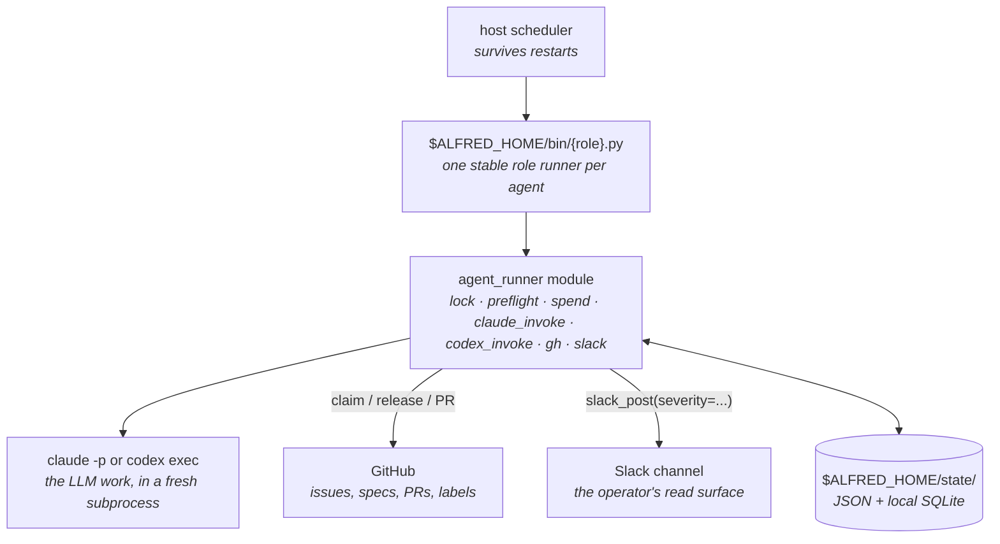

import { Card, CardGrid, LinkCard } from "@astrojs/starlight/components";

## Why Alfred exists

Interactive coding agents finish a prompt while you sit at the keyboard. Alfred is built for engineering work that should keep moving while you are away: planned features, follow-up tests, reviewer comments, dependency bumps, docs gaps, multi-repo rollouts.

You do not sit in front of Claude or Codex and keep prompting every step. You give Alfred the goal, the repos, and the approval rules; Alfred keeps the loop moving until it has a pull request, a review finding, or a decision to bring back to Slack.

That work needs durable coordination: Slack threads and specs that can become scoped GitHub issues, per-firing worktree isolation, role-based engine routing across Claude Code and Codex, review handoff, hard spend caps, and a state machine that keeps multiple agents from colliding. It runs on a host you already own and uses CLI auth you already pay for.

The starter fleet is intentionally narrow: Lucius implements scoped issues, Drake plans smaller work, Ras al Ghul reviews PRs, and agent-cleanup clears stale local state. The full roster adds Batman as the architect for cross-repo work, plus Bane, Nightwing, and other specialists.

Under the hood, each agent is a fresh subprocess in its own git worktree, dispatched by the host scheduler (`launchd` on macOS, `systemd --user` on Linux), isolated by per-agent IAM, bounded by per-day spend caps with a fleet-wide Claude provider-limit block.

`ALFRED_HOME` is the runtime root. A fresh install defaults to `~/.alfred`. No external agent gateway, hosted memory database, skill registry, or dashboard service is required. Local fleet-brain memory ships with Alfred and stays on the host.

## What you get

<CardGrid stagger>
  <Card title="Autonomous scheduled runs" icon="rocket">
    Agents keep working on schedule, survive host restarts, and do not depend on one fragile long-running process.
  </Card>
  <Card title="The loop around Claude and Codex" icon="setting">
    Alfred finds work, scopes it, runs agents in worktrees, checks results, records memory, and routes decisions back to Slack.
  </Card>
  <Card title="Plan-to-PR workflow" icon="document">
    Slack requests, specs, and issues become bounded jobs: plan, claim, open a worktree, implement, PR, review, test, report, and merge when your policy allows it.
  </Card>
  <Card title="Role-level engine routing" icon="setting">
    Route builders and reviewers separately across Claude Code, Codex, or hybrid fallback.
  </Card>
  <Card title="Batman: architect agent" icon="puzzle">
    Batman owns the feature above the repo-local work. It reads one `agent:large-feature` issue, drafts a rollout across every affected repo or monorepo package, posts the plan to Slack for approval, and files scoped child issues so Lucius can pick them up in parallel.
  </Card>
  <Card title="Local memory you approve" icon="puzzle">
    Fleet-brain recalls repo lessons, file touches, failure patterns, and reviewable memory candidates. New lessons wait for approval before they shape future runs.
  </Card>
  <Card title="Per-firing git worktree isolation" icon="puzzle">
    Each `claude -p` invocation gets a fresh worktree. No cross-firing pollution; safe to crash mid-run.
  </Card>
  <Card title="Issue claim state machine" icon="document">
    `agent:in-flight` → `agent:pr-open` → `agent:done`. Race-resistant cooperative coordination via GitHub labels + structured comments.
  </Card>
  <Card title="Visible output" icon="approve-check-circle">
    Slack firing reports and shipped summaries show what ran, what opened, what merged, and what needs human review.
  </Card>
</CardGrid>

## Quick start

<LinkCard
  title="Install Alfred"
  description="Fast setup for an existing dev machine, plus a guided path for a fresh host. The wizard can configure a one-repo or multi-repo starter fleet without manual prompt or label copying."
  href="/getting-started/install/"
/>

<LinkCard
  title="Let Claude Code or Codex install it"
  description="A copy-paste prompt for AI-assisted setup: explicit repos, starter fleet, no guessed secrets, auth checks before scheduled firings."
  href="/getting-started/ai-assisted-install/"
/>

<LinkCard
  title="Pick your workspace shape"
  description="One repo, multi-repo product workspace, plan-led work, or Batman bundle planning."
  href="/getting-started/workspace-patterns/"
/>

<LinkCard
  title="Let Alfred structure the plan"
  description="Turn rough requests or specs into scoped issue queues, Batman plans, clean worktrees, reviewable PRs, and visible Slack summaries."
  href="/guides/specs-driven-development/"
/>

<LinkCard
  title="Plan in Slack"
  description="Reply to Batman plans with plain language or structured scope commands before Alfred files child issues."
  href="/concepts/slack-native-planning/"
/>

<LinkCard
  title="Build your first agent"
  description="The Echo tutorial: pick → claim → invoke → act → release → report. The shape every richer codename inherits."
  href="/getting-started/tutorial/"
/>

<LinkCard
  title="Read the architecture"
  description="Why host scheduling, why worktrees, why per-agent IAM. The design constraints that make Alfred opinionated."
  href="/concepts/architecture/"
/>

<LinkCard
  title="How it works"
  description="One agent firing traced end to end: scheduler trigger, the gates before any spend, claim, isolate, invoke, branch on outcome."
  href="/concepts/how-it-works/"
/>

<LinkCard
  title="Meet the fleet"
  description="The starter fleet and the full engineering roster: Batman, Lucius, Drake, Ra's al Ghul, Bane, and the rest. What each codename does and how work flows between them."
  href="/concepts/fleet/"
/>

<LinkCard
  title="Alfred Desktop"
  description="The Mac/Linux app is a thin local control surface while Slack stays the collaboration surface."
  href="/concepts/native-client/"
/>

## Roadmap

The engineering fleet ships today. The local memory layer, fleet UI, and first
native client also ship today. The next larger categories are content, sales,
and ops; each needs its own integrations, prompts, tests, and human-approval
rules.

<CardGrid>
  <Card title="Content" icon="document">Blog, LinkedIn, SEO drafts, and site-page generation. Human approval before publish.</Card>
  <Card title="Sales / SDR" icon="rocket">Prospect identification, event-page sourcing, and outreach drafts. Human approval before send.</Card>
  <Card title="Ops departments" icon="setting">Personal assistant, finance, and product-ops agents with drafts-only defaults for anything that sends, publishes, or pays.</Card>
</CardGrid>

The full [roadmap](/about/roadmap/) tracks what is in flight.

## Status

Latest release: v0.5.1. Alfred ships a local engineering-agent fleet for solo builders: install, starter setup, prompt seeding, GitHub label setup, plan-led workspace patterns, doctor, dry-run, Linux/systemd or macOS launchd scheduling, Claude/Codex engine routing, Slack reporting, isolated worktree execution, fleet-brain GitHub polling, worker heartbeats, memory promotion, repeated-failure classification, the reliability governor, optional Redis AMS memory, planning-memory recall, and a signed native Mac/Linux client with a public download page.

The native client is packaged as a signed and notarized macOS app plus Linux
AppImage and Debian artifacts. The design boundary is stable: one operator, one
local host, local CLIs, isolated worktrees, GitHub as the coordination layer.
PRs are welcome when they strengthen that shape: reliability, setup, docs,
tests, new codenames with clear scope, or optional integrations that fail
cleanly. Bigger shifts, such as a new department or runtime change, should
start as a discussion.

License: [MIT](https://github.com/luminik-io/alfred-os/blob/main/LICENSE).
