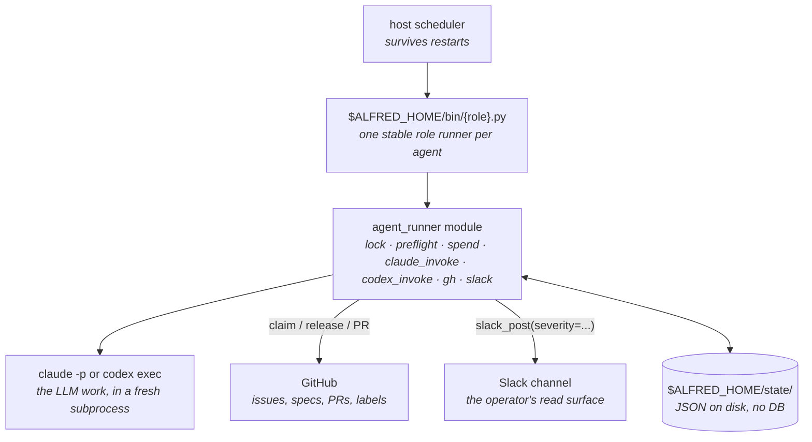

import { Card, CardGrid, LinkCard } from "@astrojs/starlight/components";

## Why Alfred exists

Interactive coding agents finish a prompt while you sit at the keyboard. The job Alfred is built for is the work that keeps coming after the keyboard closes: planned features, follow-up tests, reviewer comments, dependency bumps, docs gaps, multi-repo rollouts.

That work needs durable coordination, not another chat window. Alfred supplies the runtime: scoped intake from GitHub issues and specs, per-firing worktree isolation, role-based engine routing across Claude Code and Codex, review handoff, hard spend caps, and a state machine that keeps multiple agents from colliding. It runs on a host you already own and uses CLI auth you already pay for.

The starter fleet is intentionally narrow: Drake plans work, Lucius implements scoped issues, Ras al Ghul reviews PRs, and agent-cleanup clears stale local state. The full roster adds Batman, Bane, Nightwing, and other specialists.

Under the hood, each agent is a fresh subprocess in its own git worktree, dispatched by the host scheduler (`launchd` on macOS, `systemd --user` on Linux), isolated by per-agent IAM, bounded by per-day spend caps with a fleet-wide Claude provider-limit block.

`ALFRED_HOME` is the runtime root. A fresh install defaults to `~/.alfred`. No external agent gateway, memory database, skill registry, or dashboard service is required.

## What you get

<CardGrid stagger>
  <Card title="Autonomous scheduled runs" icon="rocket">
    Agents keep working on schedule, survive host restarts, and do not depend on one fragile long-running process.
  </Card>
  <Card title="Development-team workflow" icon="document">
    Issues and specs become bounded jobs: plan, claim, open a worktree, implement, PR, review, test, report.
  </Card>
  <Card title="Role-level engine routing" icon="setting">
    Route builders and reviewers separately across Claude Code, Codex, or hybrid fallback.
  </Card>
  <Card title="Batman: multi-repo + monorepo planning" icon="puzzle">
    The agent that holds a whole feature in its head. Reads one `agent:large-feature` issue, drafts a rollout across every affected repo or monorepo package, posts the plan to Slack for approval, and files scoped child issues so Lucius can pick them up in parallel. Single-repo coding agents stop at the boundary; Batman is the boundary.
  </Card>
  <Card title="Per-firing git worktree isolation" icon="puzzle">
    Each `claude -p` invocation gets a fresh worktree. No cross-firing pollution; safe to crash mid-run.
  </Card>
  <Card title="Issue claim state machine" icon="document">
    `agent:in-flight` → `agent:pr-open` → `agent:done`. Race-resistant cooperative coordination via GitHub labels + structured comments.
  </Card>
  <Card title="Visible output" icon="approve-check-circle">
    Slack firing reports and shipped summaries show what ran, what opened, what merged, and what needs human review.
  </Card>
</CardGrid>

## Quick start

<LinkCard
  title="Install in 30 minutes"
  description="Fresh-machine setup. The wizard can configure a one-repo or multi-repo starter fleet without manual prompt or label copying."
  href="/getting-started/install/"
/>

<LinkCard
  title="Let Claude Code or Codex install it"
  description="A copy-paste prompt for AI-assisted setup: explicit repos, starter fleet, no guessed secrets, auth checks before scheduled firings."
  href="/getting-started/ai-assisted-install/"
/>

<LinkCard
  title="Pick your workspace shape"
  description="One repo, multi-repo product workspace, specs-led planning, or Batman bundle planning."
  href="/getting-started/workspace-patterns/"
/>

<LinkCard
  title="Use specs-driven development"
  description="Turn specs into scoped issue queues, Batman plans, clean worktrees, reviewable PRs, and visible Slack summaries."
  href="/guides/specs-driven-development/"
/>

<LinkCard
  title="Build your first agent"
  description="The Echo tutorial: pick → claim → invoke → act → release → report. The shape every richer codename inherits."
  href="/getting-started/tutorial/"
/>

<LinkCard
  title="Read the architecture"
  description="Why host scheduling, why worktrees, why per-agent IAM. The design constraints that make Alfred opinionated."
  href="/concepts/architecture/"
/>

<LinkCard
  title="How it works"
  description="One agent firing traced end to end: scheduler trigger, the gates before any spend, claim, isolate, invoke, branch on outcome."
  href="/concepts/how-it-works/"
/>

<LinkCard
  title="Meet the fleet"
  description="The starter fleet and the full engineering roster: Lucius, Drake, Bane, Ra's al Ghul, and the rest. What each codename does and how work flows between them."
  href="/concepts/fleet/"
/>

## Roadmap

The engineering fleet ships today. The next categories are content, sales, ops,
memory, and a local read-only fleet UI. Each category needs its own integrations,
prompts, tests, and human-approval rules.

<CardGrid>
  <Card title="Content" icon="document">Blog, LinkedIn, SEO drafts, and site-page generation. Human approval before publish.</Card>
  <Card title="Sales / SDR" icon="rocket">Prospect identification, event-page sourcing, and outreach drafts. Human approval before send.</Card>
  <Card title="Ops departments" icon="setting">Personal assistant, finance, and product-ops agents with drafts-only defaults for anything that sends, publishes, or pays.</Card>
  <Card title="Memory + alfred serve" icon="puzzle">A recall layer so agents compound what they learn, plus a local read-only UI over fleet state.</Card>
</CardGrid>

The full [roadmap](/about/roadmap/) tracks what is in flight.

## Status

Latest release: v0.4.0. Alfred ships a local engineering-agent fleet for one operator: install, starter setup, prompt seeding, GitHub label setup, specs-led workspace patterns, doctor, dry-run, Linux/systemd or macOS launchd scheduling, Claude/Codex engine routing, Slack reporting, and isolated worktree execution. v0.4.0 lands the substrate the next quarters of roadmap items compose on: the `agent_runner` package decomposition, `alfred-metrics` and `alfred-logs` CLIs, multi-repo coordination (Batman + `cross_repo_pr`), Damian spec-bundle planning, the `slack_approval` gate, `fleet-brain` v1 memory, the `Connector` protocol with Linear and Sentry implementations, and the read-only `alfred serve` dashboard. See the [changelog](/about/changelog/) for the full ledger.

The design boundary is stable: one operator, one local host, local CLIs, isolated worktrees, GitHub as the coordination layer. PRs are welcome when they strengthen that shape: reliability, setup, docs, tests, new codenames with clear scope, or optional integrations that fail cleanly. Bigger shifts, such as a new department or runtime change, should start as a discussion.

License: [MIT](https://github.com/luminik-io/alfred-os/blob/main/LICENSE).
