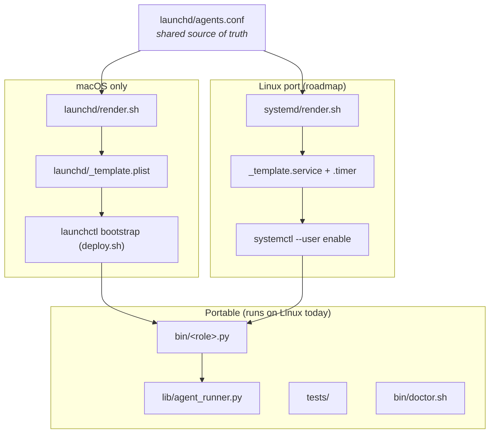

Short answer: not yet. Alfred's scheduling layer is `launchd`, which is macOS-only.

Full doc at [`docs/LINUX.md`](https://github.com/luminik-io/alfred-os/blob/main/docs/LINUX.md). Highlights:

## The scheduler is the only macOS-specific layer

Everything above the scheduler is portable Python. The launchd dependency is isolated to three files (`launchd/render.sh`, `launchd/_template.plist`, the `launchctl` calls in `deploy.sh`). A systemd port mirrors that layer and leaves the rest untouched.



## What works on Linux today

- `lib/agent_runner.py`: every primitive runs unchanged.
- `tests/`: `pytest` runs the full test suite.
- `bin/doctor.sh`: works.
- `alfred claude`: launchd-style env switching is macOS-only.
- `examples/bin/label_state.py`, `examples/git-hooks/pre-push`: work.

## What doesn't

- `launchd/render.sh`, `deploy.sh`: depend on `launchctl`.
- `install.sh`: refuses to run unless you set `ALFRED_FORCE_LINUX=1`.

## Two interim options

### Option 1: cron + a wrapper script

```text
*/20 * * * * /usr/bin/env ALFRED_HOME=$HOME/.alfred WORKSPACE_ROOT=$HOME/code GH_ORG=myorg python3 $HOME/code/myfleet/bin/lucius.py >> /tmp/lucius.log 2>&1
```

You lose per-agent stdout/stderr separation and the `_paused/` marker pattern, but the framework primitives all work.

### Option 2: hand-rolled systemd user units

```ini
# ~/.config/systemd/user/alfred-os-lucius.service
[Unit]
Description=alfred-os Lucius

[Service]
Type=oneshot
EnvironmentFile=%h/.alfredrc
ExecStart=/usr/bin/env python3 %h/.alfred/bin/lucius.py
StandardOutput=append:%h/.alfred/logs/lucius.stdout
StandardError=append:%h/.alfred/logs/lucius.stderr
```

```ini
# ~/.config/systemd/user/alfred-os-lucius.timer
[Unit]
Description=alfred-os Lucius timer

[Timer]
OnUnitActiveSec=20min
Unit=alfred-os-lucius.service

[Install]
WantedBy=timers.target
```

Enable: `systemctl --user enable --now alfred-os-lucius.timer`.

This is what a `systemd/render.sh` would generate. Until that ships, you're hand-rolling.

## Roadmap for first-class Linux support

See [Roadmap](/about/roadmap/). The structure of the work:

1. `systemd/_template.service` + `systemd/_template.timer`.
2. `systemd/render.sh` mirroring `launchd/render.sh`.
3. `deploy.sh` host detection.
4. `install.sh` Linux branch (apt/dnf/pacman).
5. Round-trip test on Ubuntu LTS + Fedora.

If you want to do this work, see [Contributing](/about/contributing/). PRs reviewed. If you want to fund it, file an issue with your willingness to sponsor.

## WSL2 and Docker

Both work for the framework code; neither is actively tested.

- **WSL2**: same as Linux. Cron or systemd-user. Watch out for cross-filesystem worktree slowness if you mount Windows drives.
- **Docker**: Alfred is not container-friendly. The host-scheduler dependency would need a real port.

If you want to run agents inside containers (a per-firing image with isolated tooling), that's compatible: write your codename's `bin/<name>.py` to `docker run --rm ... claude -p ...`. The framework doesn't care.
