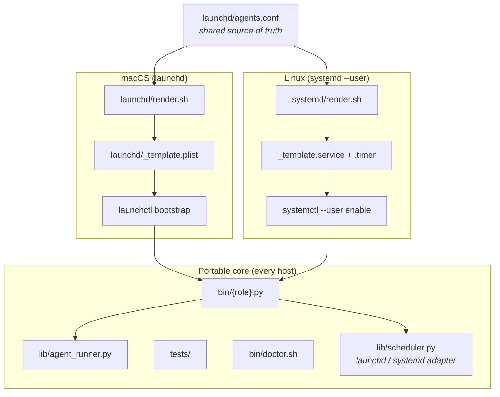

Alfred runs on Linux. The scheduling layer is `systemd --user` timers — the Linux analogue of macOS `launchd` per-user agents. `install.sh`, `deploy.sh`, `bin/doctor.sh`, `alfred-status`, and the `alfred` CLI all detect the host OS and pick the right path. Supported distros: **Debian and Ubuntu** (apt).

Full reference: [`docs/LINUX.md`](https://github.com/luminik-io/alfred-os/blob/main/docs/LINUX.md).

## The scheduler is the only OS-specific layer

Everything above the scheduler is portable Python and Bash. The host-scheduler dependency is isolated to the render scripts, the unit templates, and the `lib/scheduler.py` abstraction — `launchd` on macOS, `systemd --user` on Linux. `agents.conf` is the single source of truth for both.



## launchd → systemd mapping

The port is a real mapping, not a translation shim:

| launchd | systemd --user | Purpose |
|---|---|---|
| `~/Library/LaunchAgents/<label>.plist` | `~/.config/systemd/user/<label>.{service,timer}` | per-agent unit on disk |
| `StartInterval` / `StartCalendarInterval` | `OnUnitActiveSec=` / `OnCalendar=` | the schedule |
| `RunAtLoad=false` + one-shot exit | `Type=oneshot` | fire-and-forget, no restart loop |
| `launchctl bootstrap` / `bootout` | `systemctl --user enable --now` / `disable --now` | load / unload |
| `launchctl kickstart -k` | `systemctl --user stop` then `start` | one-shot run, killing any in-flight firing |
| `EnvironmentVariables` block | `Environment=` lines | per-agent env without polluting the shell |

Rendered systemd units use the `%h` specifier in place of the operator's literal home directory, so a unit file is host-agnostic.

## Install

```sh
git clone https://github.com/luminik-io/alfred-os.git ~/code/alfred-os
cd ~/code/alfred-os
bash install.sh
```

On Linux, `install.sh` confirms the host is Debian/Ubuntu (`/etc/os-release`), `apt-get install`s the prerequisites, installs `uv` from the official installer (and uses it to provision Python 3.11 if the distro default is newer), runs `npm install -g @anthropic-ai/claude-code`, then seeds `$ALFRED_HOME`, `$WORKSPACE_ROOT`, and `~/.alfredrc`.

AWS CLI v2 is **not** auto-installed — apt ships v1.x. Install it from Amazon if your fleet jobs touch AWS.

## Deploy

```sh
bash deploy.sh
```

On Linux, `deploy.sh` copies `lib/` and `bin/` into `$ALFRED_HOME`, renders `systemd/` units from `agents.conf`, reaps units for removed rows, copies the units into `~/.config/systemd/user/`, runs `daemon-reload`, and `enable --now`s each timer — skipping any agent whose pause marker is set.

## Operate

The `alfred` CLI is OS-agnostic; the same verbs work on Linux:

```sh
alfred agents              # roster, with a systemd-load column
alfred pause lucius        # disable the timer, write the pause marker
alfred resume lucius       # clear the marker, re-enable the timer
alfred run lucius          # one-shot run now
alfred status              # health snapshot from the systemd timer roster
bash bin/doctor.sh --dev   # preflight; --dev tolerates host-config gaps
```

Raw `systemctl --user list-timers` and `journalctl --user -u <label>` still work if you prefer them.

## `linger` — keeping the fleet alive across logout

`systemd --user` units only run while the user has an active session unless **linger** is enabled. For an always-on agent host, enable it once:

```sh
sudo loginctl enable-linger "$USER"
```

This is the one piece `deploy.sh` does **not** do for you — it needs `sudo` and is a deliberate operator decision.

## WSL2 and Docker

- **WSL2**: same path as Linux on distros that enable systemd (recent Ubuntu does by default). Keep `WORKSPACE_ROOT` on a Linux path, not `/mnt/c/...` — cross-filesystem worktrees are slow and Windows file-locking confuses `git worktree`.
- **Docker**: still not container-friendly — the host-scheduler assumption means hosting the scheduler outside the container. Running individual agents *inside* containers is fine, though: point your codename's `bin/<name>.py` at `docker run --rm ... claude -p ...`.

One thing still macOS-shaped: `alfred claude` switches the Claude Code account via `launchctl setenv`, which has no systemd equivalent. On Linux, set `CLAUDE_CONFIG_DIR` directly in `~/.alfredrc`.
