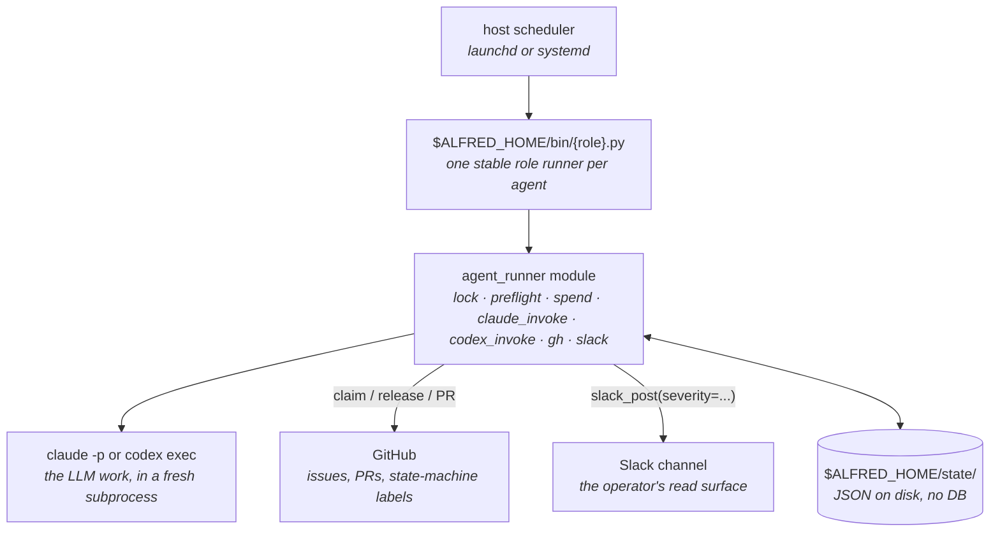

import { Card, CardGrid, LinkCard } from "@astrojs/starlight/components";

## Design notes

Most agent frameworks (crewAI, MetaGPT, OpenHands, AutoGPT-style loops) assume one long-running Python process, in-memory state, and a human at a REPL. Wrong shape for unattended work.

- **Long-running loops** have no failure isolation. One bad run trashes the others.
- **In-memory state** can't survive an OS reboot. Always-on hosts still restart.
- **Chat-first interfaces** put the operator on the critical path.

Alfred's shape: each agent is a fresh subprocess in its own git worktree, dispatched by the host scheduler (`launchd` on macOS, `systemd --user` on Linux), isolated by per-agent IAM, bounded by per-day spend caps with a fleet-wide Claude-provider-limit block.

`ALFRED_HOME` is the runtime root. A fresh install defaults to `~/.alfred`. No external agent gateway, memory database, skill registry, or dashboard service is required.

## What you get

<CardGrid stagger>
  <Card title="Host-scheduler dispatch" icon="rocket">
    Every firing is a host scheduler event. No long-running process; no in-memory state to lose on reboot. The OS is the orchestrator.
  </Card>
  <Card title="Per-firing git worktree isolation" icon="puzzle">
    Each `claude -p` invocation gets a fresh worktree. No cross-firing pollution; safe to crash mid-run.
  </Card>
  <Card title="Per-agent IAM" icon="approve-check-circle">
    Every scheduled agent gets its own scoped IAM identity. The operator's SSO is never used by scheduled agents.
  </Card>
  <Card title="Fleet-wide provider-limit block" icon="warning">
    When a Claude-backed agent hits a Claude provider limit, every other agent silently skips for an hour. No stampede.
  </Card>
  <Card title="Issue claim state machine" icon="document">
    `agent:in-flight` → `agent:pr-open` → `agent:done`. Race-resistant cooperative coordination via GitHub labels + structured comments.
  </Card>
  <Card title="Operator overrides" icon="setting">
    `do-not-pickup` to manually claim an issue. Repo pause/resume to refactor without racing the fleet.
  </Card>
</CardGrid>

## Where it's going

The engineering fleet ships today. The harness underneath is department-agnostic. Alfred was extracted from a private fleet that already runs content, sales, and ops agents on the same substrate. That's the roadmap: Alfred as the solo builder's whole agent OS.

<CardGrid>
  <Card title="Content" icon="document">Blog, LinkedIn, SEO drafts; site-page generation. Human-in-the-loop on publish.</Card>
  <Card title="Sales / SDR" icon="rocket">Prospect identification, event-page sourcing, outreach drafts. Human-in-the-loop on send.</Card>
  <Card title="Ops departments" icon="setting">Personal-assistant, finance, and product-ops: drafts-only on anything that sends, publishes, or pays.</Card>
  <Card title="Memory + alfred serve" icon="puzzle">A recall/reflect layer so agents compound what they learn, plus a local read-only UI over fleet state.</Card>
</CardGrid>

Alfred stays single-operator and local by design. It is not multi-tenant and not a hosted SaaS. The full [roadmap](/about/roadmap/) has what's in flight and the design boundaries that hold.

## Quick start

<LinkCard
  title="Install in 30 minutes"
  description="Fresh-machine setup. The wizard can configure a one-repo or multi-repo starter fleet without manual prompt or label copying."
  href="/getting-started/install/"
/>

<LinkCard
  title="Let Claude Code or Codex install it"
  description="A copy-paste prompt for AI-assisted setup: explicit repos, starter fleet, no guessed secrets, auth checks before scheduled firings."
  href="/getting-started/ai-assisted-install/"
/>

<LinkCard
  title="Pick your workspace shape"
  description="One repo, multi-repo product workspace, specs-led planning, or Batman bundle planning."
  href="/getting-started/workspace-patterns/"
/>

<LinkCard
  title="Build your first agent"
  description="The Echo tutorial: pick → claim → invoke → act → release → report. The shape every richer codename inherits."
  href="/getting-started/tutorial/"
/>

<LinkCard
  title="Read the architecture"
  description="Why host scheduling, why worktrees, why per-agent IAM. The design constraints that make Alfred opinionated."
  href="/concepts/architecture/"
/>

<LinkCard
  title="How it works"
  description="One agent firing traced end to end: scheduler trigger, the gates before any spend, claim, isolate, invoke, branch on outcome."
  href="/concepts/how-it-works/"
/>

<LinkCard
  title="Meet the fleet"
  description="The starter fleet and the full engineering roster: Lucius, Drake, Bane, Ra's al Ghul, and the rest. What each codename does and how work flows between them."
  href="/concepts/fleet/"
/>

## Status

Latest release: v0.3.0. Alfred is usable today as a local engineering-agent fleet for one operator: install, starter setup, prompt seeding, GitHub label setup, doctor, dry-run, Linux/systemd or macOS launchd scheduling, Claude/Codex engine routing, Slack reporting, and isolated worktree execution.

The design boundary is stable: one operator, one machine, local CLIs, isolated worktrees, GitHub as the coordination surface. PRs are welcome when they strengthen that shape: reliability, setup, docs, tests, new codenames with clear scope, or optional integrations that fail cleanly. Bigger shifts, such as a new department or substrate change, should start as a discussion.

License: [MIT](https://github.com/luminik-io/alfred-os/blob/main/LICENSE).
