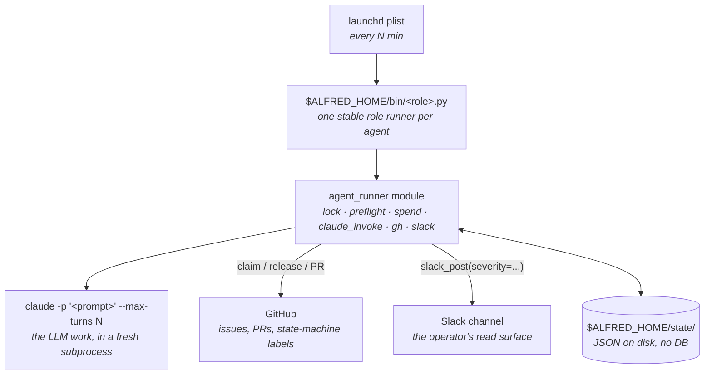

import { Card, CardGrid, LinkCard } from "@astrojs/starlight/components";

## Design notes

Most agent frameworks (crewAI, MetaGPT, OpenHands, AutoGPT-style loops) assume one long-running Python process, in-memory state, and a human at a REPL. Wrong shape for unattended work.

- **Long-running loops** have no failure isolation. One bad run trashes the others.
- **In-memory state** can't survive an OS reboot. macOS restarts every few weeks.
- **Chat-first interfaces** put the operator on the critical path.

Alfred's shape: each agent is a fresh subprocess in its own git worktree, dispatched by `launchd`, isolated by per-agent IAM, bounded by per-day spend caps with a fleet-wide rate-limit poison pill.

`ALFRED_HOME` is the runtime root. A fresh install defaults to `~/.alfred`.
Hermes, gbrain, MCP servers, skills, canon, and dashboards are compatible
optional integrations, not core requirements.

## What you get

<CardGrid stagger>
  <Card title="launchd dispatch" icon="rocket">
    Every firing is a `launchd` event. No long-running process; no in-memory state to lose on reboot. The OS is the orchestrator.
  </Card>
  <Card title="Per-firing git worktree isolation" icon="puzzle">
    Each `claude -p` invocation gets a fresh worktree. No cross-firing pollution; safe to crash mid-run.
  </Card>
  <Card title="Per-agent IAM" icon="approve-check-circle">
    Every scheduled agent gets its own scoped IAM identity. The operator's SSO is never used by scheduled agents.
  </Card>
  <Card title="Fleet-wide rate-limit poison pill" icon="warning">
    When any agent hits Anthropic's cap, every other agent silently skips for an hour. No stampede.
  </Card>
  <Card title="Issue claim state machine" icon="document">
    `agent:in-flight` → `agent:pr-open` → `agent:done`. Race-resistant cooperative coordination via GitHub labels + structured comments.
  </Card>
  <Card title="Operator overrides" icon="setting">
    `do-not-pickup` to manually claim an issue. Repo pause/resume to refactor without racing the fleet.
  </Card>
</CardGrid>

## Out of scope

<CardGrid>
  <Card title="Multi-tenant" icon="error">Single operator, one Mac, one config.</Card>
  <Card title="Web UI" icon="error">Slack is the human surface.</Card>
  <Card title="Long-running loops" icon="error">The OS scheduler is the orchestrator.</Card>
  <Card title="Hosted model gateway" icon="error">Engines are local CLI adapters, not a hosted inference service.</Card>
  <Card title="Hermes or gbrain bundle" icon="error">Integrations are optional; this repo ships the launchd fleet core.</Card>
  <Card title="Browser runtimes" icon="error">If you need Playwright, install it in your codename script.</Card>
  <Card title="Vector DBs" icon="error">A doc-shaped memory layer is your choice, not the framework's.</Card>
</CardGrid>

## Quick start

<LinkCard
  title="Install in 30 minutes"
  description="Fresh-Mac setup: install.sh handles brew + npm + dirs + shell rc + auth checks."
  href="/getting-started/install/"
/>

<LinkCard
  title="Build your first agent"
  description="The Echo tutorial: pick → claim → invoke → act → release → report. The shape every richer codename inherits."
  href="/getting-started/tutorial/"
/>

<LinkCard
  title="Read the architecture"
  description="Why launchd, why worktrees, why per-agent IAM. The design constraints that make Alfred opinionated."
  href="/concepts/architecture/"
/>

<LinkCard
  title="How it works"
  description="One agent firing traced end to end: launchd trigger, the gates before any spend, claim, isolate, invoke, branch on outcome."
  href="/concepts/how-it-works/"
/>

<LinkCard
  title="Meet the fleet"
  description="The default engineering roster: Lucius, Drake, Bane, Ra's al Ghul, and the rest. What each codename does and how work flows between them."
  href="/concepts/fleet/"
/>

## Status

Alfred is at v0.2.1. It ships a complete local engineering-agent fleet for one operator, with the first public launch cleanup pass applied. The framework substrate (`agent_runner`) is stable for the operator's own use; expect rough edges if you fork.

Maintained on weekends. Issues triaged on a best-effort basis. PRs that fit the design constraints get reviewed; PRs that broaden scope get politely declined. Read [Contributing](/about/contributing/) before opening.

License: [MIT](https://github.com/luminik-io/alfred-os/blob/main/LICENSE).
