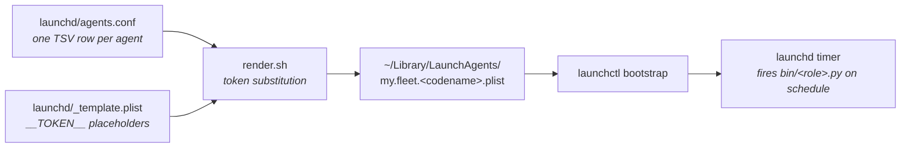

The framework's scheduling layer. Three files, fully documented.

- [`launchd/_template.plist`](https://github.com/luminik-io/alfred-os/blob/main/launchd/_template.plist): the canonical template with `__PLACEHOLDER__` tokens.
- [`launchd/agents.conf.example`](https://github.com/luminik-io/alfred-os/blob/main/launchd/agents.conf.example): TSV format documentation.
- [`launchd/render.sh`](https://github.com/luminik-io/alfred-os/blob/main/launchd/render.sh): substitutes tokens, writes one plist per row.

## The scheduling pipeline

`agents.conf` is the single source of truth for which agents run and when. `deploy.sh` runs `render.sh` over it, producing one plist per row, then bootstraps each one into `launchd`.



The same shape ports to Linux: a `systemd/render.sh` would read the same `agents.conf` and emit `.service` + `.timer` units instead of plists. See [Linux](/guides/linux/) for the interim hand-rolled approach and the port roadmap.

## `agents.conf` format

Each non-comment, non-blank line is a record with up to six tab-separated fields:

| Field | What |
|---|---|
| 1. label | launchd job label (also the .plist filename stem) |
| 2. script | python file in `$ALFRED_HOME/bin/` to invoke |
| 3. schedule | one of: `interval:<seconds>` / `cron:<HH>:<MM>` (daily) / `cron:<weekday>:<HH>:<MM>` (weekly; 0=Sun) |
| 4. needs_java | `yes` or `no`. `yes` prepends openjdk@21 + fnm bins to PATH and sets JAVA_HOME |
| 5. log_stem | basename used for `/tmp/<stem>.{stdout,stderr}`. Empty falls back to label |
| 6. role | one-line operational descriptor surfaced in `alfred agents` and Slack post prefixes |

Example:

```
my.fleet.lucius	lucius.py	interval:1200	yes			Feature developer
my.fleet.bane	bane.py	cron:2:00	yes			Test coverage
my.fleet.gordon	gordon.py	cron:8:00	no			Deploy health
my.fleet.weekly-cleanup	cleanup.py	cron:0:21:00	no	my.fleet.cleanup	Weekly cleanup
```

Tabs are required between fields. Trailing empty fields can be omitted.

## Template tokens

`render.sh` substitutes these in `_template.plist`:

| Token | Source |
|---|---|
| `__LABEL__` | `agents.conf` field 1 |
| `__SCRIPT__` | `agents.conf` field 2 |
| `__SCHEDULE_BLOCK__` | rendered from field 3 (StartInterval or StartCalendarInterval) |
| `__PATH__` | colon-joined PATH for EnvironmentVariables (varies by `needs_java`) |
| `__JAVA_BLOCK__` | JAVA_HOME entry (empty when `needs_java=no`) |
| `__GH_ORG_BLOCK__` | GH_ORG entry (omitted if env unset) |
| `__ALFRED_BIN__` | `$ALFRED_HOME/bin` |
| `__ALFRED_HOME__` | resolved at render time |
| `__WORKSPACE_ROOT__` | resolved at render time |
| `__HOME__` | `$HOME` at render time |
| `__LOG_STEM__` | `agents.conf` field 5 (or label if empty) |
| `__AGENT_SHORT__` | label suffix, rendered as `AGENT_CODENAME` |
| `__AGENT_ROLE_BLOCK__` | `ALFRED_<CODENAME>_ROLE` env var rendered from field 6 when present |

`launchd` does not source shell rc files. The rendered plist calls
`agent-launch`, which sources `~/.alfredrc` at firing time and then execs the
agent script from `$ALFRED_HOME/bin`.

## Adding an agent

1. Drop `bin/<your-codename>.py` into your fleet repo.
2. Append a row to `launchd/agents.conf`.
3. Run `bash deploy.sh`: renders + bootstraps.
4. Verify with `bash bin/doctor.sh`.

## Pause / resume

Pause persists across `deploy.sh` invocations via marker files at `$ALFRED_HOME/state/_paused/<short-name>` (where `short-name` is the label minus the `<prefix>.` prefix).

```sh
# Manual pause:
launchctl bootout "gui/$(id -u)/my.fleet.lucius"
mkdir -p $ALFRED_HOME/state/_paused
date -u +"%Y-%m-%dT%H:%M:%SZ" > $ALFRED_HOME/state/_paused/lucius

# Resume:
rm $ALFRED_HOME/state/_paused/lucius
launchctl bootstrap "gui/$(id -u)" \
  ~/Library/LaunchAgents/my.fleet.lucius.plist
```

## stdout / stderr

Each plist writes to `/tmp/<log_stem>.stdout` and `/tmp/<log_stem>.stderr`. Use `tail -f /tmp/my.fleet.lucius.std{out,err}` to watch a firing live.

`/tmp/` is wiped on macOS reboot. The framework's per-firing JSONL transcripts (under `$ALFRED_HOME/state/transcripts/`) survive, so post-hoc analysis isn't dependent on `/tmp/`.

## RunAtLoad

The shipped template sets `RunAtLoad = false`, so `bash deploy.sh` does not immediately fire any agent. They wait for their scheduled trigger (or `launchctl kickstart`).

For immediate on-deploy firing of a specific agent, render its plist with `RunAtLoad = true` (edit `_template.plist` for that agent only). No per-agent override in `agents.conf` yet; tracked.
